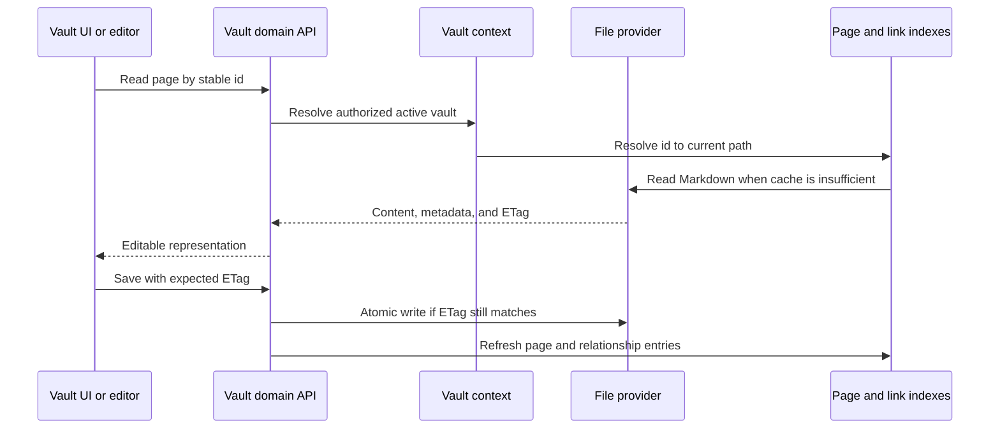

# Vault et fichiers

## Responsabilité

Le domaine Vault établit la correspondance entre les fichiers Markdown
portables et leurs ressources, d'une part, et les pages, dossiers, pièces
jointes, recherches, schémas, historiques, corbeille, exports, citations et
sélection de plusieurs Vaults, d'autre part. C'est le domaine le plus vaste et
le principal garant de la souveraineté des données.

La reconnaissance locale de l'écriture manuscrite est un adaptateur
d'ingestion facultatif à la frontière du domaine Vault. Les objets de modèle
et de traitement restent isolés en tant que valeurs d'exécution issues de
bibliothèques tierces ; le service expose un résultat typé contenant le texte,
la reconnaissance brute, les valeurs des lignes, l'identité du modèle et
l'état de correction, sans modifier le contrat public de téléversement. Les
dictionnaires d'état, de préchauffage et de reconnaissance sont validés par des
modèles de réponse Pydantic dédiés, tout en conservant leur structure
historique de dictionnaire pour les appels directs et une interface OpenAPI
identique octet par octet.

## Cycle de vie des pages

L'identité d'une page est indépendante de son titre et de son chemin. Le
frontmatter est normalisé aux frontières d'écriture, tout en préservant les
clés créées par l'utilisateur. L'état strictement interne est stocké dans des
fichiers annexes de `.gnosi` lorsque son exposition dans le frontmatter
polluerait ou déstabiliserait le contenu portable.

La lecture et l'écriture des fichiers annexes utilisent un contrat explicite
unique de correspondance des métadonnées, y compris pour les résultats de
séparation, de fusion et de persistance portable. Le mécanisme de repli partagé
et tolérant du frontmatter renvoie les valeurs scalaires de premier niveau
sous forme d'objets typés lorsqu'une récupération YAML est nécessaire ; le
contenu imbriqué mal formé reste délibérément ignoré. Ces contrats ne
convertissent pas les valeurs de l'utilisateur et ne modifient pas les
protections existantes pour les fichiers cloud.

`pages/markdown_writer.py` est la frontière canonique de sérialisation : il
récupère ou crée un identifiant stable manquant, associe les clés du schéma aux
noms utilisés pour le stockage, retire les champs virtuels, écrit l'état interne
dans le fichier annexe, enrichit les relations portables et matérialise les
instantanés de vues avant l'écriture atomique du fichier.
`services/field_resolver.py` est responsable de ce contrat de correspondance
des clés du schéma. Il accepte les identifiants immuables des champs, leurs noms
actuels et leurs anciens alias, résout les conflits de manière déterministe et
n'émet que les noms actuels lisibles par l'utilisateur aux frontières de
stockage et de réponse, tout en préservant les métadonnées locales sans rapport.

`pages/save_helpers.py` gère la préparation des métadonnées pour les sauvegardes
complètes, le choix de la destination, la réutilisation des identifiants
existants et la création d'une version avant écriture.
`pages/patch_helpers.py` gère les lectures tenant compte des ETags, la
préparation des métadonnées PATCH, le déplacement des fichiers et la mise à jour
coordonnée des caches de pages, de corps, de citations et de documents analysés.
Les huit noms historiques des fonctions auxiliaires privées restent de fines
façades de compatibilité, et chaque dépendance remplaçable ou cache mutable est
résolu par un port typé à liaison tardive.

## Frontière du backend

La lecture et l'écriture des pages, les aperçus, la duplication, l'historique
et la corbeille sont implémentés dans `backend/domains/vault/pages`, tandis que
le téléversement des ressources, les icônes et la diffusion des images résident
dans `backend/domains/vault/assets`. La diffusion de fichiers confinée aux
chemins autorisés, les routes Library/raw/thumbnail, les jetons de fichiers
locaux, les téléversements de propriétés, les liens portables et la suppression
physique résident dans `backend/domains/vault/files`. Ces paquets séparent les
schémas de requête stricts, les adaptateurs de routes, les services applicatifs,
les dépôts et les responsables uniques des verrous mutables, des caches et des
réserves de jetons. Tout nouveau comportement du Vault relève de la frontière
du domaine correspondante.

La frontière transitoire `pages/runtime.py` préserve l'état dynamique du module
historique de routes tout en exigeant un Vault actif avant de construire des
chemins de fichiers ou des moteurs de règles. Ses modèles de requête s'appuient
désormais directement sur Pydantic, ce qui évite les classes de base dépendant
de l'environnement d'exécution sans modifier leur identité de module publique
ni le contrat HTTP généré.

`backend/domains/media` gère la résolution de la racine des médias, le parcours
récursif adapté au fournisseur et son cache dérivé persistant, les fichiers
annexes synchronisés de métadonnées et de vues enregistrées, les filtres, la
pagination, l'arborescence de dossiers à chargement différé, les téléversements
confinés aux chemins autorisés, l'extraction EXIF et la sérialisation stable des
fichiers. `backend/services/media_service.py` reste la façade Python compatible :
elle préserve la classe historique, le singleton, la forme des objets
appelables, les descripteurs, l'état et les erreurs, tout en résolvant tardivement
l'état mutable et les dépendances remplaçables. Son constructeur interne possède
désormais une annotation de retour explicite `None`, supprimant la dernière
exception de typage du backend écrit à la main sans modifier le comportement
de construction. La façade vérifie l'existence d'un Vault actif avant de franchir
une frontière du système de fichiers et utilise les contrats de médias typés
pour les racines, les parcours, les requêtes, les téléversements, les données EXIF
et les informations sérialisées des fichiers. Les modules du domaine n'importent
jamais le routeur HTTP ni la façade de compatibilité.

Le module HTTP transitoire des médias précise une seule fois le type du routeur
historique importé dynamiquement en le ramenant à un `APIRouter` concret. Les
décorateurs de routes et les enregistrements délégués de ressources, fichiers,
icônes et propriétés utilisent tous cette même instance typée, préservant
l'ordre d'enregistrement et le contrat OpenAPI sans disperser les exceptions
de typage dans les gestionnaires individuels.

La frontière des dessins applique la même spécialisation d'un routeur unique
aux opérations CRUD et à l'enregistrement délégué de l'historique. Les sauvegardes
des dessins, la suppression récupérable, les délais de récupération, les
permissions et l'ordre des routes restent sous la responsabilité des services
de domaine existants, tandis que l'interface de composition HTTP est strictement
typée.

La composition des aperçus et des sauvegardes de pages partage également un
routeur dont le type a été précisé, pour la résolution des titres et
l'enregistrement délégué des aperçus et des écritures. L'identité des caches,
la correspondance des alias, les vérifications du Vault actif et les schémas
de routes générés restent inchangés.

Les routes de traduction et de synchronisation Drupal précisent elles aussi le
type de leur routeur à liaison tardive à la frontière du module. Les opérations
sur une seule ligne, en lot, de mise en correspondance, de boutons générés et
de traduction de pages préservent les contrôles de rôles, les traitements en
arrière-plan et la correspondance des erreurs externes tout en restant couvertes
par le typage strict.

Le stockage propre aux tables a des responsables explicites.
`assets/table_paths.py` gère les chemins confinés des ressources, les répertoires
par propriété, les révisions et les fonctions de renommage évitant les
collisions ; `assets/persistence.py` gère l'ingestion récursive des métadonnées
et la suppression confinée des ressources d'enregistrement ;
`assets/quarantine.py` gère la suppression des tables résistante aux arrêts
brutaux et la récupération au démarrage. `tables/folders.py` gère la création et
la migration du répertoire physique `BD/<database>/<table>` de la table. Ces
modules reçoivent de la façade de compatibilité des ports limités au système
de fichiers et au registre, et n'importent jamais le routeur HTTP.

`tables/routes.py` gère désormais les 23 opérations historiques de bases de
données, tables, catalogues d'options, vues enregistrées et schémas de dossiers,
dans leur ordre d'origine. Ses gestionnaires strictement typés délèguent aux
services existants de lignes, de cycle de vie, de propriétés, d'options et de
vues ; `tables/composition.py` constitue l'ensemble immuable de dépendances de
ces routes ainsi que des requêtes de lignes et de l'enrichissement des
métadonnées. `tables/security.py` n'expose que les deux fabriques typées
d'autorisation de l'espace de travail, évitant une dépendance statique du
domaine des tables envers la vaste composition d'authentification historique.
Le routeur historique enregistre les routes du domaine à plat pour rester
compatible avec les consommateurs de l'inventaire des routes et réexporte les
objets Python appelables pris en charge.

`backend/api/vault_routes.py` est désormais un module d'initialisation de
compatibilité de 283 lignes, et ne porte plus l'implémentation. Les modules
typés de `backend/domains/vault` gèrent les comportements restants des API,
annotations, citations, dessins, Drupal, fichiers, connaissances, liens,
médias, pages, registres, tables et traductions. Le module d'initialisation
charge et enregistre ces responsables dans l'ordre historique du code source,
tandis que `facade_bridge.py` préserve les imports pris en charge, les variables
globales mutables et les points de substitution par monkeypatch à liaison
tardive. Le routeur parent expose toujours le même inventaire à plat
d'`APIRoute` et un document OpenAPI déterministe identique octet par octet.
La façade n'a donc besoin d'aucune dérogation aux garde-fous du code source.

Le comportement du cycle de vie des traductions relève de
`backend/domains/vault/translation` : le chargement facultatif des fournisseurs,
la récupération des fichiers cloud, la traduction des lignes et des pages
entières, les effets minimaux sur les métadonnées et la propagation de
l'obsolescence aux éléments enfants constituent des services typés distincts.
La frontière partagée des fonctions auxiliaires pures canonicalise les identités
sources, détecte les changements traduisibles et les champs de langue,
réutilise les libellés d'options existants et ne traduit que les sous-champs
textuels des images tout en conservant leur ressource source.
La publication de lignes vers Drupal relève de `backend/domains/vault/drupal`,
qui sépare la correspondance des champs et des identités, la préparation des
médias locaux, la conversion de Markdown et des wikilinks, les caches de
langues, la correspondance des titres et la synchronisation idempotente des
nœuds. Le routeur de compatibilité conserve les décorateurs FastAPI d'origine,
les docstrings des routes et les points de substitution Python à liaison
tardive, tandis que le connecteur Drupal reste la frontière de transport
externe. Ces déplacements ne modifient ni les chemins, ni les payloads, ni les
codes d'état, ni les tâches d'arrière-plan, ni l'ordre des routes.

## Index et caches

L'index des pages accélère la production de listes, la résolution des
identifiants, l'accès au frontmatter et la recherche. L'index des wikilinks
résout les liens entrants afin que le renommage des pages puisse mettre à jour
les références. Les caches de corps et de documents analysés évitent les
lectures répétées. Chaque cache est dérivé et doit permettre une reconstruction
à froid.

`links/document_inventory.py` gère l'inventaire TTL par Vault utilisé par les
liens globaux. Il exclut l'historique et la corbeille, isole les fichiers
illisibles, inclut les tableaux de bord JSON et se replie sur un parcours du
disque lorsque l'index du fournisseur est indisponible.
`links/document_cache.py` gère les caches persistants des corps Markdown et du
frontmatter analysé, indexés par mtime. Le routeur ne fournit que les chemins
des caches actifs, l'analyseur et le composant d'écriture JSON sécurisé : le
comportement des caches est donc indépendant du fournisseur de fichiers.
`links/relation_sync.py` gère les mises à jour idempotentes du système de
fichiers et des caches lors des changements de relations directes et inverses.
La correspondance pure des schémas reste un port de règles typé distinct :
elle résout les champs de relation à partir des noms actuels normalisés et des
alias, exige un champ inverse unique sans ambiguïté et n'émet que des
opérations d'ajout ou de retrait sur les identifiants canoniques des relations.
Le routeur de compatibilité fournit les entrées-sorties des pages à liaison
tardive.

Le démarrage charge d'abord les instantanés valides du disque, puis lance
l'actualisation. Un parcours partiel du fournisseur de fichiers est signalé
comme tel et ne peut pas remplacer un cache dont on sait qu'il est complet.
Les défaillances sont isolées par fichier, de sorte qu'un fichier de substitution
disponible uniquement en ligne ou orphelin ne retire pas le reste du Vault
d'une réponse.

`pages/index_entries.py` gère les lectures bornées du frontmatter, les nouvelles
tentatives en cas de verrou cloud et la normalisation des entrées de cache.
`pages/index_service.py` gère la découverte, l'actualisation, les tables de
correspondance inverse des identifiants et les instantanés dédupliqués.
`pages/resolver.py` gère la résolution par identifiant stable, UUID canonique,
titre indexé et parcours à froid borné.
`pages/tags.py` gère l'agrégation, indépendante du fournisseur, des étiquettes
du frontmatter et des étiquettes sémantiques des tables, y compris leur
déduplication par page. Le routeur de compatibilité injecte les ports du Vault
actif, du registre, du calendrier et des caches ; aucun de ces services
n'importe donc la façade HTTP.

Le module d'exécution du registre précise une seule fois le type de son routeur
à liaison tardive, utilise le décorateur standard typé de gestionnaire de
contexte pour les cycles de mutation et traite l'absence de Vault actif comme
une absence de racine des pièces jointes cloud. L'ordre des routes de registre
et de tables, le verrouillage, les caches et les candidats de pièces jointes
propres aux fournisseurs restent inchangés.

L'API centrale du Vault réutilise un routeur typé unique pour les champs
virtuels, l'état de l'index, les notes quotidiennes et l'agrégation des
étiquettes. Les libellés d'affichage des utilisateurs franchissent la frontière
des descripteurs ORM historiques sous forme de chaînes concrètes, préservant
le repli existant du nom vers l'adresse e-mail, puis vers l'identifiant.

Le formatage des citations et l'enregistrement des exports passent désormais
par un routeur typé unique, tandis que la détection des formats de références,
la sérialisation et la normalisation renvoient directement leurs chaînes
natives strictement typées. Les formats d'export, la résolution des citations
et le comportement des erreurs Pandoc restent stables.

La recherche de métadonnées, la reconnaissance PDF, la traduction d'URL, la
promotion Zotero, les mises à jour en lot et l'enregistrement des catalogues et
recherches de citations partagent cette même frontière HTTP au type précisé.
Les mécanismes de repli des fournisseurs, les permissions d'édition et
l'unicité des clés de citation restent à liaison tardive et conservent leur
comportement.

L'import Markdown, les commentaires en ligne, les blocs synchronisés, la
navigation par liens et les mentions non liées partagent un routeur typé de
synchronisation des pages. Les modèles de requête utilisent directement Pydantic
tout en conservant leur identité de module historique, préservant ainsi les
noms des schémas, le comportement SSE et le document OpenAPI produit.

Les opérations CRUD des annotations PDF suivent le même modèle : des classes
de base Pydantic directes pour les requêtes et un routeur typé unique,
avec conservation de l'identité historique des schémas. Le filtrage des URI
sources, l'ordre des pages, les permissions d'édition et la sérialisation des
annotations restent inchangés.

L'administration du Vault échoue désormais explicitement avec une réponse
signalant l'indisponibilité du service lorsque le chemin du Vault principal
est absent, au lieu de construire un chemin à partir de `None`. Les annotations
de réponse historiques restent figées, et le renommage logique franchit
l'ancienne frontière des descripteurs ORM sans modifier les dossiers sur disque,
les slugs, les règles de purge ni les contrôles de confinement des chemins.

Le catalogue de modèles de Vault, l'installation, l'export et la soumission
modérée exposent des frontières de requête et de réponse typées. Les
gestionnaires valident chaque dictionnaire avant de le renvoyer, tout en
désactivant la publication des modèles de réponse sur les routes de
compatibilité ; les schémas FastAPI figés et le contrat de dictionnaire pour
les appels directs restent ainsi inchangés. Les vérifications de signature,
les constats de confidentialité, les paquets déterministes et le retour
arrière en cas d'échec d'enregistrement restent inchangés.

## Fournisseurs de fichiers

L'abstraction des fournisseurs sélectionne un comportement adapté au stockage
local, au File Provider générique de macOS, à OneDrive, à iCloud Drive, à Google
Drive, à Nextcloud ou à Dropbox. Le code ordinaire du domaine continue de
travailler avec `Path` ; l'adaptateur ajoute la détection des fichiers de
substitution, l'hydratation, la disponibilité et la correspondance des chemins.
Définissez explicitement `GNOSI_FILES_PROVIDER` lorsque la détection automatique
du chemin est ambiguë.

Le fonctionnement des fichiers à la demande est indépendant du fournisseur.
Google Drive, iCloud et Nextcloud n'héritent pas du comportement de récupération
de OneDrive ; seul `OneDriveProvider` peut redémarrer le client OneDrive après
un échec d'hydratation bornée. Les fournisseurs natifs de macOS utilisent par
défaut une action `open` dans une session graphique. Les déploiements Docker
peuvent utiliser un auxiliaire configuré sur l'hôte, car les lectures depuis
un conteneur franchissent une frontière supplémentaire.

Les chemins du File Provider Dropbox sont détectés explicitement. Un service
inconnu sous `~/Library/CloudStorage` sur macOS utilise l'adaptateur
`fileprovider` sans effets de bord ; tout dossier entièrement synchronisé ou
monté de manière ordinaire utilise `local`. Un nouvel adaptateur nommé n'est
nécessaire que pour un signal de fichier de substitution différent ou un
mécanisme d'hydratation propre au fournisseur. `GNOSI_DATA_DIR` reste local
quel que soit le fournisseur du Vault.

Seuls le Markdown portable du Vault et les pièces jointes peuvent résider dans
une arborescence synchronisée. Les bases SQLite, les verrous, les caches
dérivés, les secrets et `GNOSI_DATA_DIR` restent dans le stockage local de
l'application. Un dossier Nextcloud entièrement synchronisé se comporte comme
`local` ; les déploiements avec fichiers virtuels utilisent le fournisseur
correspondant ou l'adaptateur générique `fileprovider`. WebDAV et les API cloud
directes sont des transports de transfert ou de sauvegarde, pas un stockage
actif pour SQLite. La destination des sauvegardes et le fournisseur du Vault
sont configurés indépendamment.

## Pièces jointes et propriétés contenant des fichiers

Les écritures choisissent une destination autorisée dans le Vault actif,
normalisent les noms, évitent les collisions et renvoient des métadonnées
portables. Les liens de fichiers sont rattachés à la racine de l'hôte courant
au moment de la lecture. Les opérations de téléversement et de suppression
vérifient le confinement ; un chemin fourni par le client ne constitue jamais
une autorisation suffisante.

Les gestionnaires des routes de ressources et de fichiers sont des exports
canoniques du domaine. Le routeur historique du Vault les enregistre à leurs
positions historiques et injecte des ports limités aux recherches dans le
registre, à la résolution des chemins et à la sélection des fournisseurs. Il ne
doit pas gérer une seconde table de correspondance des jetons locaux, un second
verrou d'icônes personnalisées ni un second sémaphore de flux de fichiers. Les
décorateurs répétés `/local-file/{token}` conservent leur ordre de routes
d'origine, de bas en haut, et chaque déplacement structurel doit préserver les
en-têtes de streaming et le document OpenAPI exact.

Les métadonnées contenant des fichiers sont normalisées récursivement sans
modifier leur structure de liste ou d'objet. Les chemins `Assets/` existants et
les URL HTTP distantes restent des références ; les URL de données et les
fichiers locaux approuvés sont copiés atomiquement dans le répertoire de
ressources de la propriété. Le nettoyage physique résout chaque candidat sous
la racine `Assets` du Vault actif avant de le supprimer, empêchant ainsi une
chaîne de traversée de chemins dans le frontmatter de sortir du Vault.

## Corbeille et opérations destructives

`drawings/service.py` gère la découverte des dessins Tldraw et des anciens
dessins Excalidraw, les lectures, les instantanés d'historique soumis à un
délai minimal, les écritures atomiques et la suppression récupérable. Les
opérations sur le système de fichiers s'exécutent hors de la boucle
d'événements, et la suppression réutilise le même contrat de fichier annexe
de corbeille du Vault que les pages.

La suppression ordinaire est récupérable : les pages et les ressources
associées passent par le modèle de corbeille du Vault. La purge est distincte
et supprime le contenu ainsi que les métadonnées dérivées et les relations
inverses. `trash/purge.py` gère le passage irréversible sur le système de
fichiers et le nettoyage de l'historique, des fichiers annexes de métadonnées
et des commentaires, derrière les ports à liaison tardive de la façade.
La suppression d'un Vault du registre retire par défaut la ligne logique du
registre ; la suppression physique du dossier exige un signal explicite
distinct et des contrôles de confinement renforcés.

La suppression d'une table commence par déplacer atomiquement chaque
arborescence de ressources appartenant à la table vers
`.gnosi/pending-cleanup/table-assets/in-progress-*` et par écrire un manifeste
confiné. La validation du registre renomme ensuite ce répertoire en `ready-*`
avant une purge en arrière-plan. La récupération au démarrage restaure une
quarantaine en cours lorsque la table existe encore, la purge lorsque le
registre persistant atteste la suppression et laisse intactes les entrées
illisibles ou inconnues. Les révisions de ressources couvrent les liens
symboliques sans suivre leurs cibles et empêchent la suppression après un
aperçu obsolète.

## Modèles de Vault

Le dépôt de modèles est un catalogue signé utilisé à l'exécution ; les
ressources des paquets ne sont pas suivies dans le dépôt Git de l'application.
La création à partir d'un modèle vérifie, avant toute écriture, la signature
détachée de l'index, le SHA-256 du paquet, la signature de l'éditeur, le manifeste,
l'inventaire des fichiers, les limites de l'archive, les chemins, les types de
fichiers et les liens. L'extraction se déroule dans un répertoire frère
temporaire sous la racine des Vaults. Le répertoire complet est mis en place
atomiquement, puis seulement enregistré dans la base de gestion : un échec ne
peut donc pas exposer un Vault partiel.

La validation des archives se décompose en validation bornée des entrées,
décodage du manifeste, comparaison de l'inventaire et contrôles d'intégrité du
payload. Ces étapes pures et typées conservent le même contrat de paquet qui
refuse l'opération en cas d'erreur, tout en maintenant chaque fonction
auxiliaire sous la limite de complexité du backend.

L'export repose sur une liste d'autorisation et est déterministe. Il exclut
`.gnosi`, les plugins, les magasins de confiance, le courrier, la corbeille,
l'historique, le contenu exécutable, les fichiers d'environnement, les liens,
les fichiers illisibles et les contenus trop volumineux. Un aperçu répertorie
chaque fichier inclus ou exclu et analyse des fichiers texte de taille bornée
pour détecter des valeurs ressemblant à des identifiants d'accès. Les éléments
détectés nécessitent une confirmation explicite. Les plugins recommandés sont
des identifiants dans le manifeste ; le code exécutable des plugins n'est jamais
transporté dans un modèle de Vault.

La soumission publique est distincte de l'export et exige un accès
administrateur. Elle utilise un intermédiaire de modération facultatif plutôt
que des identifiants GitHub intégrés à Gnosi. Les champs supplémentaires des
accusés de réception propres à cet intermédiaire sont préservés sans perte par
un modèle de réponse autorisant les champs supplémentaires ; les payloads
d'échec du catalogue conservent leur structure historique pour la récupération
hors ligne et après une erreur de signature.

## Invariants de concurrence

`daily/service.py` gère la découverte de dossiers et de tables indépendamment
du fournisseur, la normalisation des dates, l'initialisation à partir de
modèles, la production de listes et le processus atomique de récupération ou
de création des notes quotidiennes. Le routeur de compatibilité conserve les
décorateurs FastAPI publics et injecte les commandes de pages à liaison tardive
afin que les plugins et les tests existants conservent leurs points de
substitution.

- Les ETags obsolètes entraînent le rejet des écrasements.
- La création de registres et de notes quotidiennes utilise de nouvelles
  vérifications protégées contre les courses concurrentes.
- Les mises à jour des pages, du registre, de l'index des liens et des fichiers
  annexes restent cohérentes après un renommage ou une suppression.
- Les chemins absolus reçus d'un client sont résolus sous des racines approuvées.
- Les liens symboliques et la traversée de chemins ne peuvent pas sortir du
  périmètre du Vault sélectionné.
- L'extraction d'un modèle ne peut pas publier un répertoire partiel ni
  l'enregistrer prématurément.
- Les exports de modèles ne peuvent pas inclure l'état d'exécution ni le
  contenu exécutable des plugins.
- Les allers-retours Markdown préservent le contenu sensible à l'échappement
  et la syntaxe des wikilinks.

## Frontend

`VaultDashboard` gère l'historique de navigation et sélectionne les interfaces
de page, de table, de dessin, de galerie, de tableau, de calendrier, de
chronologie, de flux ou de lecture. `VaultShell` fournit le cadre ; des
composants spécialisés implémentent les éditeurs et les vues. Le frontend met
en cache l'état des interactions, mais considère le contenu des pages et les
ETags du backend comme faisant autorité.

Les points d'entrée publics `VaultDashboard.tsx`, `VaultTable.tsx`,
`SchemaConfigModal.tsx` et `BlockEditor.tsx` composent des modules TypeScript
stricts. La navigation et les catalogues d'enregistrements résident dans
`pages/vault-dashboard` ; la sélection des tables, la virtualisation et
l'édition des cellules dans `Vault/vault-table` ; les champs du schéma et les
options dans `Vault/schema-config`. L'éditeur sépare les propriétés de page,
les documents enrichis, les effets, les contrôles et la persistance dans
`Vault/block-editor`. Ces frontières internes préservent les routes d'API et
les formats de stockage existants ; la réorganisation finale dans `features/`
constitue une étape distincte.

Les transitions de Markdown vers la vue visuelle publient les brouillons en
attente avant de monter l'éditeur enrichi, empêchant ainsi un contenu parent
obsolète de remplacer une modification non enregistrée. Les sauvegardes
limitées aux métadonnées omettent le corps ; les formules par défaut préservent
les valeurs imbriquées des relations et des plugins. Les tests de régression
couvrent ces transmissions, ainsi que les identifiants des options du schéma,
l'identité des lignes de table et les extensions de métadonnées inconnues.

## Points de vérification

Exécutez les tests de concurrence ETag, de confinement des chemins,
d'entrées-sorties sécurisées, de courses concurrentes du registre, de renommage,
de corbeille et de purge, de numérotation des pièces jointes, de relations,
d'actualisation des index, ainsi que des parcours Vault représentatifs avec
Playwright. Les incidents liés aux fournisseurs cloud exigent également la
lecture réelle d'un fichier de substitution, car les tests locaux sur jeux
de données ne peuvent pas reproduire le comportement de File Provider.
