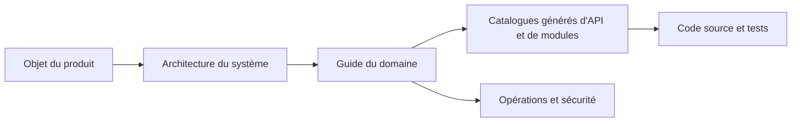

# Documentation technique Gnosi

Ce portail présente Gnosi, de l'intention du produit à son implémentation dans le code source. Il s'adresse aux ingénieurs qui doivent exploiter, examiner, étendre ou auditer le système sans dépendre de connaissances transmises oralement.

## Qu'est-ce que Gnosi

Gnosi est un espace de connaissances auto-hébergeable qui privilégie le stockage local. Les fichiers Markdown d'un vault contrôlé par l'utilisateur constituent la source de vérité durable des notes et des connaissances structurées. Un frontend React et un backend FastAPI ajoutent l'édition, les vues de type base de données, la navigation dans le graphe, les références et la lecture, les communications, l'automatisation, le travail assisté par l'IA, les intégrations et les contrôles multiutilisateurs facultatifs.

Le système propose trois modes de distribution :

- Développement et exploitation natifs : uvicorn sur le port `5002` et Vite sur `5173`.
- Auto-hébergement avec Docker : backend, frontend et translation-server de Zotero.
- Paquets de bureau Electron : le frontend plus un backend local géré.

## Comment lire ce portail

Commencez par [l'objet et la portée](product/purpose-and-scope.md), puis lisez le [contexte du système](architecture/system-context.md). Sélectionnez le guide du domaine correspondant à la capacité que vous modifiez. Les catalogues générés permettent de parcourir les routes, modules, noms de variables d'environnement, tests et compétences.

## Modèle de preuve

Lorsque les sources divergent, la documentation applique cet ordre de priorité :

1. Code source exécutable et schémas d'exécution.
2. Tests démontrant un comportement observable.
3. Définitions actuelles de déploiement et de configuration.
4. Directives actives en matière d'ingénierie.
5. Historique Git pour les motivations et la chronologie.

Les pages révisées expliquent les responsabilités et les décisions. Les pages générées décrivent ce qui est présent statiquement. Ni les unes ni les autres ne remplacent l'exécution des tests et des parcours pertinents.

## Index de l'implémentation actuelle

- [Inventaire du dépôt](generated/repository-inventory.md)
- [Opérations FastAPI](generated/api-catalog.md)
- [Modules du backend](generated/backend-modules.md)
- [Routes et composants du frontend](generated/frontend-catalog.md)
- [Tables et colonnes relationnelles](generated/data-model.md)
- [Noms de configuration et consommateurs](generated/configuration.md)
- [Fichiers de test](generated/tests.md)
- [Compétences en cours d'exécution](generated/skills.md)
- [Couverture des domaines](generated/coverage.md)

## Règle de modification

Un changement est incomplet lorsqu'il modifie un contrat visible de l'extérieur, une frontière architecturale, un invariant, une clé de configuration, une procédure opérationnelle ou un mode de défaillance sans actualiser le guide révisé correspondant et régénérer les catalogues de référence.
