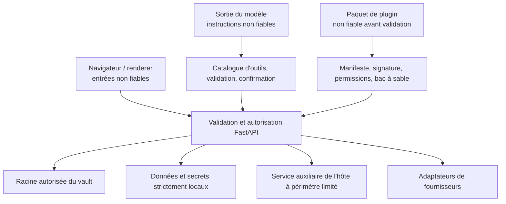

# Modèle de confiance

## Actifs protégés

- Pages du vault, pièces jointes, métadonnées internes, historiques et corbeille.
- Identités des utilisateurs, appartenances, rôles, droits d'accès aux vaults, hachages des PAT et partages.
- Jetons de rafraîchissement OAuth, identifiants du courrier, clés IA, clés de signature et secrets des plugins.
- Bases locales, index, points de contrôle des agents, journaux et actions planifiées.
- Système de fichiers de l'hôte et applications de bureau accessibles via les API auxiliaires.
- Comptes externes pouvant envoyer, publier, supprimer ou modifier des données distantes.

## Frontières de confiance

Les entrées du navigateur, sorties des modèles, fichiers importés, HTML distant, réponses des fournisseurs, paquets de plugins et descriptions MCP sont non fiables. La connexion d'un utilisateur ne rend pas sûrs les chemins, le HTML, les arguments d'outils ou les identifiants d'espaces de travail.

## Authentification et autorisation

Les sessions JWT utilisent un cookie HttpOnly ; les mécanismes bearer prennent en charge les clients API. La sûreté du secret de signature est vérifiée au démarrage pour les déploiements exposés. Les mots de passe sont hachés ; les PAT ne sont jamais persistés en clair.

L'autorisation combine l'identité effective, l'appartenance à un espace de travail, le rôle hiérarchisé, le droit d'accès au vault et l'opération. Les dépendances des routes imposent les exigences générales ; les services répètent les contrôles de confinement et de propriété lorsque la ressource détermine elle-même le périmètre.

## Confinement du système de fichiers

Les chemins sont résolus avant comparaison et vérifiés par rapport aux racines autorisées. Les téléversements, imports, exports, requêtes du lecteur, accès aux fichiers des outils générés, ouvertures natives, recherches et opérations de corbeille utilisent des frontières dédiées. Les liens symboliques, `..`, URL de fichiers, correspondances de chemins cloud et encodages en pourcentage ne doivent pas permettre de sortir de la racine autorisée.

La suppression récupérable est privilégiée. La purge permanente et la suppression physique du vault sont des opérations explicites distinctes.

## Sécurité du réseau

L'ingestion d'URL et la récupération de contexte externe utilisent une protection SSRF. Les hôtes résolus, redirections, schémas d'URL et tailles de réponse sont contraints ; les cibles privées ou link-local sont rejetées, sauf si l'endpoint relève d'une intégration de confiance spécifique. Le HTML distant est assaini avant rendu ou conversion.

Les clients des fournisseurs utilisent des délais d'expiration et un nombre limité de nouvelles tentatives. Les erreurs affichées dans le navigateur excluent les identifiants secrets et les chemins internes détaillés.

## Sécurité des IA et des outils

La sortie du modèle reste une donnée jusqu'à l'acceptation d'un appel d'outil validé. L'origine, le schéma, l'effet, la compatibilité avec les compétences et la politique de confirmation de l'outil sont catalogués. Les outils générés passent une validation du code source et ne peuvent accéder aux variables d'environnement, effectuer des imports arbitraires, écrire sans restriction dans le système de fichiers ou utiliser une introspection dangereuse.

Un enregistrement de confirmation lie les arguments exacts et possède une expiration. Il n'est pas réutilisé après modification, changement d'utilisateur ou de session, ou expiration du délai.

## Cycle de vie des secrets

Les secrets sont stockés dans le magasin d'identifiants du système ou dans le répertoire de secrets des données locales. Les variables d'environnement restent prises en charge pour l'amorçage du déploiement et les migrations historiques. Les réponses API masquent l'état des secrets ; la documentation répertorie les noms et leurs consommateurs, mais masque les valeurs par défaut.

Les secrets ne doivent figurer ni dans Git, ni dans le vault Markdown, la documentation générée, les captures d'écran, les journaux, les jeux de test ou les paquets de plugins partagés.

## Principales protections contre les menaces

| Menace | Principales protections |
| --- | --- |
| Accès aux données d'un autre espace de travail | Dépendance d'authentification, vérification des appartenances, contexte du vault, contrôles de propriété dans les services. |
| Sortie du périmètre par traversée de chemins ou liens symboliques | Résolution canonique, racines autorisées, correspondance des chemins des fournisseurs, tests de confinement. |
| XSS depuis du courrier, du web ou du contenu importé | Assainissement HTML, échappement React, ressources du lecteur contraintes. |
| SSRF | Validation des schémas d'URL, hôtes et IP, vérification des redirections, limites de taille et de durée. |
| Divulgation d'identifiants secrets | Stockage local des secrets, masquage, erreurs génériques, discipline de journalisation. |
| Action non souhaitée de l'agent | Liste d'outils autorisés, classification des effets, validation des arguments, confirmations. |
| Plugin malveillant | Vérification du manifeste et de la signature, permissions, racine d'installation confinée, bac à sable, délai d'expiration. |
| Paquet malveillant du catalogue | Index signé, somme de contrôle, signature de l'éditeur, extraction bornée en zone temporaire, publication atomique. |
| Fuite de données privées via un modèle de vault | Liste d'export autorisée, exclusions strictes, détection de secrets potentiels, aperçu, confirmation, soumission par administrateur. |
| Écrasement par une version obsolète | ETags, révisions de schémas, écritures atomiques, réponses de conflit. |
| Corruption SQLite | Stockage local seulement; pas de synchronisation du cloud. |

## Vérification de la sécurité

Les changements sensibles à la sécurité exigent les tests d'authentification centrale, d'espaces de travail, de PAT, de partage, de confinement des chemins, de XSS, de SSRF, d'outils générés, de bac à sable des plugins et de concurrence. Lorsque les interfaces publiques changent, la QA dans le navigateur utilise une session authentifiée et un contexte anonyme vierge.
