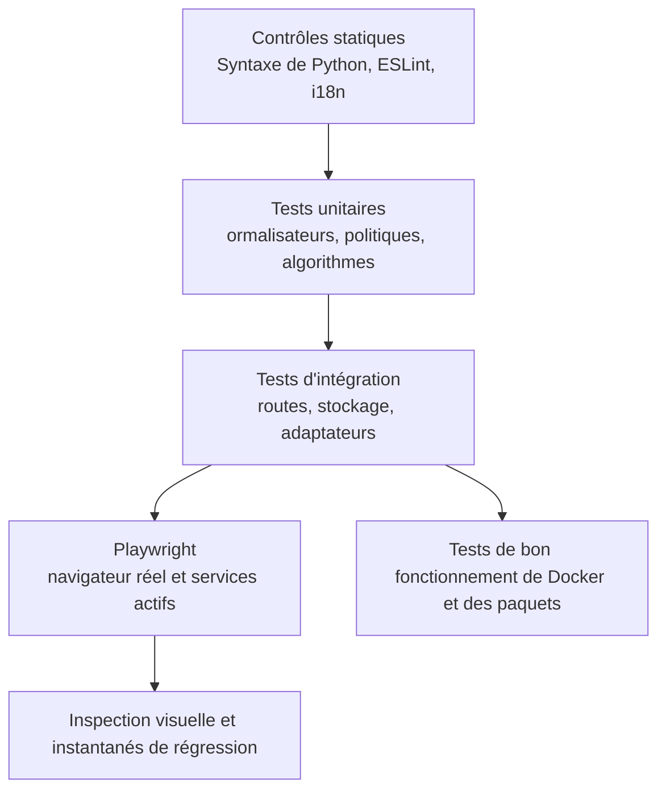

# Stratégie de test

## Niveaux de vérification de la qualité

Aucun niveau ne suffit à lui seul. Un build du frontend détecte les erreurs d'import et de syntaxe, mais pas une interaction défaillante. Un test unitaire de route ne prouve pas l'intégration dans le navigateur. Une capture d'écran ne prouve ni la persistance ni l'autorisation.

## Vérification unifiée des types

Exécuter `pnpm typecheck` à la racine du dépôt. La commande vérifie, dans cet
ordre, TypeScript du frontend, mypy strict sur tout le backend (hors tests),
mypy strict sur tous les fichiers Python publics indexés du pipeline, puis
la syntaxe Python de backend, pipeline, scripts et extensions. Chaque échec
interrompt les étapes suivantes et conserve son code de sortie.

Les commandes individuelles `typecheck:backend-boundaries` et
`typecheck:pipeline` restent disponibles. Cette vérification statique ne remplace
ni lint, ni tests unitaires, ni builds, ni parcours navigateur, ni validation
du déploiement. Sa réussite ne prouve pas la suppression de toutes les
frontières avec `Any` explicite. La régression vérifie les périmètres complets
et utilise des exécutables simulés isolés sous POSIX pour contrôler l'ordre
et la propagation des erreurs ; elle ne prouve pas l'exécution sous Windows.

## Tests du backend

Pytest couvre les services, les dépendances des routes, la normalisation, le stockage, la sécurité, la concurrence et les régressions. Les tests utilisent des répertoires temporaires de vaults et de données locales. Les fournisseurs externes sont simulés sauf si le test est explicitement marqué live/E2E.

Les suites importantes comprennent:

- Authentification, PAT, amorçage des workspaces, rôles et interfaces publiques.
- Confinement des chemins, écritures sûres, ETags, concurrence, registre et fichiers auxiliaires.
- Formules, rollups, filtres typés, relations, planification de projets et tâches planifiées.
- MIME/CID du courrier, fusion des contacts et vCard, confinement du calendrier et rappels.
- Routage IA, compétences, résilience MCP, confirmations et outils générés.
- Plugins, importations, citations, normalisation du lecteur, XSS et SSRF.

## Tests du frontend

Vitest couvre les composants, hooks, registres, utilitaires de formatage, logique typée des vues et comportement de l'état. ESLint et le build Vite de production sont obligatoires. `check:i18n` vérifie la présence de chaque clé référencée visible par l'utilisateur dans tous les catalogues linguistiques.

La compilation doit se terminer par zéro erreur. Les avertissements existants ne sont pas la permission d'ajouter de nouveaux avertissements sans examen.

Les frontières de propriété sont vérifiées par `gnosi/feature-boundaries`
dans ESLint. L'extension révisée prévoit un manifeste d'entrées publiques exactes
dans `frontend/feature-public-entries.json`, avec une justification par chemin.
Les consommateurs externes à une feature utilisent sa racine/`index` ou une
entrée explicitement révisée ; les fichiers voisins non répertoriés restent
privés. Vérifier imports statiques, réexports, imports différés littéraux et
imports de types TypeScript. Le manifeste ne doit pas créer d'agrégateur chargé
au démarrage ni modifier les frontières de chargement différé.

Les règles `shared` → aucune feature/`app` et features → aucun `app` sont
inconditionnelles, y compris pour les types et les entrées du manifeste.
Les modules internes d'une feature peuvent utiliser des imports locaux.
Les contrats globaux du code résident dans `frontend/tests/contracts/` ;
le guardrail complète le lint AST. Vérifier l'implémentation après le déplacement ;
cette documentation ne prouve pas la réussite de la vérification globale.

Sur les machines aux ressources limitées, exécutez les contrôles de build et de
typage coûteux en CPU séparément de la suite complète utilisant le DOM réel.
Si des traitements parallèles provoquent des dépassements de délai, relancez
la suite concernée isolément, puis la suite complète avec un nombre borné de
workers, par exemple `pnpm --filter @gnosi/frontend exec vitest run
--maxWorkers=2 --minWorkers=2`. Conservez les assertions et les délais des tests ;
la réussite isolée ne prouve pas que toute la suite passe.

## Limites de taille de production

Le build frontend exécute `scripts/check-bundle-size.ts` après Vite. Les limites
fixes en octets JavaScript non compressés sont : fichier d'entrée 1 400 000 ;
plus gros fragment 1 800 000 ; editor vendor 1 550 000 ; tldraw vendor
1 350 000 ; route des paramètres 600 000. L'absence ou la duplication d'un
fragment contrôlé fait échouer la vérification. Les tests couvrent les URL
relatives, à la racine et préfixées, la croissance et les fragments absents.
La taille du fichier d'entrée ne mesure ni le graphe initial complet des
dépendances, ni le transfert compressé, ni le temps de démarrage. L'avertissement
existant de Vite à 1 500 kB reste visible ; ces limites empêchent la croissance
sans prouver que les performances sont optimales.

## Tests de bout en bout et visuels

Playwright s'exécute comme projet sur l'hôte contre l'application native. Une préparation anonyme couvre le démarrage et le comportement public ; la préparation authentifiée couvre les fonctions du workspace. Les tests des domaines exercent le vault, le tableau de bord, le courrier, le calendrier, les contacts, les dessins, l'automatisation, le chat de l'agent et la navigation.

Les instantanés visuels couvrent des pages représentatives sur ordinateur et mobile. Pour une modification d'interface, inspectez la page réellement rendue, cliquez sur le contrôle modifié, surveillez la console et prenez une capture d'écran. Vérifiez que les fenêtres modales, superpositions, notifications et menus utilisent le système de z-index enregistré et ne bloquent pas les interactions.

## Contrôle bloquant d'accessibilité

Le projet Playwright `accessibility` est un contrôle bloquant WCAG 2.2 AA. Il
exécute axe sur douze itinéraires sélectionnés du produit dans
les thèmes clair et sombre, y compris le contraste des couleurs, les étiquettes,
les régions et les relations ARIA. Le balisage propre à l’application reste
toujours dans l’audit, sans liste permanente d'exceptions aux violations.
Les données de test déterministes activent les modules
optionnels de la matrice d’itinéraires, et chaque itinéraire échoue également
en cas d’erreur de page non gérée dans le navigateur ; une surface défaillante
ne peut pas réussir axe.

Avant l’analyse, chaque cas exige l’URL canonique attendue et une surface
visible propre à la fonctionnalité, sans squelette de chargement ni message
d’extension désactivée. Il ne recharge pas la page pour retenter un démarrage
échoué. Le test du lien d’évitement vérifie sa bordure visible de deux pixels
et son soulignement au clavier ; la navigation vers le graphe suit le lien du
vault. Les captures multimédia et du centre de contrôle conservent les preuves
de contraste clair/sombre. Un résultat positif couvre ces cas et états, pas
toutes les interactions, technologies d’assistance, données personnelles ni
la conformité WCAG complète.

Les assertions d'interaction complètent axe pour les comportements que l'analyse
statique ne prouve pas : navigation d'évitement, focus visible et ordre logique,
utilisation complète au clavier, déplacement du focus entre onglets mobiles,
Échap dans les dialogues annulables, confinement et restauration du focus,
noms accessibles et annonces de changement de route. Les changements du focus
partagé, des modales, de la navigation ou des tokens de couleur doivent réussir
ce projet avant publication.

Le style global du focus utilise l’attribut `data-focus-modality` à la racine
du document. L’activation au pointeur supprime les contours génériques ; au
clavier, des indicateurs contextuels sont appliqués : bordure existante pour
les champs, soulignement pour les liens et contour pour les contrôles sans
bordure. Les titres modifiables du Vault conservent uniquement leur curseur de
saisie. Les tests unitaires couvrent les transitions de modalité et les tests
du navigateur, le focus au pointeur et au clavier dans les thèmes clair et
sombre.

## Tests de déploiement

Actuellement, la CI Docker valide Compose et construit les images backend et
frontend ; elle ne démarre pas les conteneurs et ne vérifie ni leur état ni
leur persistance. Ces tests d'exécution restent nécessaires avant une release.
Le job frontend auto-hébergé applique le budget révisé de 4 Gio de heap Node à
l'ensemble du job afin que le lint, le contrôle des types, les tests et le build
de production partagent le même contrat de mémoire prévisible.

La CI Electron configure les paquets pour macOS arm64/x64, Linux arm64 et
Windows x64. Configurer cette matrice, réussir les tests unitaires desktop
ou vérifier une migration synthétique du profil du navigateur ne valide
ni les installateurs ni le backend figé. Chaque architecture exige des preuves
d'installation, de démarrage, de persistance et de mise à jour depuis 2.x.
Actuellement, macOS utilise des mises à jour manuelles par installateur.
Une exécution locale sous macOS ne valide pas les autres plateformes :
ne pas publier 3.0 avant la réussite de toute la matrice de release.

## Correspondance entre changements et tests

| Changement | Preuve minimale |
| --- | --- |
| Documentation révisée uniquement | Contrôle du générateur, validateur, build documentaire strict, test de bon fonctionnement du portail dans le navigateur. |
| Logique des catalogues générés | Tests unitaires du générateur, déterminisme sur deux exécutions, validateur, build documentaire strict. |
| Comportement du backend | Régression pytest ciblée et suite d'intégration concernée. |
| Comportement du frontend | Vitest lorsque possible, contrôle i18n, build de production, action dans le navigateur et capture d'écran. |
| Accessibilité ou jeton d’interface partagé | Vitest de la primitive, parité des quatre langues, matrice axe en clair et sombre, tests clavier et capture du navigateur. |
| Authentification, sécurité ou chemins | Tests négatifs et tentatives d'accès hors périmètre, pas uniquement le parcours nominal. |
| Déploiement ou dépendances | Vérification native et CI Docker ou des paquets selon le cas. |

## Catalogue des tests

Le [catalogue de tests](../generated/tests.md) généré répertorie les fichiers de tests propres au projet et les repères de navigation. La collecte par les exécuteurs de tests reste la référence pour le nombre de tests exécutables.
