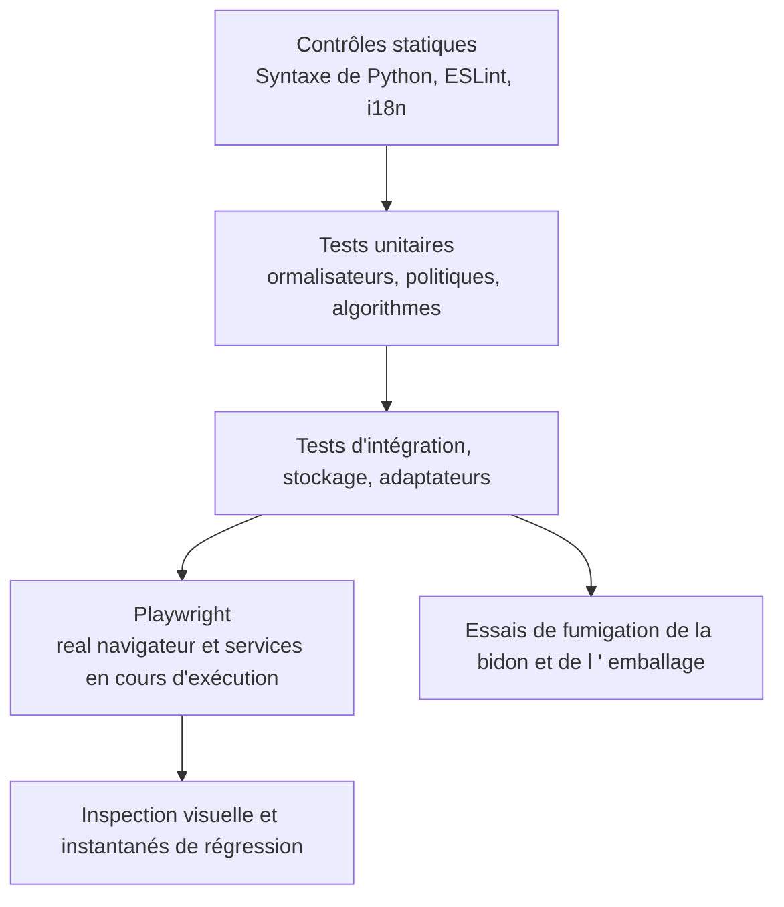

# Stratégie d'essai

## Calques de qualité

Une version de la construction de frontend capte les importations et la syntaxe mais pas une interaction rompue. Un test d'unité de route ne prouve pas l'intégration du navigateur. Une capture d'écran ne prouve pas la persistance ou l'autorisation.

## Essais de l'arrière-pays

Pytest couvre les services, les dépendances d'itinéraire, la normalisation, le stockage, la sécurité, la concurrence et les cas de régression. Les tests utilisent des coffres-forts temporaires et des répertoires de données locales. Les fournisseurs externes sont taboussés à moins qu'un test ne soit explicitement marqué comme live/E2E.

Les suites importantes comprennent:

- Auth, PAT, bootstrap, rôles et surfaces publiques.
- Contenance de chemin, écrits sûrs, ETags, races, registre et comportement sidecar.
- Formules, rollups, filtres dactylographiés, relations, planification et calendrier.
- Mail MIME/CID, contacts fusion/vCard, confinement de calendrier et rappels.
- AI routage, compétences, résilience MCP, confirmations et outils générés.
- Plugins, importations, citations, normalisation du lecteur, XSS et SSRF.

## Essais frontaliers

Vitest couvre les composants, les crochets, les registres, les utilitaires de formatage, la logique de visualisation dactylographiée et le comportement d'état. `check:i18n` vérifie que les clés référencées orientées vers l'utilisateur existent dans chaque localité.

La compilation doit se terminer par zéro erreur. Les avertissements existants ne sont pas la permission d'ajouter de nouveaux avertissements sans examen.

Les frontières de propriété sont vérifiées par `gnosi/feature-boundaries`
dans ESLint. L'extension révisée prévoit un manifeste d'entrées publiques exactes
dans `frontend/feature-public-entries.json`, avec une justification par chemin.
Les consommateurs externes à une feature utilisent sa racine/`index` ou une
entrée explicitement révisée ; les fichiers voisins non répertoriés restent
privés. Vérifier imports statiques, réexports, imports différés littéraux et
imports de types TypeScript. Le manifeste ne doit pas créer d'agrégateur chargé
au démarrage ni modifier les frontières de chargement différé.

Les règles `shared` → aucune feature/`app` et features → aucun `app` sont
inconditionnelles, y compris pour les types et les entrées du manifeste.
Les modules internes d'une feature peuvent utiliser des imports locaux.
Les contrats globaux du code résident dans `frontend/tests/contracts/` ;
le guardrail complète le lint AST. Vérifier l'implémentation après le déplacement ;
cette documentation ne prouve pas la réussite de la vérification globale.

## Limites de taille de production

Le build frontend exécute `scripts/check-bundle-size.ts` après Vite. Les limites
fixes en octets JavaScript non compressés sont : fichier d'entrée 1 400 000 ;
plus gros fragment 1 800 000 ; editor vendor 1 550 000 ; tldraw vendor
1 350 000 ; route des paramètres 600 000. L'absence ou la duplication d'un
fragment contrôlé fait échouer la vérification. Les tests couvrent les URL
relatives, à la racine et préfixées, la croissance et les fragments absents.
La taille du fichier d'entrée ne mesure ni le graphe initial complet des
dépendances, ni le transfert compressé, ni le temps de démarrage. L'avertissement
existant de Vite à 1 500 kB reste visible ; ces limites empêchent la croissance
sans prouver que les performances sont optimales.

## Essais visuels de bout en bout

Playwright fonctionne comme un projet de niveau hôte contre l'application native. Une configuration anonyme couvre le démarrage et le comportement public; la configuration authentifiée couvre la fonctionnalité de l'espace de travail. Exercice de tests de domaine Vault, tableau de bord, courrier, calendrier, contacts, dessins, automatisation, chat agent et navigation.

Les instantanés visuels couvrent les pages représentatives des bureaux et des mobiles. Pour un changement d'interface, inspectez la page rendue, cliquez sur le contrôle modifié, regardez la console et prenez une capture d'écran. Confirmez que les modaux, les superpositions, les toasts et les menus utilisent le système d'index z enregistré et ne captent pas l'interaction.

## Porte d’accessibilité

Le projet Playwright `accessibility` est une porte bloquante WCAG 2.2 AA. Il
exécute axe sur un itinéraire représentatif de chaque domaine principal dans
les thèmes clair et sombre, y compris le contraste des couleurs, les étiquettes,
les régions et les relations ARIA. Le balisage propre à l’application reste
toujours dans l’audit. Les données de test déterministes activent les modules
optionnels de la matrice d’itinéraires, et chaque itinéraire échoue également
en cas d’erreur de page non gérée dans le navigateur ; une surface défaillante
ne peut pas réussir axe.

Les tests d’interaction complètent axe avec la navigation d’évitement, le focus
visible et ordonné, le clavier complet, le focus roving des onglets mobiles,
Échap dans les dialogues annulables, le focus trap et le retour du focus, les
noms accessibles et les annonces de changement d’itinéraire.

Le style global du focus utilise l’attribut `data-focus-modality` à la racine
du document. L’activation au pointeur supprime les contours génériques ; au
clavier, des indicateurs contextuels sont appliqués : bordure existante pour
les champs, soulignement pour les liens et contour pour les contrôles sans
bordure. Les titres modifiables du Vault conservent uniquement leur curseur de
saisie. Les tests unitaires couvrent les transitions de modalité et les tests
du navigateur, le focus au pointeur et au clavier dans les thèmes clair et
sombre.

## Essais de déploiement

Docker CI construit des images de backend et de frontend, valide Composer et exerce le paramètre santé avec le stockage local. Electron release CI possède des emballages multiplateformes; une compilation locale macOS ne peut pas valider les artefacts Windows et Linux.

## Cartographie de la variation aux essais

| Changement | Preuve minimale |
| --- | --- |
| Documents purement réexaminés | Contrôle du générateur, validateur, stricte construction de documents, navigateur de documents de fumée. |
| Logique générée du catalogue | Essais d'unités de générateur, déterminisme à deux commandes, validateur, construction de documents stricts. |
| Comportement du moteur | Régression des pytests étroits plus suite d'intégration affectée. |
| Comportement de la frontée | Vitest lorsque possible, i18n vérifier, construction de production, action du navigateur et capture d'écran. |
| Accessibilité ou jeton d’interface partagé | Vitest de la primitive, parité des quatre langues, matrice axe en clair et sombre, tests clavier et capture du navigateur. |
| Comportement de l'autorité/de la sécurité/de la voie | Tests négatifs et tentatives croisées, pas seulement le chemin doré. |
| Déploiement/dépendance | Vérification autochtone plus Docker ou colis IC, selon le cas. |

## Catalogue d'essai

Les [catalogue d'essai](../generated/tests.md) La collection Runner reste autorisée pour les comptes de tests exécutables.
