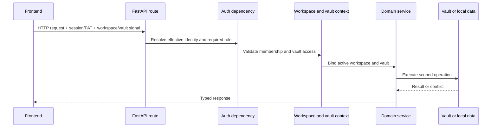

# Cross-cutting flows

## Request context and authorization

Personal mode may resolve a local effective user without a login. Organization
mode requires a valid session or accepted bearer mechanism. The backend owns
the decision; the frontend authentication gate improves UX but is not a
security boundary.

Context variables carry the active vault through nested service calls without
turning the path into a global mutable setting. Code outside a request must
provide an explicit vault or use the documented default resolution path.

## Vault-scoped routing

Private browser deep links identify the stable vault slug before the product
surface and resource: `/@{vaultSlug}/{app}/{resourceType}/{resourceId}`. App
landing pages stop after the app segment. Vault names remain editable, while
their URL slugs are persisted separately and do not change on rename. Public
shares and global account or vault-management surfaces stay outside this
namespace.

Vault data APIs mirror the same ownership boundary under
`/api/v1/vaults/{vaultSlug}/{app}/...`. `ActiveVaultMiddleware` resolves the
slug before normal FastAPI dispatch, binds the immutable vault id and path, and
then reuses the existing endpoint implementation. The canonical path wins over
a conflicting legacy header, query parameter, or cookie, but workspace and
vault-access dependencies still make the authorization decision.

Signal parsing is isolated into typed header, query and cookie helpers. The
middleware call only rewrites canonical scope, installs the context token,
dispatches, and resets it, so HTTP and WebSocket share one propagation boundary.

The frontend keeps browser-route construction separate from network transport.
Ordinary HTTP crosses one typed `openapi-fetch` client or the shared
compatibility adapter; both delegate to `transportFetch`, which adds current
workspace, user and Vault context and canonicalizes string/URL requests without
replacing `window.fetch`. TanStack Query owns server cache and invalidation at
the application provider boundary. SSE, streaming, downloads and collaboration
WebSockets use explicit specialized adapters because OpenAPI does not describe
their browser contracts completely.

The OpenAPI artifact and TypeScript operations are generated deterministically
from the canonical FastAPI application in an ephemeral runtime. A source guard
forbids Axios, direct production `fetch`, global fetch monkeypatches and
unreviewed special transports; its small reasoned allowlist covers only browser
boundaries that cannot import the application client. Stored legacy links are
still replaced with canonical browser locations, and legacy API paths remain
compatibility aliases for older clients.

## Configuration flow

1. Environment files and the OS credential store supply bootstrap values.
2. Application base YAML supplies versioned defaults.
3. Home or active-vault parameters supply persisted user configuration.
4. Environment variables override deployment-sensitive paths and policies.
5. Settings routes validate and persist supported changes.

Deleted AI providers use a tombstone so a legacy environment variable cannot
silently recreate a provider during a later config load.

## Error handling

Routes translate known domain failures into explicit status codes. A global
handler logs unexpected exceptions with an error identifier and returns a
generic response so file paths, SQL fragments, or tokens are not leaked to the
client.

Long-running optional operations report state or progress and degrade without
blocking unrelated domains. Background tasks must own their database sessions
and event-loop boundaries; request-scoped sessions cannot be reused after the
response lifecycle.

## Observability

Backend modules use standard logging. Native runtime logs are captured under
the user's Gnosi log directory by LaunchAgents. Operational notifications and
task history live in local data. Health endpoints report effective behavior,
not just raw environment values.

Logs are developer-facing and written in English. They must not contain
credentials, unredacted provider responses, or full sensitive user content.

## Internationalization

User-visible frontend strings pass through `react-i18next` and exist in all
four locale catalogs: Catalan, English, Spanish, and French. Code comments,
docstrings, developer logs, public technical documentation, and identifiers are
English unless an identifier or compatibility value is already persisted.

## Accessibility

The application shell owns the single main landmark, skip navigation, visible
focus tokens, and polite route announcements. Product domains inherit those
primitives and keep accessible names in the same four locale catalogs as visual
labels.

Cancelable modal dialogs use the shared keyboard layer so only the topmost
dialog handles Escape, Tab remains inside it, and focus returns to the opener.
Responsive tab sets expose complete tab-to-panel relationships and roving
keyboard focus. Playwright combines axe WCAG 2.2 AA scans across the product
route matrix with explicit keyboard assertions because neither layer proves the
other.

## External-effect policy

Agent tools and application actions classify effects such as read, write,
external communication, or destructive change. Role checks, scoped services,
confirmation records, and recoverable operations are applied according to the
effect. Client confirmation alone does not authorize the backend action.
