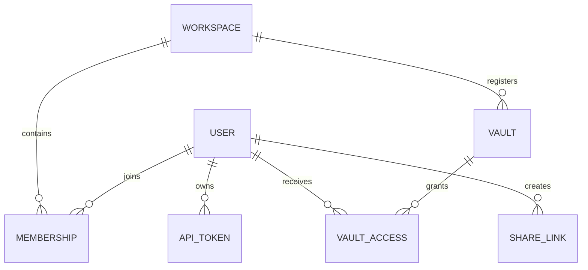

# Data and storage

## Ownership map

| Data | Durable owner | Rebuild or recovery rule |
| --- | --- | --- |
| Page content and front matter | Markdown vault | Back up and version as ordinary files. |
| Attachments and library files | Active vault | Preserve relative or portable references. |
| Internal page metadata | Vault `.gnosi` sidecars | Migrate with the page; hide implementation-only fields from authored content. |
| Page and wikilink indexes | Local data caches | Rebuild from vault; partial scans must not overwrite complete caches. |
| Users, workspaces, memberships, vault access, PATs, shares | Management SQLite | Back up as local application state; never cloud-sync the live database. |
| Mail, reader, notification, annotation, and execution indexes | Local SQLite | Domain-dependent; recover from providers or source data where possible. |
| OAuth tokens and integration secrets | Local-data secrets or OS credential store | Reconnect per machine if lost; never copy to a shared vault. |
| Agent checkpoints | Local data | Per-instance execution memory, not vault content. |

## Vault format

A page is a Markdown file with YAML front matter. Stable page identifiers allow
links and relations to survive title changes. Human-visible links use wikilink
syntax; attachments and file-valued properties use portable paths or structured
metadata rather than machine-specific absolute paths.

Database-style views are projections over pages and registries. They do not
replace Markdown with an opaque relational store. View definitions, schema
metadata, formulas, rollups, relations, and presentation state are resolved by
the vault service layer.

## Write concurrency

Page reads expose an ETag derived from the current representation. Mutating
clients return the expected ETag; mismatches reject stale writes instead of
silently overwriting a concurrent change. Atomic-write helpers replace files
only after the new representation is complete.

Rename operations depend on the wikilink index to rewrite inbound links. A
rename therefore crosses page identity, file naming, registry metadata,
sidecars, and link indexes and must be treated as a coordinated operation.

## Management database

SQLAlchemy models represent:

The engine is initialized lazily and guarded against concurrent first access.
`Base.metadata.create_all` creates missing tables. There is no general migration
framework: a small idempotent startup pass adds explicitly registered columns
and applies narrowly scoped backfills. New non-additive schema evolution needs
a dedicated migration design.

Only PAT hashes and a recognizable prefix are persisted. Public share tokens
are opaque identifiers whose rows retain creator, vault, permission, expiry, and
revocation state.

## Local-data isolation

`GNOSI_DATA_DIR` points to the per-instance root. The path resolver creates
cache, system, checkpoint, log, audio, output, backup, and secret directories.
Docker maps this to `/data`; native defaults follow the operating system's
application-data convention. `GNOSI_LOCAL_DATA` remains a deprecated 3.x alias.

SQLite files must not be placed on OneDrive, iCloud Drive, Dropbox, or another
file-sync layer. File synchronization does not provide SQLite locking semantics
and can corrupt or fork the database.

## Cloud-backed vaults

File-provider adapters separate ordinary filesystem behavior from hydration
and availability. Reads catch transient per-file errors and continue when a
partial response is meaningful. A partial scan is marked and must never be
saved as a complete cache. Native OneDrive hydration uses a GUI-session helper
because a LaunchAgent process may receive `EDEADLK` for online-only content.

## Configuration ownership

Configuration is deep-merged from base parameters and the applicable user or
active-vault `.gnosi/params.yaml`. Environment values override deployment paths
and a small set of bootstrap behavior. Credentials are references into local
secret storage, not raw values embedded in the vault configuration.

Process variables have priority over Gnosi's local `.env`. A shared environment
file is loaded only when `GNOSI_SHARED_ENV_FILE` explicitly names it and remains
read-only to the application. UI-managed credentials use the operating-system
credential store, with an encrypted fallback under `GNOSI_DATA_DIR/secrets`.
