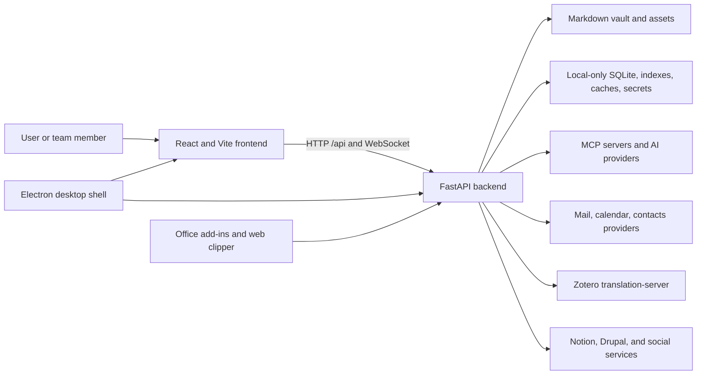

# System context

## Container view

## Frontend boundary

The frontend is a React single-page application. `app/App.tsx` owns the
authentication gate and global shell; `app/routes.tsx` composes routes, Vault
scope, redirects and lazy page imports while Home remains eager.
`app/bootstrap.tsx` prepares routing and language;
`app/AppProviders.tsx` preserves the StrictMode → API → router → authentication
provider order. The relocation places the CSS entry and bootstrap call in
`app/main.tsx`, with ordered styles in `app/styles/index.css`.
Vite proxies `/api` and WebSocket traffic during native development.

### Module ownership

The reviewed relocation assigns composition, navigation and global integration
to `app/`; product domains to `features/`; reusable infrastructure, UI,
records, routing and API adapters to `shared/`; and generated contracts to
`generated/`. Generated contracts are regenerated, never edited by hand.
The authentication provider belongs to `features/auth/context/AuthProvider.tsx`,
while its reusable context belongs to `shared/auth/auth-context.ts`.

The `frontend/feature-public-entries.json` manifest records exact reviewed
public paths and their reasons. Existing feature root `index` entries remain
supported; an unlisted neighboring module stays private. Consumers use a root
entry or an explicitly reviewed entry directly, including separate lazy imports,
without introducing an eager aggregate barrel. The manifest describes access;
it does not import modules.

Dependencies may flow from `app` to features and shared infrastructure.
Features never depend on `app`; `shared` never depends on features or
`app`, including type-only imports. Moving the existing Markdown/wikilink
preview code inside shared infrastructure does not resolve its internal cycle.
The relocation must preserve lazy boundaries, styles, routes and payloads;
the layout alone is not evidence of completed integration or release.

Components call the backend through typed API adapters in `shared/api/`.
The backend remains responsible for authorizing users, workspaces, vaults and
destructive operations.

## Backend boundary

`backend/server.py` creates the FastAPI application and registers domain
routers. Route modules translate HTTP contracts into service calls. Business
logic belongs in `backend/services/`; persisted relational entities live in
`backend/models/`; AI orchestration lives in `backend/agent/`; scheduled work
lives in `backend/scheduler/` and runtime skills.

The application lifespan starts shared infrastructure, constructs agent
capabilities, warms safe indexes, starts mail IDLE workers, and later closes
those resources. Optional integration startup is isolated so one unavailable
provider does not abort the whole server.

## Storage boundaries

The vault and local data have deliberately different durability and
synchronization properties:

- Vault: portable user content; may live on local disk or a cloud-backed file
  provider.
- Local data: SQLite, indexes, caches, secrets, logs, checkpoints, and outputs;
  never cloud-synchronized.
- Configuration: merged from application defaults, user or vault parameters,
  environment overrides, and local credential stores.

See [data and storage](data-and-storage.md) for ownership and rebuild rules.

## External systems

All external services are optional domain dependencies. OAuth and credentials
are managed locally. Adapters normalize provider-specific behavior for Google,
Microsoft, IMAP/SMTP, CalDAV, Notion, Drupal, AI providers, social networks,
file providers, and Zotero translation.

## Navigation to implementation

- [API catalog](../generated/api-catalog.md)
- [Frontend catalog](../generated/frontend-catalog.md)
- [Backend module catalog](../generated/backend-modules.md)
- [Configuration catalog](../generated/configuration.md)
