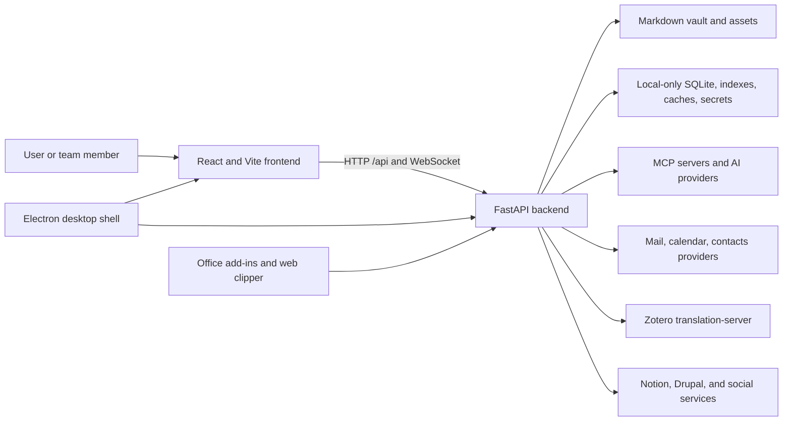

# System context

## Container view

## Frontend boundary

The frontend is a React single-page application. `app/App.tsx` owns the
authentication gate, global shell, toasts and optional global surfaces.
`app/routes.tsx` owns browser routes, Vault scope, redirects, loading fallbacks
and lazy page imports; Home remains eager. `app/bootstrap.tsx` prepares the
Vault cookie/routing, canonical URL and interface language before rendering.
`app/AppProviders.tsx` preserves the StrictMode → API → router → authentication
provider order. `main.tsx` imports the ordered CSS entry and starts bootstrap.
Vite proxies `/api` and WebSocket traffic to the backend during native development.

The application navigation rail and command palette live in `app/navigation/`;
global file-link interception lives in `app/integration/`. Reusable headers,
layout, loading state, tooltips, and generic hooks live under `shared/`, so route
features never import application composition. Login and meeting surfaces expose
feature public entries while preserving the original authentication and lazy gates.

Pages compose reusable components; components call the backend through shared
typed, domain-specific API adapters; direct transports stay inside reviewed
shared boundaries. The frontend is not trusted to authorize a
workspace, vault, user, or destructive operation. Client identifiers are
signals that the backend resolves and validates.

## Backend boundary

`backend/server.py` creates the FastAPI application and registers domain
routers. Route modules translate HTTP contracts into service calls. Business
logic belongs in `backend/services/`; persisted relational entities live in
`backend/models/`; AI orchestration lives in `backend/agent/`; scheduled work
lives in `backend/scheduler/` and runtime skills.

The application lifespan starts shared infrastructure, constructs agent
capabilities, warms safe indexes, starts mail IDLE workers, and later closes
those resources. Optional integration startup is isolated so one unavailable
provider does not abort the whole server.

## Storage boundaries

The vault and local data have deliberately different durability and
synchronization properties:

- Vault: portable user content; may live on local disk or a cloud-backed file
  provider.
- Local data: SQLite, indexes, caches, secrets, logs, checkpoints, and outputs;
  never cloud-synchronized.
- Configuration: merged from application defaults, user or vault parameters,
  environment overrides, and local credential stores.

See [data and storage](data-and-storage.md) for ownership and rebuild rules.

## External systems

All external services are optional domain dependencies. OAuth and credentials
are managed locally. Adapters normalize provider-specific behavior for Google,
Microsoft, IMAP/SMTP, CalDAV, Notion, Drupal, AI providers, social networks,
file providers, and Zotero translation.

## Navigation to implementation

- [API catalog](../generated/api-catalog.md)
- [Frontend catalog](../generated/frontend-catalog.md)
- [Backend module catalog](../generated/backend-modules.md)
- [Configuration catalog](../generated/configuration.md)
