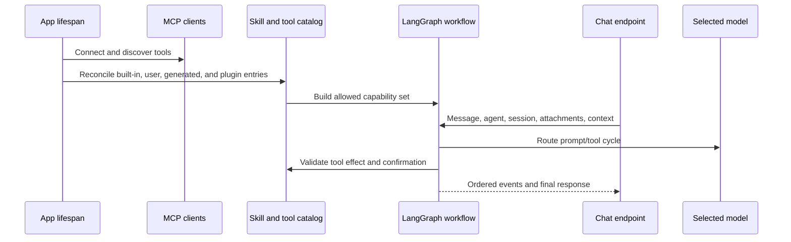

# AI agents, models, tools, and skills

## Capability model

Gnosi separates models, agents, skills, and tools:

- Model: a provider route with capabilities, limits, cost metadata, reliability,
  and credentials.
- Agent: instructions, model selection, memory/checkpoint policy, and assigned
  skills.
- Skill: a documented capability package that contributes instructions and
  constrains compatible tools.
- Tool: a callable operation classified by effect and origin.
- Context source: user-selected Vault, table, file, or external material added
  to a conversation with explicit containment and size behavior.

The Artificial Analysis feed is a typed, server-side comparison boundary. It
keeps API credentials private, validates every paginated response, enriches only
missing catalog metadata, preserves verified cached metrics, and falls back to
stale cache or models.dev with explicit provenance.

## Startup and request flow

Legacy Agent imports remain available through narrow compatibility facades,
while the domain package owns context matching and storage, first-party tool
dispatch, evidence and citation contracts, stream state, confirmations,
sessions, and route composition. Agent catalog and governance routes use the
same pattern under the configuration domain, preserving route order and
operation identifiers.

The model router resolves provider/model combinations, context limits, tool
support, spend caps, and fallback policy. Credentials are obtained from local
secret storage or supported environment migration, not exposed to the
frontend. Failure reasons are recorded separately from user-facing responses so
operators can distinguish timeout, provider rejection, invalid credentials,
context overflow, and tool incompatibility.

Runtime model selection belongs to the agent profile. `pinned` uses only the
assigned provider/model, `resilient` starts there and permits failover only on a
transient error, and `adaptive` may choose from the primary plus the profile's
explicit allowlist. Every alternative must be an enabled registry row with the
same local/remote locality; credentials and catalog defaults never expand the
allowlist. Authentication, policy, and content errors never cause failover.
The selected fallback is marked in message metadata and in the stream receipt,
so a local model cannot unexpectedly send private context to a remote provider.

## Tool governance

Tool descriptors declare read/write/external/destructive effects. Generated
tools pass AST-based validation and execute in a restricted environment. The
validator blocks dangerous capabilities such as unrestricted file writes,
environment access, dynamic dunder traversal, and unsafe imports.

Actions requiring confirmation create durable pending records. Confirmation
binds the user, session, tool, arguments, effect, and expiry; accepting a stale
or altered action does not authorize a different invocation. Maintenance
expires and removes records independently of chat traffic.

## Skills and plugins

Built-in runtime skills live in `pipeline/skills/`. User and plugin packages are
validated into a catalog while preserving origin, activation, compatibility,
and managed-versus-user-owned fields. Plugin reconciliation is idempotent:
disabling a plugin suspends its managed contribution without deleting user
overrides.

## Context and memory

Conversation state is scoped by agent and session. UI message ordering uses
stable identifiers rather than arrival time alone. Attachments and context
sources validate paths, size, file type, and workspace/vault scope. Large
external sources use searchable representations instead of injecting unlimited
raw text into every turn.

The durable checkpoint remains the complete audit record, but provider prompts
use a bounded projection. Earlier user and final assistant messages remain as
conversation memory, while historical tool-call groups and raw tool payloads
are omitted. The current turn retains complete call/result protocol groups, and
the aggregate conversational projection has a hard character ceiling even when
the selected model advertises a much larger context window.

Reviewed personal memory is a separate, explicit local store scoped by Vault
and agent. Users can create, edit, disable, expire, and delete revisioned facts
or preferences in Settings. Retrieval is lexical and bounded to five items;
the prompt labels the result as data that cannot change policy, tools, or
authorization. Conversation checkpoints and vocabulary associations retain
their separate lifecycles.

Vault navigation contributes turn-scoped page, table, and active-view context.
The server expands a dashboard with one embedded view to the canonical table
view, reapplies its filters and sorting, and exposes an exact bounded row query
with count and pagination. Exact page and table reads are server-authored tool
calls; after a complete result, synthesis runs without tool bindings so a
tool-eager model cannot repeat the call until the graph recursion limit.

The canonical self-authored Resources request is also server-routed. Gnosi
executes the saved authorship view exactly once and formats its count and
bounded record list directly from the governed result. This path performs no
model call after the tool succeeds. Requests requiring interpretation or
generation continue through normal model synthesis.

The same deterministic contract now applies to arbitrary attached-Vault
inventories rather than individual topics or tables. Before tool selection, the
server classifies the operation as conversation, lookup, inventory, analysis,
or governed action. Inventory requests receive an exhaustive structured scan
with exact count, canonical record ids, live registry type resolution, type
grouping, selected provenance metadata, and offset pagination. The subject is
query data: adding a topic or a new table does not add an intent branch. The
first page and continuation pages are formatted directly from the governed
tool result without a model call.

The request mode also prevents the default Knowledge attachment from hijacking
unrelated work. Conversation mode performs no source read and binds no passive
tools. Explicit mail, calendar, contacts, Reader, weather, web, Notion, or
Zotero requests omit default Vault tools unless the same request also names a
Vault object; the relevant assigned skill remains available.

Every request now carries an effective universal turn plan into the graph. The
plan combines operation mode, explicit data domains, live runtime descriptors,
required evidence, guarded grants, provider locality, execution strategy, and
response strategy. It is request-scoped state that overwrites checkpoint data
from previous turns. The Brain node intersects normal runtime selection with
the plan's tool names, so the metadata shown to the user describes the actual
tool surface rather than an advisory classifier.

Privacy is also request-scoped. The plan distinguishes local processing,
private evidence processed by the configured remote model, external reads, and
ordinary conversation. Attached Vault data does not count as used when an
explicit Mail, Reader, Notion, web, or other domain excludes its tools. The UI
reports only this posture and source counts; source bodies, prompts, secrets,
and hidden reasoning never enter transparency metadata.

Final model responses pass through a deterministic verifier. It checks only
current-turn tool results and effect policy, blocks claims that a governed
action completed without a successful tool result, blocks source-dependent
answers that skipped mandatory evidence, records tool failures as limitations,
and emits evidence/tool counts. Inventory answers use the same verifier even
though their text is server-rendered. Verification never invokes a second
model.

Source-dependent responses also carry server-validated claim citations. Tool
results define the only source ids valid for the current turn. Deterministic
inventories map each listed line to its canonical Vault record and map aggregate
count, grouping, pagination, and method statements to the exact tool-result
manifest. Model synthesis may emit `[[cite:SOURCE_ID]]` markers; the verifier
removes valid markers from visible prose, rejects ids absent from current-turn
evidence, and marks incomplete grounding as a limitation. The chat renders the
bounded claim/source mapping with safe Vault, Reader, or HTTP(S) links and never
persists excerpts or filesystem paths as citation metadata.
Every cited source also carries a short version fingerprint derived from its
revision, etag, update timestamp, or exact current-turn tool manifest. The UI
distinguishes exact from identity-only versions without exposing source bodies
or connector secrets.

Vault search uses a deterministic hybrid rank: expanded multilingual lexical
terms, exact-title boosts, index-role boosts, and the rebuildable vector score.
Results are cached briefly by Brain/query/k only; the cache is bounded and does
not retain prompts or unbounded source bodies. Returned excerpts are delimited
as untrusted evidence and injection-like instructions are flagged; the Brain
prompt treats every source, connector, attachment, and web result as data rather
than an instruction.

Exhaustive inventories reuse the locally persisted parsed-document and link
indexes. Relation ids are expanded to indexed target titles, so a record linked
to a matching project or source remains discoverable without reopening every
OneDrive document. Normal Gnosi writes update these indexes; periodic index
maintenance reconciles external edits. Records absent from the cache fall back
to a direct bounded read. Semantic top-k search remains the evidence-discovery
path for lookups and analyses and is never presented as a complete inventory.

Inventory payloads also report link-index build age, cache coverage, direct
fallback reads, and stale-while-revalidate state. A stale or missing index
requests a guarded background reconciliation without delaying the answer; the
message retains the limitation instead of implying that the index was freshly
rebuilt.

Whole-collection Reader analysis is admitted as a background operation through
the provider-neutral capability-job facade. The server creates the job tool
call deterministically, returns a namespaced `reader:` job id, and exposes
status, result availability, resume after failure or interruption, and
cooperative cancellation in message details. The same
facade remains extensible to other source-owned durable providers; unsupported
requests stay foreground and are never represented as durable work.
Providers and queue dispatchers register versioned contracts declaring job
kind, idempotency, lease, attempt and model-call budgets, result, resume, and
cancellation behavior. Unknown job types fail visibly instead of entering a
hard-coded worker branch.

Reader jobs persist a bounded recovery policy beside their checkpoints. A
transient timeout, temporary network/service failure, or rate limit enters a
cancelable retry-wait state with capped exponential backoff. Attempts and model
calls consume separate persisted budgets before any new call is made. A daemon
timer handles normal in-process retries; job list/status reconciliation starts
an overdue retry after a backend restart. Permanent, cancelled, malformed, or
budget-exhausted failures remain terminal and visible. Manual resume uses the
same budgets and therefore cannot bypass the loop boundary.

Other read-only turns have an independent three-result budget: if the model
keeps requesting tools, the next Brain invocation receives the accumulated
evidence without tool bindings and must synthesize the response. The graph
recursion ceiling therefore remains a final safety net rather than normal flow
control.

The universal plan also carries an immutable operational budget for every turn:
the HTTP timeout, maximum model calls, maximum tool calls, and maximum read
results. Conversation turns receive a short no-tool budget; lookup and
inventory turns receive bounded read budgets; analysis and governed actions
receive a larger but finite budget. The graph enforces these values before the
next provider or tool invocation, and the stream exposes the same values and
whether a limit was reached. A zero tool budget is a mode declaration, not an
authorization bypass: mandatory server-authored context reads still follow
their explicit path. Dynamic context tools are not selected for a general
question unless the user actually supplied a context source.

The ToolNode retains the complete active-skill runtime for execution and policy
checks, while each model invocation binds only passive read tools plus guarded
tools explicitly authorized by the current request. Legacy automatic profiles
also narrow passive reads to multilingual request-domain matches and an exact
required context operation, with a bounded maximum; explicitly scoped skills
retain their already-small assigned read surface. Mandatory context reads bind
only the required source tool for their first step. This per-turn binding is
derived from request state and is never reused as cached authorization.

The chat measures each response from request dispatch through stream
completion. A live whole-second counter is replaced by the saved elapsed time
on the completed response. The stream also reports server setup, routing,
tool, model, residual, and total durations together with model/tool call and
token counts; message details retain this bounded diagnostic breakdown. Every
visible message also exposes conversation
rewind: after confirmation, the server truncates the scoped canonical
checkpoint at the complete turn boundary and returns its public projection.
Rewind changes conversation memory only; completed confirmations and external
side effects are never presented as reversed.

During execution the stream emits a bounded phase marker for routing, model
generation, or tool execution. The chat shows the active phase beside the
elapsed seconds counter and resets it when the turn ends. Stable transient
failure codes (`agent_loop_exhausted`, timeout, service-unavailable, and rate
limit variants) include advisory recovery metadata. The client offers one
deliberate retry of the original request after user review; the server never
replays a failed turn automatically because a governed action may already have
been prepared. Permanent configuration or authorization errors instead invite
editing the request or runtime settings.

The stream owns an opaque cancellation token. The explicit Cancel action calls
an authenticated stream-scoped endpoint and reaches the asynchronous provider
cancellation bridge. An accidental browser or proxy disconnect does not cancel
the accepted bounded turn: an independent producer continues and its events
remain resumable. Cached workflows do not capture request-specific events, and
tokens are released after the producer completes. Provider failures use a bounded
process-local circuit breaker keyed by provider/model, while authentication and
policy errors remain terminal. Tool descriptors additionally expose a cheap
 health status (healthy, unavailable, or temporarily quarantined) so missing ids,
 names, handlers, and repeatedly failing adapters cannot be advertised as runnable
 capabilities. Two failures inside the bounded health window quarantine a tool
 briefly; a successful later call clears the consecutive-failure record.

The newline-delimited transport is wrapped in protocol version 1. Each event carries an
opaque stream id, event id, monotonic sequence, trace id, and optional turn id. A pending
provider operation remains alive while a heartbeat is emitted, so a slow but healthy
provider is not cancelled by transport keep-alive. The client ignores duplicate sequence
numbers. Events are encrypted in a scope-bound local journal for at most one
hour, and the browser resumes from its last sequence for the full turn timeout.
Replay repeats no model/tool call or governed action; it reapplies the original
event envelope only.

Long prompts retain the complete checkpoint as an audit record but add a bounded
deterministic digest of dropped human/assistant turns to the provider projection.
The digest contains short excerpts and opaque hashes only; raw tool payloads and
unbounded source bodies are never carried forward.

Every streamed turn receives an opaque `trace_id` propagated through planning,
model selection, runtime health, messages, errors, metrics, and completion
events. This gives distributed logs and the UI one correlation key without
persisting prompts, credentials, or source text. MCP readiness is cached briefly
per server, and provider/connector snapshots are included in the runtime receipt.

Brain retrieval combines the rebuildable vector score with accent-normalized,
multilingual lexical expansion, title/index boosts, bounded caching, and
injection-marked evidence. Live table/trash HTTP tests are opt-in and run in CI
against a throwaway Vault and separate port; the hermetic suite always points at
a closed port so a developer's native backend cannot be mutated accidentally.

Editable model-registry rows are hydrated from the canonical catalog before
they reach Settings or runtime routing. Partial budget/settings updates merge
with existing capability, context-window, cost, and quality metadata. Provider
or model changes invalidate cached graphs so tool support and credentials take
effect on the next turn. The chat header reports the selected model, exact tool
count, and actionable reasons for any degraded runtime.

Message details provide bounded operational explainability: mode, route,
foreground/background execution, tools actually used, evidence count, privacy
posture, verifier status, index freshness, durable job state when present, and
timings. This is an execution receipt, not chain-of-thought.

The same receipt includes a redacted semantic interpretation (operation,
confidence, concepts, and retrieval strategy), the capability broker decision
(candidate and guarded tool counts), and the checkpoint scope. Query digests,
source bodies, historical tool payloads, prompts, and hidden reasoning are
excluded from the client metadata.

Turn metrics include a provider-catalog-based USD estimate alongside token and
latency counts. The persistent spend ledger remains the source of truth; the
estimate is bounded display metadata and is never used as authorization by
itself. The deterministic evaluation suite also asserts that every plan stays
within the 120-second latency ceiling.

The deterministic corpus under `backend/agent/evals/` covers all request modes,
all four UI languages, domain containment, private local and remote processing,
governed actions, and durable Reader admission. It runs before the backend test
suite on matching pull requests and every day; any failed case exits nonzero
without calling a provider or spending tokens.

Production errors and assistant thumbs feedback feed a local, authenticated
quality loop. `POST /api/chat/feedback` accepts bounded operational metadata
only and explicitly rejects response content. Stream errors are recorded by the
server with stable codes. The local SQLite store retains hashed turn/session/
agent identities, plan and verifier fields, tool names, and timing buckets; it
has no prompt, response, source, title, path, URL, excerpt, attachment, or raw
tool-payload columns. Negative feedback and errors deterministically upsert
deduplicated synthetic evaluation candidates. Administrators list, accept,
reject, reopen, and run these candidates through `/api/ai/evals/candidates*`.
Accepted local cases remain separate from the versioned CI corpus until a
maintainer deliberately promotes them.

Administrators may also run an explicit cost-bearing real-model evaluation for
an agent's assigned primary model. It uses three synthetic multilingual/schema
prompts and stores only route identity, score, latency, token counts, and stable
failure codes. Prompts and responses are never persisted. Reviewed scores may
influence `adaptive` ordering but cannot add an allowed model or capability.

## Adaptive quality and capability discovery

Tool health survives backend restarts in a bounded local SQLite store. Each
capability retains success/failure counters, a consecutive-failure window,
temporary quarantine state, and aggregate invocation latency. Runtime catalog
construction reads these rows in one short-lived cache snapshot rather than
opening the database once per tool. A later successful invocation clears the
quarantine but retains bounded service-level totals for diagnostics.

Vault inventory retrieval fuses exact phrases, normalized lexical tokens,
conservative character similarity, metadata, cached body text, and canonical
relations while preserving an exhaustive scan of the authorized scope. Users
can add or remove reviewed vocabulary associations through
`/api/ai/semantic-associations`. The local store hashes the Vault scope and
contains only bounded term pairs and a hashed author identity; it never stores
prompts, answers, source bodies, paths, credentials, or executable text.

The final deterministic verifier now publishes a response-quality score over
visible output, required evidence, tool success, supported completion claims,
citations, inventory pagination, and contradiction handling. Structured facts
with the same record and field but incompatible current-turn values produce a
bounded conflict receipt containing provenance names but not the private values.
The visible answer receives a localized warning instead of silently merging the
facts. A provider-free response corpus complements the routing corpus and
exercises these final-answer contracts in CI.

Tool and attachment evidence is scanned for instruction override, authority
spoofing, tool coercion, and secret-exfiltration markers. Only bounded taint
categories reach response metadata; source text remains untrusted data and the
receipt always records that authorization was unchanged. The adversarial
response corpus asserts this boundary.

Each plan exposes a soft synthesis boundary before the hard turn timeout. Once
the reserve is reached and required evidence is available, Brain removes tool
bindings and synthesizes the best supported result; the stream emits a deadline
stage so the client can show that transition. If required evidence is still
missing, the evidence boundary remains authoritative rather than producing an
unsupported answer.

Capability discovery is part of the enforced turn plan. For each explicit
domain it reports a usable capability, an assigned but guarded capability, or a
missing connection/skill. Discovery cannot install software, grant permission,
or authorize a guarded action. Settings → AI → Quality displays metadata-only
turn counts, latency buckets, verification outcomes, errors, evaluation
candidates, persistent capability health, and the reversible vocabulary editor
through `/api/ai/quality/dashboard`.

Capability contracts may opt into schema version 2 through descriptor metadata.
Version 2 fails closed unless timeout, idempotency, privacy, egress, and durable
result behavior are valid. Legacy version 1 tools and skills remain visible as
legacy or partial in Settings while they migrate; conformance metadata never
makes a handler executable.

## LLM Wiki configuration

`backend/domains/configuration/llm_wiki.py` validates the Brain table, source
tables, categorical dimensions, file/URL fields, fixed values and relation
targets before any schema mutation. It then provisions the canonical roles and
source relations, revalidates eligible index fields, persists atomically and
refreshes the system pages through late-bound facade ports.
`backend/domains/configuration/llm_wiki_schema.py` separately owns idempotent
Brain-field repair and consolidation of one canonical source relation, including
legacy aliases, page metadata and contextual embedded views.
`backend/domains/configuration/llm_wiki_records.py` normalizes existing managed
notes, source labels and localized resource-index titles without owning HTTP routes.
Source extraction is split between `backend/domains/llm_wiki/documents.py` for
typed document and media adapters and `origins.py` for deterministic evidence
identity, deduplication and chunking. The historical service remains a compact
compatibility facade so notebook and plugin contracts keep their current symbols.
Processing is split further into `planning.py` for prompts, parsing and grounded
plans, `dimensions.py` for fixed/source/AI field mapping, `ingestion.py` for the
blocking workflow, and `writing.py` for idempotent persistence. `index_rendering.py` owns managed resource,
dimension and general pages, while `search_index.py` owns rebuildable JSON, FTS5
and vector indexes. `backend/services/llm_wiki.py` and
`backend/services/llm_wiki_indices.py` remain late-bound compatibility facades so
existing imports and monkeypatch/plugin seams continue to resolve at call time.

Deterministic Brain lint is split into bounded checks for orphan notes, stale
reviews, missing cross-references, duplicate provenance keys, retained managed
notes, broken evidence citations, reprocessing and resource-index drift. The
report shape and finding limits remain stable and require no model provider.

Grounded PDF citations use a separate deterministic persistence boundary. It
resolves quote geometry with one cached document handle per attachment, upserts
stable managed highlights in one transaction, preserves manual annotations and
removes only obsolete Gnosi-managed entries.

## Failure and safety invariants

- Provider failure does not silently route to a more expensive or less private
  model outside the configured policy.
- A tool unavailable to the selected model/skill cannot be invoked by name
  alone.
- Destructive or external effects require their declared policy.
- Generated code cannot access secrets or unrestricted filesystem state.
- One failed MCP server does not remove healthy servers from the catalog.
- Partial model output is not presented as a completed confirmed action.
- Source-dependent output cannot pass verification without current-turn source
  evidence.
- Citation ids cannot resolve unless the same turn returned that exact source.
- Transparency metadata cannot contain source bodies, prompts, or raw tool
  payloads.
- Automatic and manual job recovery cannot exceed persisted attempt or model-call
  budgets.
- Quality telemetry cannot accept or retain prompt/response content.
- Stale index evidence is labeled and refreshed outside the foreground turn.
- Agent messages remain isolated by agent and session across reloads.
- Adaptive routing cannot escape the selected agent's explicit model allowlist
  or local/remote trust boundary.
- Evidence taint and personal memory cannot grant tools or change authorization.

## Verification focus

Run model routing, provider deletion, reliability, timeouts, MCP retry and
resilience, skill catalog/runtime/API, generated-tool validation, context
containment, confirmation race/expiry, chat ordering, and browser chat flows.
# Universal agent runtime

Gnosi routes every turn through a bounded, provider-neutral contract. Before
capability selection, the semantic interpreter normalizes multilingual intent,
records a confidence score and can abstain when a request has no subject. The
result is included in the turn plan without storing the original prompt.

Background capabilities use the local SQLite durable queue. A job has an
idempotency key, attempt budget, lease and heartbeat; an expired lease can be
reclaimed after a process restart or when a second worker is active. Reader
analysis retains its JSON snapshots and batch checkpoints, while the queue is
the source of truth for orchestration.

Every model and tool operation emits a bounded span correlated by the turn
`trace_id`. Span attributes are allowlisted and redacted; prompts, sources,
arguments and raw provider output are never persisted as telemetry. Tool calls
also pass through argument-size validation, descriptor timeouts, output limits
and the existing role/confirmation policy.

Brain search maintains its JSON compatibility cache plus an FTS5 sidecar. The
sidecar narrows lexical candidates before deterministic vector hybrid ranking,
and exposes freshness metadata for diagnostics. If the sidecar is unavailable,
the JSON cache remains a safe fallback.

Explicit turn identifiers are claimed durably in the workspace/user/session
scope. A duplicate request is rejected instead of executing the same action or
background job twice. The SSE stream emits `progress` events with node, phase,
elapsed time and bounded call counters so clients can render responsive
progress without reading internal prompts.

Security boundaries remain conservative: generated tools are revalidated at
load time, connector URLs can use the public-host egress policy, and common
credentials are redacted before diagnostics or tool messages are persisted.

The runtime dispatcher now wakes the durable queue on application startup, so
Reader work is recovered without a status request. Brain FTS updates are
incremental and carry an explicit stale marker. Approved generated tools are
loaded as subprocess-backed proxies with resource limits; descriptor JSON
schemas are checked before and after execution, with optional reviewed
compensators for partial failures. A metadata-only replay endpoint exposes
bounded plan, error, timing, and verification events by trace id. Ambiguous
requests stop at the semantic interpreter and ask for the missing subject in
the request language instead of guessing a capability.

Verification uses the deterministic universal-turn corpus, focused phase-two
tests, the full `backend/tests` suite and the documentation gate.
