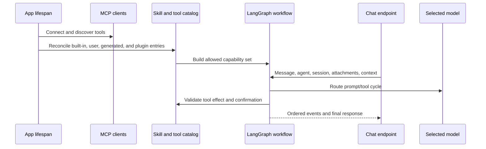

# AI agents, models, tools, and skills

## Frontend conversation ownership

`features/agent` owns chat composition, sessions, confirmations, message actions,
and stream presentation. Its public entry exports `AgentChat` and the complete
props contract. The application loads this entry dynamically; notebooks import
the same component inside their optional route chunk. No caller reaches private
chat modules or casts the component to a narrower type.

Context-reference arrays remain read-only through the UI and are copied only
when constructing the existing HTTP request. This preserves source metadata,
notebook scoping, payloads, stream replay, and persistence keys. Generic HTTP and
NDJSON adapters remain under `shared/api`; composed feedback-and-transport tests
belong to the agent feature so shared code does not depend on UI internals.

## Capability model

Gnosi separates models, agents, skills, and tools:

- Model: a provider route with capabilities, limits, cost metadata, reliability,
  and credentials.
- Agent: instructions, model selection, memory/checkpoint policy, and assigned
  skills.
- Skill: a documented capability package that contributes instructions and
  constrains compatible tools.
- Tool: a callable operation classified by effect and origin.
- Context source: user-selected Vault, table, file, or external material added
  to a conversation with explicit containment and size behavior.

The Vault knowledge tool belt keeps LangChain `StructuredTool` objects at the
registration boundary and unwraps their typed callables only for internal tool
composition. Page creation registers through the canonical Vault owner, Vault
search obtains its dedicated lazy store explicitly, and path/PDF reads retain
their containment and server-owned size ceilings.

The Artificial Analysis feed is a typed, server-side comparison boundary. It
keeps API credentials private, validates every paginated response, enriches only
missing catalog metadata, preserves verified cached metrics, and falls back to
stale cache or models.dev with explicit provenance.

## Startup and request flow

Legacy Agent imports remain available through narrow compatibility facades,
while the domain package owns context matching and storage, first-party tool
dispatch, evidence and citation contracts, stream state, confirmations,
sessions, and route composition. Agent catalog and governance routes use the
same pattern under the configuration domain, preserving route order and
operation identifiers.

The model router resolves provider/model combinations, context limits, tool
support, spend caps, and fallback policy. Credentials are obtained from local
secret storage or supported environment migration, not exposed to the
frontend. Failure reasons are recorded separately from user-facing responses so
operators can distinguish timeout, provider rejection, invalid credentials,
context overflow, and tool incompatibility.

The legacy hybrid client remains available to social composition, mail drafting
and older pipeline parsers through a strictly typed compatibility boundary. It
narrows dynamic YAML provider maps, requires a concrete provider URL before any
network call, validates OpenAI-compatible response envelopes, writes its
prompt-hash cache atomically below the per-device data directory, and preserves
the established primary-then-fallback behavior without exposing credentials.

Local Whisper transcription exposes a typed model protocol and result shape;
audio remains on-device and its lazily downloaded model cache lives below the
provider-neutral `GNOSI_DATA_DIR`. The optional untyped `faster-whisper` import
is confined to this adapter. Currency conversion similarly narrows remote and
cached JSON before budget arithmetic, retains stale-real and static fallbacks,
and always returns a positive typed units-per-USD rate.

The router normalizes unknown registry metadata before iteration, compares
token quotas and context windows as integers, and keeps its usage ledger behind
typed atomic path/load/save boundaries. Monetary caps distinguish an absent cap
from zero explicitly, preserving the existing near-cap and free-model fallback
policy while making malformed persisted data recover to an empty ledger.

Agent observability, replay, stream journals, turn claims, reviewed quality,
personal and semantic memory, model evaluations, capability audit and health
are operational per-device state. Their SQLite/JSON stores resolve directly
through `GNOSI_DATA_DIR`; they never derive a location from a Vault or cloud
provider. Tests inject that same canonical resolver, and encrypted stream keys
remain in the `secrets` child of the local data directory.

Profile execution uses `pinned`: exactly the configured provider and model.
Legacy `resilient`, `adaptive`, and `decision_engine: jev` settings no longer
select alternatives for profiles. The settings form saves one model with no
fallbacks. Legacy strategy helpers remain covered in
`backend/tests/test_agent_model_decisions.py`; profile editing is covered in
`frontend/src/features/settings/global-settings/AIAgentForm.test.tsx`.

The stdio MCP client validates JSON-RPC object boundaries, types pending async
requests explicitly, and routes tools through a cache that refreshes only on a
miss. Malformed tool catalogs fail locally instead of leaking unchecked values
into the agent runtime.

AI settings keep provider credentials, connection tombstones, model registry,
budget and usage routes in a strictly typed compatibility facade. Editor
generation and correction live in the configuration AI domain, while validated
YAML mapping loads and explicit legacy response metadata preserve the existing
HTTP and OpenAPI contracts exactly.

## Tool governance

Tool descriptors declare read/write/external/destructive effects. Generated
tools pass AST-based validation and execute in a restricted environment. The
validator blocks dangerous capabilities such as unrestricted file writes,
environment access, dynamic dunder traversal, and unsafe imports.

Actions requiring confirmation create durable pending records. Confirmation
binds the user, session, tool, arguments, effect, and expiry; accepting a stale
or altered action does not authorize a different invocation. Maintenance
expires and removes records independently of chat traffic.

Versioned capability metadata is narrowed from model or mapping input before
validation. Version 2 contracts fail closed unless timeout, idempotency,
privacy, egress and durable-result policies are complete and valid; legacy
version 1 descriptors remain compatible. Cooperative cancellation wraps any
Python awaitable in a cancellable future, so coroutine and future based provider
adapters share the same token semantics.

## Skills and plugins

Built-in runtime skills live in `pipeline/skills/`. User and plugin packages are
validated into a catalog while preserving origin, activation, compatibility,
and managed-versus-user-owned fields. Plugin reconciliation is idempotent:
disabling a plugin suspends its managed contribution without deleting user
overrides.

Row, page and skill-instruction translations use the shared `translation`
operation. UI buttons select the Translation plugin's profile; actions within a
conversation inherit the running agent's profile. That profile governs the
model, policies and activity records. Translation settings link to this profile.
Historical DeepL and Softcatalà arguments remain compatible but are ignored;
there is no language-pair routing or placeholder provider fallback. Translating
a skill displays a reading copy and preserves its original instructions.

Plugin reconciliation can also run before FastAPI route composition. It derives
the `.gnosi` directory from the canonical active-Vault context and reads state
through `backend/domains/configuration/plugin_state.py`; it never imports a
Vault route merely to resolve paths or configuration. Before the process-wide
store exists, the same normalizer and atomic writer run behind a bootstrap
lock; after composition, reconciliation reuses the shared store and mutation
locks.

The legacy Chroma memory facade remains lazy and strictly typed for import
compatibility. Importing it creates only the configured storage directory; it
does not load embedding models. Missing embeddings degrade to empty reads and
explicit failed writes, while canonical governed personal memory remains in the
Agent domain's scoped SQLite service.

## Context and memory

Conversation state is scoped by agent and session. UI message ordering uses
stable identifiers rather than arrival time alone. Attachments and context
sources validate paths, size, file type, and workspace/vault scope. Large
external sources use searchable representations instead of injecting unlimited
raw text into every turn.

The durable checkpoint remains the complete audit record, but provider prompts
use a bounded projection. Earlier user and final assistant messages remain as
conversation memory, while historical tool-call groups and raw tool payloads
are omitted. The current turn retains complete call/result protocol groups, and
the aggregate conversational projection has a hard character ceiling even when
the selected model advertises a much larger context window.

Reviewed personal memory is a separate, explicit local store scoped by Vault
and agent. Users can create, edit, disable, expire, and delete revisioned facts
or preferences in Settings. Retrieval is lexical and bounded to five items;
the prompt labels the result as data that cannot change policy, tools, or
authorization. Conversation checkpoints and vocabulary associations retain
their separate lifecycles.

Vault navigation contributes turn-scoped page, table, and active-view context.
The server expands a dashboard with one embedded view to the canonical table
view, reapplies its filters and sorting, and exposes an exact bounded row query
with count and pagination. Exact page and table reads are server-authored tool
calls; after a complete result, synthesis runs without tool bindings so a
tool-eager model cannot repeat the call until the graph recursion limit.

The canonical self-authored Resources request is also server-routed. Gnosi
executes the saved authorship view exactly once and formats its count and
bounded record list directly from the governed result. This path performs no
model call after the tool succeeds. Requests requiring interpretation or
generation continue through normal model synthesis.

The same deterministic contract now applies to arbitrary attached-Vault
inventories rather than individual topics or tables. Before tool selection, the
server classifies the operation as conversation, lookup, inventory, analysis,
or governed action. Inventory requests receive an exhaustive structured scan
with exact count, canonical record ids, live registry type resolution, type
grouping, selected provenance metadata, and offset pagination. The subject is
query data: adding a topic or a new table does not add an intent branch. The
first page and continuation pages are formatted directly from the governed
tool result without a model call.

The request mode also prevents the default Knowledge attachment from hijacking
unrelated work. Conversation mode performs no source read and binds no passive
tools. Explicit mail, calendar, contacts, Reader, weather, web, Notion, or
Zotero requests omit default Vault tools unless the same request also names a
Vault object; the relevant assigned skill remains available.

Every request now carries an effective universal turn plan into the graph. The
plan combines operation mode, explicit data domains, live runtime descriptors,
required evidence, guarded grants, provider locality, execution strategy, and
response strategy. It is request-scoped state that overwrites checkpoint data
from previous turns. The Brain node intersects normal runtime selection with
the plan's tool names, so the metadata shown to the user describes the actual
tool surface rather than an advisory classifier.

Privacy is also request-scoped. The plan distinguishes local processing,
private evidence processed by the configured remote model, external reads, and
ordinary conversation. Attached Vault data does not count as used when an
explicit Mail, Reader, Notion, web, or other domain excludes its tools. The UI
reports only this posture and source counts; source bodies, prompts, secrets,
and hidden reasoning never enter transparency metadata.

Final model responses pass through a deterministic verifier. It checks only
current-turn tool results and effect policy, blocks claims that a governed
action completed without a successful tool result, blocks source-dependent
answers that skipped mandatory evidence, records tool failures as limitations,
and emits evidence/tool counts. Inventory answers use the same verifier even
though their text is server-rendered. Verification never invokes a second
model.

Source-dependent responses also carry server-validated claim citations. Tool
results define the only source ids valid for the current turn. Deterministic
inventories map each listed line to its canonical Vault record and map aggregate
count, grouping, pagination, and method statements to the exact tool-result
manifest. Model synthesis may emit `[[cite:SOURCE_ID]]` markers; the verifier
removes valid markers from visible prose, rejects ids absent from current-turn
evidence, and marks incomplete grounding as a limitation. The chat renders the
bounded claim/source mapping with safe Vault, Reader, or HTTP(S) links and never
persists excerpts or filesystem paths as citation metadata.
Every cited source also carries a short version fingerprint derived from its
revision, etag, update timestamp, or exact current-turn tool manifest. The UI
distinguishes exact from identity-only versions without exposing source bodies
or connector secrets.

Vault search uses a deterministic hybrid rank: expanded multilingual lexical
terms, exact-title boosts, index-role boosts, and the rebuildable vector score.
Results are cached briefly by Brain/query/k only; the cache is bounded and does
not retain prompts or unbounded source bodies. Returned excerpts are delimited
as untrusted evidence and injection-like instructions are flagged; the Brain
prompt treats every source, connector, attachment, and web result as data rather
than an instruction.

Exhaustive inventories reuse the locally persisted parsed-document and link
indexes. Relation ids are expanded to indexed target titles, so a record linked
to a matching project or source remains discoverable without reopening every
cloud-synced document. Normal Gnosi writes update these indexes; periodic index
maintenance reconciles external edits. Records absent from the cache fall back
to a direct bounded read. Semantic top-k search remains the evidence-discovery
path for lookups and analyses and is never presented as a complete inventory.

Inventory payloads also report link-index build age, cache coverage, direct
fallback reads, and stale-while-revalidate state. A stale or missing index
requests a guarded background reconciliation without delaying the answer; the
message retains the limitation instead of implying that the index was freshly
rebuilt.

Whole-collection Reader analysis is admitted as a background operation through
the provider-neutral capability-job facade. The server creates the job tool
call deterministically, returns a namespaced `reader:` job id, and exposes
status, result availability, resume after failure or interruption, and
cooperative cancellation in message details. The same
facade remains extensible to other source-owned durable providers; unsupported
requests stay foreground and are never represented as durable work.

Reader agent tools require a concrete active Vault before analysis or page
persistence, expose typed scope payloads and retain an identity decorator only
for lean environments without LangChain. Article reads and mutations narrow
legacy ORM descriptors at one boundary while preserving tool names, effects and
serialized responses.
Attached-Reader context tools apply the same guard and reuse one resolved Vault
for status authorization and result retrieval, preventing cross-Vault context
drift within a tool call. Untrusted-content wrapping and output bounds remain
unchanged.
Providers and queue dispatchers register versioned contracts declaring job
kind, idempotency, lease, attempt and model-call budgets, result, resume, and
cancellation behavior. Unknown job types fail visibly instead of entering a
hard-coded worker branch.

Reader jobs persist a bounded recovery policy beside their checkpoints. A
transient timeout, temporary network/service failure, or rate limit enters a
cancelable retry-wait state with capped exponential backoff. Attempts and model
calls consume separate persisted budgets before any new call is made. A daemon
timer handles normal in-process retries; job list/status reconciliation starts
an overdue retry after a backend restart. Permanent, cancelled, malformed, or
budget-exhausted failures remain terminal and visible. Manual resume uses the
same budgets and therefore cannot bypass the loop boundary.

Other read-only turns have an independent three-result budget: if the model
keeps requesting tools, the next Brain invocation receives the accumulated
evidence without tool bindings and must synthesize the response. The graph
recursion ceiling therefore remains a final safety net rather than normal flow
control.

The universal plan also carries an immutable operational budget for every turn:
the HTTP timeout, maximum model calls, maximum tool calls, and maximum read
results. Conversation turns receive a short no-tool budget; lookup and
inventory turns receive bounded read budgets; analysis and governed actions
receive a larger but finite budget. The graph enforces these values before the
next provider or tool invocation, and the stream exposes the same values and
whether a limit was reached. A zero tool budget is a mode declaration, not an
authorization bypass: mandatory server-authored context reads still follow
their explicit path. Dynamic context tools are not selected for a general
question unless the user actually supplied a context source.

Capability automations persist scope, revision, schedule and per-run budgets in
their own migrated SQLite database under the canonical local data directory.
Run reservation is transactional, rejects overlapping or over-budget work,
recovers stale leases, and records terminal status even when agent execution
fails. Missing data configuration or a failed persistence round-trip aborts
explicitly instead of reporting an automation that was not stored.

The ToolNode retains the complete active-skill runtime for execution and policy
checks, while each model invocation binds only passive read tools plus guarded
tools explicitly authorized by the current request. Legacy automatic profiles
also narrow passive reads to multilingual request-domain matches and an exact
required context operation, with a bounded maximum; explicitly scoped skills
retain their already-small assigned read surface. Mandatory context reads bind
only the required source tool for their first step. This per-turn binding is
derived from request state and is never reused as cached authorization.

The chat measures each response from request dispatch through stream
completion. A live whole-second counter is replaced by the saved elapsed time
on the completed response. The stream also reports server setup, routing,
tool, model, residual, and total durations together with model/tool call and
token counts; message details retain this bounded diagnostic breakdown. Every
visible message also exposes conversation
rewind: after confirmation, the server truncates the scoped canonical
checkpoint at the complete turn boundary and returns its public projection.
Rewind changes conversation memory only; completed confirmations and external
side effects are never presented as reversed.

During execution the stream emits a bounded phase marker for routing, model
generation, or tool execution. The chat shows the active phase beside the
elapsed seconds counter and resets it when the turn ends. Stable transient
failure codes (`agent_loop_exhausted`, timeout, service-unavailable, and rate
limit variants) include advisory recovery metadata. The client offers one
deliberate retry of the original request after user review; the server never
replays a failed turn automatically because a governed action may already have
been prepared. Permanent configuration or authorization errors instead invite
editing the request or runtime settings.

The stream owns an opaque cancellation token. The explicit Cancel action calls
an authenticated stream-scoped endpoint and reaches the asynchronous provider
cancellation bridge. An accidental browser or proxy disconnect does not cancel
the accepted bounded turn: an independent producer continues and its events
remain resumable. Cached workflows do not capture request-specific events, and
tokens are released after the producer completes. Provider failures use a bounded
process-local circuit breaker keyed by provider/model, while authentication and
policy errors remain terminal. Tool descriptors additionally expose a cheap
 health status (healthy, unavailable, or temporarily quarantined) so missing ids,
 names, handlers, and repeatedly failing adapters cannot be advertised as runnable
 capabilities. Two failures inside the bounded health window quarantine a tool
 briefly; a successful later call clears the consecutive-failure record.

The newline-delimited transport is wrapped in protocol version 1. Each event carries an
opaque stream id, event id, monotonic sequence, trace id, and optional turn id. A pending
provider operation remains alive while a heartbeat is emitted, so a slow but healthy
provider is not cancelled by transport keep-alive. The client ignores duplicate sequence
numbers. Events are encrypted in a scope-bound local journal for at most one
hour, and the browser resumes from its last sequence for the full turn timeout.
Replay repeats no model/tool call or governed action; it reapplies the original
event envelope only.

Long prompts retain the complete checkpoint as an audit record but add a bounded
deterministic digest of dropped human/assistant turns to the provider projection.
The digest contains short excerpts and opaque hashes only; raw tool payloads and
unbounded source bodies are never carried forward.

Every streamed turn receives an opaque `trace_id` propagated through planning,
model selection, runtime health, messages, errors, metrics, and completion
events. This gives distributed logs and the UI one correlation key without
persisting prompts, credentials, or source text. MCP readiness is cached briefly
per server, and provider/connector snapshots are included in the runtime receipt.

Brain retrieval combines the rebuildable vector score with accent-normalized,
multilingual lexical expansion, title/index boosts, bounded caching, and
injection-marked evidence. Live table/trash HTTP tests are opt-in and run in CI
against a throwaway Vault and separate port; the hermetic suite always points at
a closed port so a developer's native backend cannot be mutated accidentally.

Editable model-registry rows are hydrated from the canonical catalog before
they reach Settings or runtime routing. Partial budget/settings updates merge
with existing capability, context-window, cost, and quality metadata. Provider
or model changes invalidate cached graphs so tool support and credentials take
effect on the next turn. The chat header reports the selected model, exact tool
count, and actionable reasons for any degraded runtime.

Message details provide bounded operational explainability: mode, route,
foreground/background execution, tools actually used, evidence count, privacy
posture, verifier status, index freshness, durable job state when present, and
timings. This is an execution receipt, not chain-of-thought.

The same receipt includes a redacted semantic interpretation (operation,
confidence, concepts, and retrieval strategy), the capability broker decision
(candidate and guarded tool counts), and the checkpoint scope. Query digests,
source bodies, historical tool payloads, prompts, and hidden reasoning are
excluded from the client metadata.

Turn metrics include a provider-catalog-based USD estimate alongside token and
latency counts. The persistent spend ledger remains the source of truth; the
estimate is bounded display metadata and is never used as authorization by
itself. The deterministic evaluation suite also asserts that every plan stays
within the 120-second latency ceiling.

The deterministic corpus under `backend/agent/evals/` covers all request modes,
all four UI languages, domain containment, private local and remote processing,
governed actions, and durable Reader admission. It runs before the backend test
suite on matching pull requests and every day; any failed case exits nonzero
without calling a provider or spending tokens.

Production errors and assistant thumbs feedback feed a local, authenticated
quality loop. `POST /api/chat/feedback` accepts bounded operational metadata
only and explicitly rejects response content. Stream errors are recorded by the
server with stable codes. The local SQLite store retains hashed turn/session/
agent identities, plan and verifier fields, tool names, and timing buckets; it
has no prompt, response, source, title, path, URL, excerpt, attachment, or raw
tool-payload columns. Negative feedback and errors deterministically upsert
deduplicated synthetic evaluation candidates. Administrators list, accept,
reject, reopen, and run these candidates through `/api/ai/evals/candidates*`.
Accepted local cases remain separate from the versioned CI corpus until a
maintainer deliberately promotes them.

Administrators may also run an explicit cost-bearing real-model evaluation for
an agent's assigned primary model. It uses three synthetic multilingual/schema
prompts and stores only route identity, score, latency, token counts, and stable
failure codes. Prompts and responses are never persisted. Reviewed scores may
influence `adaptive` ordering but cannot add an allowed model or capability.

## Adaptive quality and capability discovery

Tool health survives backend restarts in a bounded local SQLite store. Each
capability retains success/failure counters, a consecutive-failure window,
temporary quarantine state, and aggregate invocation latency. Runtime catalog
construction reads these rows in one short-lived cache snapshot rather than
opening the database once per tool. A later successful invocation clears the
quarantine but retains bounded service-level totals for diagnostics.

Vault inventory retrieval fuses exact phrases, normalized lexical tokens,
conservative character similarity, metadata, cached body text, and canonical
relations while preserving an exhaustive scan of the authorized scope. Users
can add or remove reviewed vocabulary associations through
`/api/ai/semantic-associations`. The local store hashes the Vault scope and
contains only bounded term pairs and a hashed author identity; it never stores
prompts, answers, source bodies, paths, credentials, or executable text.

The final deterministic verifier now publishes a response-quality score over
visible output, required evidence, tool success, supported completion claims,
citations, inventory pagination, and contradiction handling. Structured facts
with the same record and field but incompatible current-turn values produce a
bounded conflict receipt containing provenance names but not the private values.
The visible answer receives a localized warning instead of silently merging the
facts. A provider-free response corpus complements the routing corpus and
exercises these final-answer contracts in CI.

Tool and attachment evidence is scanned for instruction override, authority
spoofing, tool coercion, and secret-exfiltration markers. Only bounded taint
categories reach response metadata; source text remains untrusted data and the
receipt always records that authorization was unchanged. The adversarial
response corpus asserts this boundary.

Each plan exposes a soft synthesis boundary before the hard turn timeout. Once
the reserve is reached and required evidence is available, Brain removes tool
bindings and synthesizes the best supported result; the stream emits a deadline
stage so the client can show that transition. If required evidence is still
missing, the evidence boundary remains authoritative rather than producing an
unsupported answer.

Capability discovery is part of the enforced turn plan. For each explicit
domain it reports a usable capability, an assigned but guarded capability, or a
missing connection/skill. Discovery cannot install software, grant permission,
or authorize a guarded action. Settings → AI → Quality displays metadata-only
turn counts, latency buckets, verification outcomes, errors, evaluation
candidates, persistent capability health, and the reversible vocabulary editor
through `/api/ai/quality/dashboard`.

Capability contracts may opt into schema version 2 through descriptor metadata.
Version 2 fails closed unless timeout, idempotency, privacy, egress, and durable
result behavior are valid. Legacy version 1 tools and skills remain visible as
legacy or partial in Settings while they migrate; conformance metadata never
makes a handler executable.

## LLM Wiki configuration

Knowledge uses its dedicated plugin profile. The historical `agent_id` setting is preserved but does not override the plugin profile. The old managed `llm-wiki` profile remains retired; the new profile retains migrated Knowledge companion instructions. Settings link to the plugin profile and its skills.

The secondary Brain tools menu lives in the Brain table header, including
embedded tables. It offers deterministic review with an in-view report and AI
connection proposals that refresh and open the existing connection inbox.
Maintenance actions no longer appear in plugin settings.

`backend/domains/configuration/llm_wiki.py` validates the Brain table, source
tables, categorical dimensions, file/URL fields, fixed values and relation
targets before any schema mutation. It then provisions the canonical roles and
source relations, revalidates eligible index fields, persists atomically and
refreshes the system pages through late-bound facade ports.
The per-Vault configuration facade narrows property, source and dimension
mappings to typed objects while deliberately retaining late-bound path and
reference-table callables from `vault_routes`; disposable-Vault tests and
existing integrations can therefore replace those historical seams without
duplicating their mutable state.
Its HTTP boundary narrows the late-bound legacy router once to `APIRouter`, so
Brain designation and LLM Wiki configuration endpoints remain strictly typed
without altering permissions, payload schemas, route order or OpenAPI output.
The route adapter imports the canonical configuration, schema and record
services directly, avoiding partially initialized facade lookups during
standalone Agent startup. Runtime-replaceable Vault operations remain explicit
ports, including the typed `VaultActionsPort` used by Brain processing actions.
The processing boundary uses the same typed router for durable ingestion,
polling, evidence, maintenance, lint, suggestion review, dictation and glossary
learning; late-bound services and recoverable HTTP errors remain unchanged.
Brain planning retries transient provider failures, including HTTP 429, within
five attempts per fragment, 120 seconds of cumulative waits and a 360-second
overall call budget. Each request receives the remaining timeout (at most 240
seconds). Exponential backoff includes jitter and honors `Retry-After` seconds,
HTTP dates and `retry-after-ms`; a cooldown beyond the budget stops the attempt
instead of retrying early. Authentication, validation and explicit exhausted
billing quotas are not retried, and no provider is switched automatically.
The durable job exposes `phase: retrying` during waits. The processing dialog
keeps polling, explains rate limits and offers a retry when the job stops.
Successful fragment plans are checkpointed with their exact prompt hash and
source chunk. A non-forced retry of an error or partial job reuses only matching
plans, copies them into the new job and continues at the remaining fragments.
Changed source evidence or planning inputs invalidate cached fragments; explicit
force processing bypasses all previous checkpoints. Interrupted jobs retain
their actual progress and source notes are written only after planning completes.
Every ingestion call explicitly selects the configured `agent_id`. A
provider response with `x-ratelimit-limit-req-minute: 0` stops automatic retries,
because waiting cannot replenish a zero request limit; zero remaining capacity
with a positive limit still receives normal retries. After a backend restart,
status lookup reads the persisted job by its exact ID and checks the source
table when supplied. Interrupted running jobs become `phase: partial` and retain
their completed-fragment counts. The dialog allows one status request at a time,
ignores cancelled responses and shows fragment progress; `phase: idle` for a
tracked job ends polling with a recoverable error.

Settings loading allows up to 45 seconds for a slow local response. Failed HTTP
responses are rejected before entering the shared configuration cache, so a
retry can reach the recovered server. Empty server failures use the translated
configuration error with a separate retry button. Loading these settings does
not require an available model provider.

`backend/domains/configuration/llm_wiki_schema.py` separately owns idempotent
Brain-field repair and consolidation of one canonical source relation, including
legacy aliases, page metadata and contextual embedded views.
`backend/domains/configuration/llm_wiki_records.py` normalizes existing managed
notes, source labels and localized resource-index titles without owning HTTP routes.
Source extraction is split between `backend/domains/llm_wiki/documents.py` for
typed document and media adapters and `origins.py` for deterministic evidence
identity, deduplication and chunking. The historical service remains a compact
compatibility facade so notebook and plugin contracts keep their current symbols.
Extractor inputs now carry explicit metadata/configuration mappings and cross
legacy attachment and local-data helpers as concrete `Path` values. The
optional `yt-dlp` import is the sole localized untyped third-party adapter;
public-URL checks, fingerprints, source ordering and provenance remain stable.
Processing is split further into `planning.py` for prompts, parsing and grounded
plans, `dimensions.py` for fixed/source/AI field mapping, `ingestion.py` for the
blocking workflow, and `writing.py` for idempotent persistence. `index_rendering.py` owns managed resource,
dimension and general pages, while `search_index.py` owns rebuildable JSON, FTS5
and vector indexes. `backend/services/llm_wiki.py` and
`backend/services/llm_wiki_indices.py` remain late-bound compatibility facades so
existing imports and monkeypatch/plugin seams continue to resolve at call time.
`backend/domains/llm_wiki/legacy_ports.py` narrows the path, table, page parsing
and persistence collaborators without introducing eager route imports. The JSON
writer remains exposed by the facade because it is a historical replaceable seam;
rebuild and incremental upsert paths retain their cache invalidation behaviour.
The same late-bound path port owns Vault, `.gnosi` and local-data resolution for
the personal dictation glossary, connection queue and durable Brain jobs,
snapshots, manifests and synchronized page sidecars. Queue and lint scans use
the late-bound table-page port, preserving existing runtime replacements.
That input port still returns dynamically typed pages; its metadata contract
remains separate typing debt.
The ingestion facade uses the same late-bound ports for Brain page enumeration,
table lookup and processed-state updates. Runtime plugin replacement is preserved,
but the broad `Any` annotations in these ports do not prove complete typing.

Deterministic Brain lint is split into bounded checks for orphan notes, stale
reviews, missing cross-references, duplicate provenance keys, retained managed
notes, broken evidence citations, reprocessing and resource-index drift. The
report shape and finding limits remain stable and require no model provider.

`backend/domains/llm_wiki/lint_contracts.py` defines the normalized note projection,
all eight finding categories, counts and complete report at their producer.
These are ordinary dictionaries with precise static types, not runtime models
or schemas asserted over arbitrary stored metadata. The HTTP route may add
optional suggestion totals; pure lint does not emit them. Output order,
date handling, citation decoding and truncation are unchanged. The legacy
page-input boundary and route composition still require separate typing work.

Grounded PDF citations use a separate deterministic persistence boundary. It
resolves quote geometry with one cached document handle per attachment, upserts
stable managed highlights in one transaction, preserves manual annotations and
removes only obsolete Gnosi-managed entries.

## Failure and safety invariants

- Provider failure does not silently route to a more expensive or less private
  model outside the configured policy.
- A tool unavailable to the selected model/skill cannot be invoked by name
  alone.
- Destructive or external effects require their declared policy.
- Generated code cannot access secrets or unrestricted filesystem state.
- One failed MCP server does not remove healthy servers from the catalog.
- Partial model output is not presented as a completed confirmed action.
- Source-dependent output cannot pass verification without current-turn source
  evidence.
- Citation ids cannot resolve unless the same turn returned that exact source.
- Transparency metadata cannot contain source bodies, prompts, or raw tool
  payloads.
- Automatic and manual job recovery cannot exceed persisted attempt or model-call
  budgets.
- Quality telemetry cannot accept or retain prompt/response content.
- Stale index evidence is labeled and refreshed outside the foreground turn.
- Agent messages remain isolated by agent and session across reloads.
- Adaptive routing cannot escape the selected agent's explicit model allowlist
  or local/remote trust boundary.
- Evidence taint and personal memory cannot grant tools or change authorization.

## Verification focus

Run model routing, provider deletion, reliability, timeouts, MCP retry and
resilience, skill catalog/runtime/API, generated-tool validation, context
containment, confirmation race/expiry, chat ordering, and browser chat flows.

## Universal agent runtime

Gnosi routes every turn through a bounded, provider-neutral contract. Before
capability selection, the semantic interpreter normalizes multilingual intent,
records a confidence score and can abstain when a request has no subject. The
result is included in the turn plan without storing the original prompt.

Background capabilities use the local SQLite durable queue. A job has an
idempotency key, attempt budget, lease and heartbeat; an expired lease can be
reclaimed after a process restart or when a second worker is active. Reader
analysis retains its JSON snapshots and batch checkpoints, while the queue is
the source of truth for orchestration.

Every model and tool operation emits a bounded span correlated by the turn
`trace_id`. Span attribute names are allowlisted; callers must not place prompts,
sources, arguments or raw provider output under those allowed names. This filter
does not inspect arbitrary text for secrets. Tool calls
also pass through argument-size validation, descriptor timeouts, output limits
and the existing role/confirmation policy.

Brain search maintains its JSON compatibility cache plus an FTS5 sidecar. The
sidecar narrows lexical candidates before deterministic vector hybrid ranking,
and exposes freshness metadata for diagnostics. If the sidecar is unavailable,
the JSON cache remains a safe fallback.

Explicit turn identifiers are claimed durably in the workspace/user/session
scope. A duplicate request is rejected instead of executing the same action or
background job twice. The NDJSON stream emits `progress` events with node, phase,
elapsed time and bounded call counters so clients can render responsive
progress without reading internal prompts.

Security boundaries remain conservative: generated tools are revalidated at
load time, connector URLs can use the public-host egress policy, and common
credentials are redacted before diagnostics or tool messages are persisted.
The generated-tool registry declares its local SQLite path only through an
idempotent initialization boundary; migrations and parent-directory creation
complete before any search, approval, rejection or statistics query can open
the database. Cloud-synced source files remain separate from this local state.
Dry-run protection preserves wrapped callable signatures, generates collision-
resistant pending identifiers and never invokes an external-write function
before confirmation. Confirm and cancel consume only the addressed pending
record; non-external operations retain normal execution.

The generated-tool runtime also keeps typed boundaries from registry records
through loader caches, dynamic JSON schemas, learning-loop results and sandbox
resource callbacks. Untrusted schema payloads are narrowed before Pydantic
model creation; these annotations document the existing subprocess contract
without weakening validation or moving execution into the application process.
The approval-registry provider constructs validated `ToolDescriptor` instances
directly and exposes a signature-preserving lazy callable, so catalog policy
and runtime loading share one typed record boundary. Approval and rejection
handlers likewise validate their mutation responses with Pydantic while keeping
the historical dictionary and OpenAPI shapes unchanged.
Third-party plugin contributions use the same descriptor contract after
narrowing manifest schemas and resolving the active Vault through the typed
domain adapter. Their handlers remain Node-sandbox callables with exactly the
declared permission subset; typing does not import plugin Python into FastAPI.
First-party Gnosi tool support similarly narrows the remaining legacy facade
ports for frontmatter parsing, page versioning, index refresh and table-view
revisions. These adapters keep confirmation snapshots and optimistic
concurrency checks typed without changing their persisted formats.
Vault-administration tools consume those ports through explicit registry,
table-row, metadata-refresh and page-index call signatures. Table discovery,
saved authorship views, deterministic filtering and contained page relocation
therefore retain their existing JSON tool contract under strict typing.
Contact tools bind each operation to a typed management session and
workspace-scoped `ContactsService`. Duplicate detection, bounded updates and
destructive merges still close the session deterministically, while a missing
primary after a concurrent update now follows the existing error-result path.
Provider-neutral job tools resolve a concrete active Vault before listing,
estimating, reading, resuming or cancelling durable work. Missing request
context fails at this adapter boundary, while namespaced job identifiers and
all persisted result payloads remain unchanged.
MCP tool construction narrows each third-party descriptor and JSON schema
before creating its dynamic Pydantic argument model. Required and optional
fields preserve their prior call semantics, malformed entries remain isolated,
and server-qualified routing continues through the existing MCP client.
Mail tools use the installed LangChain tool contract directly and type the
bounded serialization boundary for exact messages, threads and folders.
Remote read/star/reply/batch behavior, account confinement and confirmation
effects are unchanged.
The remaining governed adapters for translation, public-web context,
calendar, social publishing, Notion cloning and project planning use concrete
tool signatures and canonical domain routes. Web fetches also make the
otherwise unreachable no-response state explicit after bounded redirect
handling; SSRF checks, payload limits, account policy and confirmation effects
remain unchanged.
Agent context sources now expose a typed searchable-source protocol for BOE
and require concrete active-Vault paths before opening Reader or planning
state. Plugin state is read through the canonical Vault configuration domain,
while the small LangGraph compatibility graph uses a secret-bearing API-key
type without changing its fallback responses.
Runtime support now types confirmation context tokens and requires the
configured local-data directory before opening its audit database. Memory and
Vault search use their explicit lazy-store accessors, while model-catalog JSON,
model identifiers, reliability ranking and evaluation metadata are narrowed at
their input boundaries without altering routing evidence.
Notion integration boundaries now type hosted-MCP responses, Markdown trees,
attachment localization callbacks and clone-verification configuration. An
atomic, idempotent integration-key deletion primitive removes irrecoverably
expired OAuth credentials instead of repeatedly retrying a dead token; clone
schemas, page bodies, views and attachment markers retain their formats.
Core AI workflow contributions use an internal typed specification for identity,
activation, source requirements, tools, and instructions. Descriptor creation
therefore cannot conflate string fields with source/tool sequences, while the
published catalog schema and ordering remain unchanged.
Attached-context readers now preserve the concrete string contracts of URL,
external-source, and internal-record wrappers directly. No dynamic cast masks a
provider mismatch at these untrusted-content boundaries.
Inventory cache readers retain the legacy Vault monkeypatch seams through a
narrow typed adapter. This preserves plugin and test compatibility without
allowing dynamically re-exported callables to spread into the agent domain.
Confirmed page and table dispatchers apply the same rule to Vault mutation
seams: each dynamically re-exported handler is narrowed at the call site, while
conflict detection, partial-result reporting, rollback, and background cleanup
retain their historical behavior.
Context storage and the built-in LLM Wiki catalog also narrow their legacy Vault
readers locally. Plugin lifecycle verification binds a concrete active Vault,
including in isolated tests, before resolving filesystem-backed configuration.
Eligible MCP tools are materialized as validated `ToolDescriptor` instances at
the contribution boundary, with an explicit MCP origin and normalized input
schema. Read-only/destructive annotations still determine admission exactly as
before.
Reference evidence requires a concrete active Vault before resolving or reading
paths, and its table-page seam is narrowed locally. Notebook evidence wrappers
return their typed untrusted-content strings directly across search, exact-read,
and whole-analysis operations.
Built-in catalog registration keeps tool and skill descriptor variables
separate, so static validation cannot carry a tool type into the subsequent
skill loop; registration order and resulting catalog revision remain stable.

The runtime dispatcher now wakes the durable queue on application startup, so
Reader work is recovered without a status request. Brain FTS updates are
incremental and carry an explicit stale marker. Approved generated tools are
loaded as subprocess-backed proxies with resource limits; descriptor JSON
schemas are checked before and after execution, with optional reviewed
compensators for partial failures. A metadata-only replay endpoint exposes
bounded plan, error, timing, and verification events by trace id. Ambiguous
requests stop at the semantic interpreter and ask for the missing subject in
the request language instead of guessing a capability.

Verification uses the deterministic universal-turn corpus, focused phase-two
tests, the full `backend/tests` suite and the documentation gate.

## Local diagnostic span contracts

`agent_observability.py` accepts arbitrary attribute values and a mutable context
holder. Its produced `SpanRecord` maps string keys to `SpanValue` primitives:
strings, integers, floats and booleans. The contract is not a rigid event schema:
allowed attributes can override status and duration. Typing preserves the existing
value conversions, exception behavior and shared record identity.

The service examines the first 32 input entries before filtering by `SAFE_KEYS`.
Strings are whitespace-normalized and limited to 240 characters; booleans and
numeric values retain their existing representation. Unknown keys are dropped.
Filtering by name is not content redaction: never hide private content under an
allowed provider, model or status key.

The in-memory buffer holds at most 2,000 spans; a query returns at most 200 and
shares the stored dictionaries. This is not a size or retention cap on the
append-only `agent_spans.jsonl` file. An `OSError` during append does not block the
operation or discard the in-memory record; other exceptions retain their normal
propagation. Context-manager errors record the exception class, not its message.

Tests use disposable logs, controlled clocks and owned threads. The real policy
wrapper is exercised with an inert model to verify response/exception identity
and absence of synthetic prompt/error content in diagnostics. No provider call
or real user log is required for these checks.

## Resource catalogue and personalisation

Tool labels are keyed by exact operation identity; different operations no
longer collapse to a generic verb and domain. Localised descriptions have an
exact-key fallback to the original catalogue text. Executable instructions
always show the actual stored content. Technical identifiers and schemas are
available in expandable details; tool selection includes descriptions, origin,
effects, availability and search filters.

Bundled skills remain immutable. Personalise opens an editable draft, with no
write until Save. The server verifies the source revision and stores source
identity, version, original instructions and tool selection in `derived_from`.
Subsequent edits preserve this provenance, and catalogue updates are compared
without overwriting the personal version.

Applying a personal skill to selected agents and automations is explicit.
Assignments use freshly read revisions and retain required skills. Targets receive
the new skill before selected automations are updated; successful partial
changes are preserved and errors are reported. An original still used by an
unselected automation remains assigned. Cancelling a draft changes neither the
catalogue nor assignments.

## Model comparison and verified parameter counts

The comparison shows the model and its multi-role assessment first, then estimated monthly cost and model maker, followed by intelligence, context, input/output prices, modes, parameter counts, speed, latency and specialist scores. Compact headings retain units and full tooltips; filters align with their fields, mode menus close on outside pointer input, and monthly token inputs use grouped thousands. The footer remains clear of the horizontal scrollbar.

Parameter counts are expressed in billions, distinguishing total and active MoE parameters. Filters support verified/undisclosed/pending status and total-size bounds. Selected modes use explicit AND (default) or OR matching. Static reviewed metadata remains available when the server does not provide enriched data.

`backend/services/model_parameters.py` enriches comparison responses from a local cache without network requests during rendering. The `refresh_model_parameters` task appears once in the control-center scheduler, enabled every 1440 minutes and gated by `ai-platform`. Each run checks at most 40 distinct model identities with a 120-second budget checked between models; request timeouts bound individual source calls. A persistent cursor resumes subsequent batches.

Only allowlisted official Hugging Face organizations, unambiguous model identities and explicit parameter fields are accepted. Verified entries retain source and check date. Unmatched or unavailable sources preserve earlier verified values; absence never automatically becomes “not published”. Unsupported and ambiguous models remain pending manual review. Cache replacement is atomic. Tests cover parsing, identity ambiguity, failed-source preservation, resumable batches, scheduler reconciliation, remote metadata and filter interactions.

Monetary columns, the maximum input-price filter and the monthly spending cap use the configured currency. Comparison prices and ledger spending originate in USD and use the supplied exchange rate for conversion before filtering or budget checks. The incomplete-model filter uses the shared application switch.

## Application tool coverage

The September 2026 audit adds 29 assignable tools, reusing canonical feature
services and their validation. Four domain skills group the new notebook,
literature, media and activity tools; five planning tools extend the existing
planning skill. These additions do not grant skills to existing agents.

| Application area | Agent and skill coverage |
| --- | --- |
| Vault, tables, tags, comments, links and trash | Existing first-party tools cover discovery, reading and governed mutations. |
| Mail, contacts and calendar | Existing account-scoped tools cover reading and actions, including confirmations for external changes. |
| Reader and analysis jobs | Existing tools cover feeds, extraction, analysis, progress, cancellation and resumption. |
| Notebooks | 10 new tools list/read notebooks and sources, search a fixed revision, read cited evidence, create private notebooks, add Resources, rename, refresh and cancel indexing. Attached-context tools remain constrained to their selected notebook sources. |
| Academic discovery and Resources | 8 new tools list sources/searches, start a bounded search, read results, import one stored result with deduplication and inspect systematic reviews. Ordinary Resources records remain accessible through existing table tools. |
| Gallery | 3 new tools list roots, search by name/type/tags and edit a file's tags and description. They do not edit file contents or expose native file pickers. |
| Control center | 3 new tools inspect the user's automations and run results, plus system schedules in the personal workspace. They do not approve actions or create schedules. |
| Planning | 5 new tools list baselines and create/update work calendars, resources and assignments, or delete an exact entity with confirmation and dependency checks. Existing schedule, allocation, variance, worklog and recurrence tools remain available. |
| Brain, memory, social publishing, translation and Notion | Existing built-in/plugin contributions remain the supported entry points. |
| Meetings, documents and graph | Existing internal-source readers, page/PDF tools and link operations expose recorded information. Live capture, native device access and graph layout stay in the interface. |

The adapters require the server-bound user, workspace, role and active Vault;
missing or mismatched context fails closed. Notebook ownership and revision
checks remain authoritative. Reads require viewer access; writes require editor
access and the normal runtime confirmation policy. Plugin availability is
rechecked both when resolving skills and when executing tools. Disabled plugins
leave catalogue entries visible but unavailable, including in custom skills.

Academic queries require explicit enabled, available source IDs and never fall
back to searching every source. Source listings omit transport configuration and
credentials. Import and review inspection currently require the personal primary
Vault because their canonical services resolve Resources there. Other Vaults are
rejected before access rather than silently redirected. Search and indexing
responses report queued/running state; completion must be checked separately.

Names and actionable descriptions are provided in Catalan, English, Spanish and
French. Administrators can compose custom skills from individual tools or assign
the domain skills to agents. Credentials, permission grants, approval decisions,
plugin installation and device access intentionally remain outside this tool
expansion. No external searches or provider calls are made by the regression tests.

## Principal assistant and optional profiles

Assigned skill names link to their expanded catalogue entries. Opening a skill preserves the assistant editor and its unsaved form values; returning to the Assistant tab resumes the same draft. Following the link does not toggle the skill assignment. Assignments use the shared accessible switches; required skills remain disabled, while unavailable assignments can still be removed.

Concurrent catalog readers wait for built-in plugin registration to finish. Recursive reads on the registering thread remain permitted to avoid import cycles; other threads cannot cache a partial catalog without Brain skills.

## Conversation learning and editable memory

The private chat learning panel groups project instructions, selected sources and result references. Explicit requests such as “Remember that…” create traceable memories; quoted text and ambiguous references do not. Memories are isolated by vault, assistant and user, with additional project or skill scopes. Settings → AI → Memory supports search, filters, editing, activation, expiry and deletion. Updates reject stale revisions. Deleting a project unlinks its sessions and disables its scoped memories.

Conversation-to-skill extraction uses the saved private transcript and the selected assistant’s configured model. The user reviews the procedure, acceptance criteria, synthetic examples and text templates before saving to the existing skill catalog. Assignment remains an explicit administrator action. A second-case trial makes no tool calls: a separate model review reports evidence for each criterion, and the user decides whether to keep the example. It does not certify external actions or factual correctness.

Portable `gnosi-skill-v1` JSON packages include instructions, tool dependencies, criteria, examples and text resources. Import validates size and resource names before review; it never automatically saves or assigns a skill. Export excludes personal memories and conversation history. Runtime instructions include the saved criteria and resources without expanding tool permissions. The additive `personal_memory_0002` migration preserves existing memories and creates private project/session bindings.

Validation: `backend/tests/test_agent_learning.py` covers capture, ownership, scopes, expiry, stale revisions, package boundaries and trial failures. Frontend tests cover read-only memory management, scope-preserving changes, learning intent and replay-safe acknowledgements.

## Contextual source reading

The source button and chat use the same durable processing job and the assigned `plugin.llm-wiki.process-source` skill. The job freezes the selected profile, model and effective instructions. A missing skill or disabled profile fails explicitly. The skill owns interpretation, attribution, evidence requests and review; the application enforces budgets, citations, persistence and indexes.

Reading follows structural fragments with neighbouring context, section maps and a hierarchical global map. Extraction and review can request distant original passages. Every primary fragment is accounted for, and proposed notes are reviewed against a joint overview before writing. Coverage and exact quotations establish provenance, not guaranteed semantic correctness. Checkpoints are reused only when their source and execution inputs match; legacy unreviewed write plans are invalidated. Progress and reading observations appear in the processing dialog.

## Instruction language

Skill instructions are saved and executed exactly as authored, in any language. The catalogue offers an explicit translation into the active interface language using the configured AI provider. This reading aid is shown alongside the original and never changes saved or executed instructions. Opening a skill does not request translation. Successful translations are cached only in memory, scoped by vault, original text and target language. Failures leave the original available and can be retried.

The translation action uses a compact button aligned to the right. Provider rate-limit or quota failures have a specific message; the original remains visible.

## Principal Agent execution

Functional AI uses a shared executor with explicit profiles. Plugin buttons and schedules resolve the plugin profile; conversations use their selected profile. Skills, scoped memory, usage accounting, bounded format repair and phase checkpoints remain shared.

Activity exposes scoped execution IDs, cancellation and supported resumptions. The versioned migration backs up configuration, retires only the managed Brain profile, preserves personal profiles and moves Knowledge-specific instructions into a companion skill. Knowledge URLs and the historical routes share handlers and permissions; Notion remains optional.

## Profiles and conversations

Create profiles under **Additional profiles (advanced)**. In chat, open the selector at the assistant name and choose the **Conversation profile**. The change applies to subsequent requests and preserves history. Each conversation remembers its profile. **Use as default** in Settings selects the profile for new conversations; it does not change existing chats.

Each profile has exactly one LLM. To use another model, choose another profile or edit the profile model. There is no automatic model selection or fallback to alternative models. If a profile is deleted or its model becomes unavailable, choose another profile in chat. To delete the default profile, first set another default. Disable the AI plugin to turn off AI.

Conversation checkpoint ownership remains in `agent_id` and `session_id`. The optional `profile_id` selects the execution profile, and the browser persists it as `profileId` per conversation. Switching profiles leaves messages, attachments, stream recovery and rewind attached to the same checkpoint. Server-owned confirmation arguments retain the original execution profile. New conversations use the current default; scheduled plugin skills use their plugin profile. A missing or disabled selected profile fails explicitly.

## Plugin profiles

Each AI plugin declares an editable profile and the skills its actions use. Settings → AI → Assistant shows plugin profiles separately from personal profiles. Edit the single model, instructions, sources and skill assignments there. Initial profiles copy only the current default model; plugin updates preserve user edits. Disabling a plugin suspends its profile without deleting settings. A missing model or required skill fails explicitly instead of falling back to the personal default. New standalone actions and scheduled plugin skills resolve the plugin profile; existing jobs retain their frozen snapshot. A manually selected conversation profile still governs that conversation.

## Indicative score — weighted_catalog_v1

Guidance, not certification: at least 60/100 and 60% data coverage, with role-specific requirements. Intelligence, coding and agentic benchmarks are ranked within the current catalog; context and speed saturate at 200,000 tokens and 100 tokens/s. Latency and price use 1/(1+x/2). Price uses a fixed mix of 4 input tokens per output token, not actual task cost. Context does not demonstrate citation fidelity, Catalan quality or reliability.

Role weights are defined in `backend/services/model_role_suitability.py`. Benchmarks use tie-aware relative ranks in the current unfiltered feed (a singleton receives 0.5); they are not absolute quality probabilities. Required evidence gates are intelligence/agentic/tools for director, intelligence/tools for allrounder, intelligence/context for documentalist (minimum 100k), intelligence for expert, intelligence/tools-or-structured for administrative, and text/price/speed for worker. Unknown inputs are excluded from normalization but reduce coverage; absent requirements prevent a recommendation. Explicit tool limitations override scores. Parameter count is not treated as a proxy for capability. The legacy profile is retained only for older consumers. Catalog refresh recalculates assessments on cached feeds as well as fresh responses.

The Use column shows only the selected role and its percentage; sorting compares that score with unknown values last. Estimated cost and Model maker follow it. Without a role filter, Use sorts by each model’s highest available score.

The comparison’s Role and strategy tests panel lets users select enabled agents and explicitly authorize each run with real usage. Role suites use 2–3 synthetic cases with deterministic validators. Strategy comparison applies the same three cases to an all-rounder, an always-on director and a director with direct routes; these include two known routes and conflicting-source resolution with dependencies. It compares valid contracts, calls, avoidable interventions and cost; missing values do not become zero. This isolated laboratory reuses economic selection without business tools. It does not comprehensively certify language, long-context retrieval or real tool use.

Each result records version, date, model, provider and per-case checks within its original user and Vault. Assessments with sufficient catalog evidence combine 50% catalog and 50% synthetic results; broader limitations and evidence gaps stay visible. Refresh comparison after reviewing results. The global cap is 24 calls, each capped at 512 output tokens; the three-strategy comparison makes 17 calls. These tests retain metadata-only traces. Cancel from Activity. Assigned models never change.

Retention proposals show reusable skills, coverage/model differences from existing agents and completed executions. Completion does not certify every task-specific acceptance criterion. Permanent instructions start from a registered-skill template without copying the assignment; users can review them. Acceptance can also add the personal profile to the team. An existing equivalent configuration prevents a duplicate proposal. Rejection prevents repeating the same proposal.

Implementation: `backend/services/agent_role_evaluations.py` · `backend/services/agent_team_retention.py` · `frontend/src/features/settings/AI/AgentEvaluationLab.tsx`

For an unresolved parameter count, select **Pending verification** in the Parameters column. **Consult the official source** attempts an exact-version match against supported manufacturer model cards. An unavailable source or no match leaves the value pending. You can instead record total and active billions, or a reviewed non-disclosure, with an HTTPS source and explicit confirmation that you checked the exact model. Manually reviewed values retain their provenance and date; merely failing to find a number never establishes non-disclosure. Supplied links are not fetched by the server.

Selecting a role sorts by estimated suitability. Candidates with insufficient evidence appear only with Include incomplete enabled; searching or changing other filters does not enable that option. Compare all candidates explicitly enables incomplete candidates while preserving the role and token budget. Choosing a model does not require running evaluations.

Provider pricing is independent of the benchmark price. The selected provider controls monthly estimates, input/output price columns, price filtering and price sorting. With all providers selected, distinct provider/tariff pairs are listed by increasing monthly token cost; unknown prices appear last. Cached comparison routes are refreshed from the current catalog. Missing tariffs and unverified legacy zeros are unknown, not free. Local token fees exclude hardware and energy; estimates exclude fixed charges and taxes. Speed and role suitability remain general model data.

Model matching preserves the plus variant and does not remove size suffixes such as mini or small when looking for a provider route.

Activation rejects unknown route tariffs before enabling the provider or saving the registry; refreshing the catalog can resolve missing prices.

Provider context and capabilities are displayed per route, including input/output modalities, tool use and reasoning. Unknown declarations stay unknown, including legacy default context values. Provider filters, context sorting and combined price/context/mode filters use route data; one route must satisfy all constraints. Context sorting uses the highest known matching-provider window, with unknowns last. The general benchmark and role assessments remain model-level evidence.

Registry matching uses exact provider/model routes, never names or substrings. Active-state filtering and aliases respect the selected provider. Director and all-rounder filters exclude routes declaring no tool support. Activation retains every distinct provider/model offer and probes the selected route. Comparison edits are serialized and re-read the persisted registry before saving, preserving intervening model and budget changes. Restoring cached metrics recalculates role assessments against the restored feed.

Comparison writes include an optimistic registry revision; a stale writer receives HTTP 409 instead of overwriting another window’s changes. Explicit Refresh bypasses the benchmark and provider catalog caches, retaining fallback provenance on failure. Benchmark variants sharing an executable route remain informative views of one offer: activation and aliases apply to the shared offer, and the setup explains that it does not configure reasoning options or reproduce benchmark conditions. Unrated means no numeric role score; known limitations and below-threshold scores retain distinct labels. Compact context previews show the largest window; each price preview shows the minimum for that column, matching sorting. Sort headers expose aria-sort, filtered result counts are announced, and parameter inspection prepopulates existing evidence without reporting a saved change.
