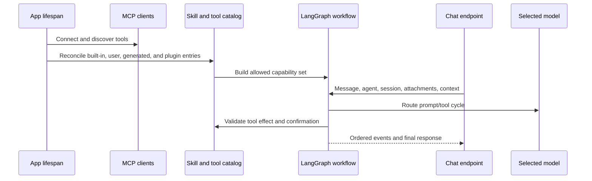

# AI agents, models, tools, and skills

## Capability model

Gnosi separates models, agents, skills, and tools:

- Model: a provider route with capabilities, limits, cost metadata, reliability,
  and credentials.
- Agent: instructions, model selection, memory/checkpoint policy, and assigned
  skills.
- Skill: a documented capability package that contributes instructions and
  constrains compatible tools.
- Tool: a callable operation classified by effect and origin.
- Context source: user-selected Vault, table, file, or external material added
  to a conversation with explicit containment and size behavior.

## Startup and request flow

The model router resolves provider/model combinations, context limits, tool
support, spend caps, and fallback policy. Credentials are obtained from local
secret storage or supported environment migration, not exposed to the
frontend. Failure reasons are recorded separately from user-facing responses so
operators can distinguish timeout, provider rejection, invalid credentials,
context overflow, and tool incompatibility.

## Tool governance

Tool descriptors declare read/write/external/destructive effects. Generated
tools pass AST-based validation and execute in a restricted environment. The
validator blocks dangerous capabilities such as unrestricted file writes,
environment access, dynamic dunder traversal, and unsafe imports.

Actions requiring confirmation create durable pending records. Confirmation
binds the user, session, tool, arguments, effect, and expiry; accepting a stale
or altered action does not authorize a different invocation. Maintenance
expires and removes records independently of chat traffic.

## Skills and plugins

Built-in runtime skills live in `pipeline/skills/`. User and plugin packages are
validated into a catalog while preserving origin, activation, compatibility,
and managed-versus-user-owned fields. Plugin reconciliation is idempotent:
disabling a plugin suspends its managed contribution without deleting user
overrides.

## Context and memory

Conversation state is scoped by agent and session. UI message ordering uses
stable identifiers rather than arrival time alone. Attachments and context
sources validate paths, size, file type, and workspace/vault scope. Large
external sources use searchable representations instead of injecting unlimited
raw text into every turn.

The durable checkpoint remains the complete audit record, but provider prompts
use a bounded projection. Earlier user and final assistant messages remain as
conversation memory, while historical tool-call groups and raw tool payloads
are omitted. The current turn retains complete call/result protocol groups, and
the aggregate conversational projection has a hard character ceiling even when
the selected model advertises a much larger context window.

Vault navigation contributes turn-scoped page, table, and active-view context.
The server expands a dashboard with one embedded view to the canonical table
view, reapplies its filters and sorting, and exposes an exact bounded row query
with count and pagination. Exact page and table reads are server-authored tool
calls; after a complete result, synthesis runs without tool bindings so a
tool-eager model cannot repeat the call until the graph recursion limit.

The canonical self-authored Resources request is also server-routed. Gnosi
executes the saved authorship view exactly once and formats its count and
bounded record list directly from the governed result. This path performs no
model call after the tool succeeds. Requests requiring interpretation or
generation continue through normal model synthesis.

Other read-only turns have an independent three-result budget: if the model
keeps requesting tools, the next Brain invocation receives the accumulated
evidence without tool bindings and must synthesize the response. The graph
recursion ceiling therefore remains a final safety net rather than normal flow
control.

The ToolNode retains the complete active-skill runtime for execution and policy
checks, while each model invocation binds only passive read tools plus guarded
tools explicitly authorized by the current request. Legacy automatic profiles
also narrow passive reads to multilingual request-domain matches and an exact
required context operation, with a bounded maximum; explicitly scoped skills
retain their already-small assigned read surface. Mandatory context reads bind
only the required source tool for their first step. This per-turn binding is
derived from request state and is never reused as cached authorization.

The chat measures each response from request dispatch through stream
completion. A live whole-second counter is replaced by the saved elapsed time
on the completed response. The stream also reports server setup, routing,
tool, model, residual, and total durations together with model/tool call and
token counts; message details retain this bounded diagnostic breakdown. Every
visible message also exposes conversation
rewind: after confirmation, the server truncates the scoped canonical
checkpoint at the complete turn boundary and returns its public projection.
Rewind changes conversation memory only; completed confirmations and external
side effects are never presented as reversed.

Editable model-registry rows are hydrated from the canonical catalog before
they reach Settings or runtime routing. Partial budget/settings updates merge
with existing capability, context-window, cost, and quality metadata. Provider
or model changes invalidate cached graphs so tool support and credentials take
effect on the next turn. The chat header reports the selected model, exact tool
count, and actionable reasons for any degraded runtime.

## Failure and safety invariants

- Provider failure does not silently route to a more expensive or less private
  model outside the configured policy.
- A tool unavailable to the selected model/skill cannot be invoked by name
  alone.
- Destructive or external effects require their declared policy.
- Generated code cannot access secrets or unrestricted filesystem state.
- One failed MCP server does not remove healthy servers from the catalog.
- Partial model output is not presented as a completed confirmed action.
- Agent messages remain isolated by agent and session across reloads.

## Verification focus

Run model routing, provider deletion, reliability, timeouts, MCP retry and
resilience, skill catalog/runtime/API, generated-tool validation, context
containment, confirmation race/expiry, chat ordering, and browser chat flows.
