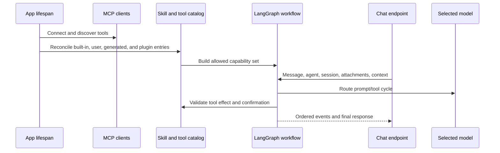

# AI agents, models, tools, and skills

## Capability model

Gnosi separates models, agents, skills, and tools:

- Model: a provider route with capabilities, limits, cost metadata, reliability,
  and credentials.
- Agent: instructions, model selection, memory/checkpoint policy, and assigned
  skills.
- Skill: a documented capability package that contributes instructions and
  constrains compatible tools.
- Tool: a callable operation classified by effect and origin.
- Context source: user-selected Vault, table, file, or external material added
  to a conversation with explicit containment and size behavior.

## Startup and request flow

The model router resolves provider/model combinations, context limits, tool
support, spend caps, and fallback policy. Credentials are obtained from local
secret storage or supported environment migration, not exposed to the
frontend. Failure reasons are recorded separately from user-facing responses so
operators can distinguish timeout, provider rejection, invalid credentials,
context overflow, and tool incompatibility.

Runtime failover is bounded and trust-aware. A transient timeout, connection
failure, rate limit, or 5xx may move to another configured model with the same
local/remote locality; authentication, policy, and content errors never do.
The selected fallback is marked in message metadata and in the stream receipt,
so a local model cannot unexpectedly send private context to a remote provider.

## Tool governance

Tool descriptors declare read/write/external/destructive effects. Generated
tools pass AST-based validation and execute in a restricted environment. The
validator blocks dangerous capabilities such as unrestricted file writes,
environment access, dynamic dunder traversal, and unsafe imports.

Actions requiring confirmation create durable pending records. Confirmation
binds the user, session, tool, arguments, effect, and expiry; accepting a stale
or altered action does not authorize a different invocation. Maintenance
expires and removes records independently of chat traffic.

## Skills and plugins

Built-in runtime skills live in `pipeline/skills/`. User and plugin packages are
validated into a catalog while preserving origin, activation, compatibility,
and managed-versus-user-owned fields. Plugin reconciliation is idempotent:
disabling a plugin suspends its managed contribution without deleting user
overrides.

## Context and memory

Conversation state is scoped by agent and session. UI message ordering uses
stable identifiers rather than arrival time alone. Attachments and context
sources validate paths, size, file type, and workspace/vault scope. Large
external sources use searchable representations instead of injecting unlimited
raw text into every turn.

The durable checkpoint remains the complete audit record, but provider prompts
use a bounded projection. Earlier user and final assistant messages remain as
conversation memory, while historical tool-call groups and raw tool payloads
are omitted. The current turn retains complete call/result protocol groups, and
the aggregate conversational projection has a hard character ceiling even when
the selected model advertises a much larger context window.

Vault navigation contributes turn-scoped page, table, and active-view context.
The server expands a dashboard with one embedded view to the canonical table
view, reapplies its filters and sorting, and exposes an exact bounded row query
with count and pagination. Exact page and table reads are server-authored tool
calls; after a complete result, synthesis runs without tool bindings so a
tool-eager model cannot repeat the call until the graph recursion limit.

The canonical self-authored Resources request is also server-routed. Gnosi
executes the saved authorship view exactly once and formats its count and
bounded record list directly from the governed result. This path performs no
model call after the tool succeeds. Requests requiring interpretation or
generation continue through normal model synthesis.

The same deterministic contract now applies to arbitrary attached-Vault
inventories rather than individual topics or tables. Before tool selection, the
server classifies the operation as conversation, lookup, inventory, analysis,
or governed action. Inventory requests receive an exhaustive structured scan
with exact count, canonical record ids, live registry type resolution, type
grouping, selected provenance metadata, and offset pagination. The subject is
query data: adding a topic or a new table does not add an intent branch. The
first page and continuation pages are formatted directly from the governed
tool result without a model call.

The request mode also prevents the default Knowledge attachment from hijacking
unrelated work. Conversation mode performs no source read and binds no passive
tools. Explicit mail, calendar, contacts, Reader, weather, web, Notion, or
Zotero requests omit default Vault tools unless the same request also names a
Vault object; the relevant assigned skill remains available.

Every request now carries an effective universal turn plan into the graph. The
plan combines operation mode, explicit data domains, live runtime descriptors,
required evidence, guarded grants, provider locality, execution strategy, and
response strategy. It is request-scoped state that overwrites checkpoint data
from previous turns. The Brain node intersects normal runtime selection with
the plan's tool names, so the metadata shown to the user describes the actual
tool surface rather than an advisory classifier.

Privacy is also request-scoped. The plan distinguishes local processing,
private evidence processed by the configured remote model, external reads, and
ordinary conversation. Attached Vault data does not count as used when an
explicit Mail, Reader, Notion, web, or other domain excludes its tools. The UI
reports only this posture and source counts; source bodies, prompts, secrets,
and hidden reasoning never enter transparency metadata.

Final model responses pass through a deterministic verifier. It checks only
current-turn tool results and effect policy, blocks claims that a governed
action completed without a successful tool result, blocks source-dependent
answers that skipped mandatory evidence, records tool failures as limitations,
and emits evidence/tool counts. Inventory answers use the same verifier even
though their text is server-rendered. Verification never invokes a second
model.

Source-dependent responses also carry server-validated claim citations. Tool
results define the only source ids valid for the current turn. Deterministic
inventories map each listed line to its canonical Vault record and map aggregate
count, grouping, pagination, and method statements to the exact tool-result
manifest. Model synthesis may emit `[[cite:SOURCE_ID]]` markers; the verifier
removes valid markers from visible prose, rejects ids absent from current-turn
evidence, and marks incomplete grounding as a limitation. The chat renders the
bounded claim/source mapping with safe Vault, Reader, or HTTP(S) links and never
persists excerpts or filesystem paths as citation metadata.

Vault search uses a deterministic hybrid rank: expanded multilingual lexical
terms, exact-title boosts, index-role boosts, and the rebuildable vector score.
Results are cached briefly by Brain/query/k only; the cache is bounded and does
not retain prompts or unbounded source bodies. Returned excerpts are delimited
as untrusted evidence and injection-like instructions are flagged; the Brain
prompt treats every source, connector, attachment, and web result as data rather
than an instruction.

Exhaustive inventories reuse the locally persisted parsed-document and link
indexes. Relation ids are expanded to indexed target titles, so a record linked
to a matching project or source remains discoverable without reopening every
OneDrive document. Normal Gnosi writes update these indexes; periodic index
maintenance reconciles external edits. Records absent from the cache fall back
to a direct bounded read. Semantic top-k search remains the evidence-discovery
path for lookups and analyses and is never presented as a complete inventory.

Inventory payloads also report link-index build age, cache coverage, direct
fallback reads, and stale-while-revalidate state. A stale or missing index
requests a guarded background reconciliation without delaying the answer; the
message retains the limitation instead of implying that the index was freshly
rebuilt.

Whole-collection Reader analysis is admitted as a background operation through
the provider-neutral capability-job facade. The server creates the job tool
call deterministically, returns a namespaced `reader:` job id, and exposes
status, result availability, resume after failure or interruption, and
cooperative cancellation in message details. The same
facade remains extensible to other source-owned durable providers; unsupported
requests stay foreground and are never represented as durable work.

Reader jobs persist a bounded recovery policy beside their checkpoints. A
transient timeout, temporary network/service failure, or rate limit enters a
cancelable retry-wait state with capped exponential backoff. Attempts and model
calls consume separate persisted budgets before any new call is made. A daemon
timer handles normal in-process retries; job list/status reconciliation starts
an overdue retry after a backend restart. Permanent, cancelled, malformed, or
budget-exhausted failures remain terminal and visible. Manual resume uses the
same budgets and therefore cannot bypass the loop boundary.

Other read-only turns have an independent three-result budget: if the model
keeps requesting tools, the next Brain invocation receives the accumulated
evidence without tool bindings and must synthesize the response. The graph
recursion ceiling therefore remains a final safety net rather than normal flow
control.

The universal plan also carries an immutable operational budget for every turn:
the HTTP timeout, maximum model calls, maximum tool calls, and maximum read
results. Conversation turns receive a short no-tool budget; lookup and
inventory turns receive bounded read budgets; analysis and governed actions
receive a larger but finite budget. The graph enforces these values before the
next provider or tool invocation, and the stream exposes the same values and
whether a limit was reached. A zero tool budget is a mode declaration, not an
authorization bypass: mandatory server-authored context reads still follow
their explicit path. Dynamic context tools are not selected for a general
question unless the user actually supplied a context source.

The ToolNode retains the complete active-skill runtime for execution and policy
checks, while each model invocation binds only passive read tools plus guarded
tools explicitly authorized by the current request. Legacy automatic profiles
also narrow passive reads to multilingual request-domain matches and an exact
required context operation, with a bounded maximum; explicitly scoped skills
retain their already-small assigned read surface. Mandatory context reads bind
only the required source tool for their first step. This per-turn binding is
derived from request state and is never reused as cached authorization.

The chat measures each response from request dispatch through stream
completion. A live whole-second counter is replaced by the saved elapsed time
on the completed response. The stream also reports server setup, routing,
tool, model, residual, and total durations together with model/tool call and
token counts; message details retain this bounded diagnostic breakdown. Every
visible message also exposes conversation
rewind: after confirmation, the server truncates the scoped canonical
checkpoint at the complete turn boundary and returns its public projection.
Rewind changes conversation memory only; completed confirmations and external
side effects are never presented as reversed.

The stream owns an opaque cancellation token. If the client disconnects, it
signals the token and the next graph node/tool gate exits without starting more
work; cached workflows do not capture request-specific events. Tokens are
released after the stream completes. Tool descriptors additionally expose a
cheap health status (healthy or unavailable) so missing ids, names, or handlers
cannot be advertised as runnable capabilities.

Editable model-registry rows are hydrated from the canonical catalog before
they reach Settings or runtime routing. Partial budget/settings updates merge
with existing capability, context-window, cost, and quality metadata. Provider
or model changes invalidate cached graphs so tool support and credentials take
effect on the next turn. The chat header reports the selected model, exact tool
count, and actionable reasons for any degraded runtime.

Message details provide bounded operational explainability: mode, route,
foreground/background execution, tools actually used, evidence count, privacy
posture, verifier status, index freshness, durable job state when present, and
timings. This is an execution receipt, not chain-of-thought.

Turn metrics include a provider-catalog-based USD estimate alongside token and
latency counts. The persistent spend ledger remains the source of truth; the
estimate is bounded display metadata and is never used as authorization by
itself. The deterministic evaluation suite also asserts that every plan stays
within the 120-second latency ceiling.

The deterministic corpus under `backend/agent/evals/` covers all request modes,
all four UI languages, domain containment, private local and remote processing,
governed actions, and durable Reader admission. It runs before the backend test
suite on matching pull requests and every day; any failed case exits nonzero
without calling a provider or spending tokens.

Production errors and assistant thumbs feedback feed a local, authenticated
quality loop. `POST /api/chat/feedback` accepts bounded operational metadata
only and explicitly rejects response content. Stream errors are recorded by the
server with stable codes. The local SQLite store retains hashed turn/session/
agent identities, plan and verifier fields, tool names, and timing buckets; it
has no prompt, response, source, title, path, URL, excerpt, attachment, or raw
tool-payload columns. Negative feedback and errors deterministically upsert
deduplicated synthetic evaluation candidates. Administrators list, accept,
reject, reopen, and run these candidates through `/api/ai/evals/candidates*`.
Accepted local cases remain separate from the versioned CI corpus until a
maintainer deliberately promotes them.

## Failure and safety invariants

- Provider failure does not silently route to a more expensive or less private
  model outside the configured policy.
- A tool unavailable to the selected model/skill cannot be invoked by name
  alone.
- Destructive or external effects require their declared policy.
- Generated code cannot access secrets or unrestricted filesystem state.
- One failed MCP server does not remove healthy servers from the catalog.
- Partial model output is not presented as a completed confirmed action.
- Source-dependent output cannot pass verification without current-turn source
  evidence.
- Citation ids cannot resolve unless the same turn returned that exact source.
- Transparency metadata cannot contain source bodies, prompts, or raw tool
  payloads.
- Automatic and manual job recovery cannot exceed persisted attempt or model-call
  budgets.
- Quality telemetry cannot accept or retain prompt/response content.
- Stale index evidence is labeled and refreshed outside the foreground turn.
- Agent messages remain isolated by agent and session across reloads.

## Verification focus

Run model routing, provider deletion, reliability, timeouts, MCP retry and
resilience, skill catalog/runtime/API, generated-tool validation, context
containment, confirmation race/expiry, chat ordering, and browser chat flows.
