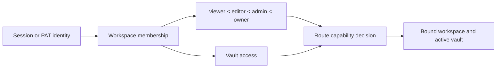

# Authentication, workspaces, and sharing

## Operating modes

`personal` mode is the default local single-user experience. Authentication is
bypassed unless effective policy requires it. `org` mode requires identity and
workspace membership. Exposed deployments may force authentication regardless
of the friendly mode label.

The frontend gate selects login or application UI, but all authorization is
enforced in backend dependencies and services.

The shell imports the login form through `features/auth`'s public entry.
Login/register validation, session handling, and the backend policy gate retain
their existing behavior. Account and workspace settings remain separate from
this form; moving the entry point does not authorize access to a workspace.

The sharing feature exposes its read-only page through a lazy public entry.
The `/s/:token` route remains outside both the authentication gate and application
shell. Relocating this screen does not broaden access: the backend still resolves
the token and expired or invalid links retain their existing error display.

Workspace resolution validates the configured project and Vault roots before
any bootstrap or path selection. Personal bootstrap is race-safe and confirms
the winning membership after a uniqueness conflict; organization mode narrows
membership roles and JSON capabilities before constructing the request context.
Missing mounts fall back only where personal-mode compatibility explicitly
allows it and never fabricate an organization Vault.

## Session and token authentication

Email/password login verifies a password hash and issues a signed JWT in an
HttpOnly, SameSite=Lax cookie. Accepted API clients may also send an
`Authorization` bearer token. Personal Access Tokens use a separate opaque
format; only a SHA-256 hash and display prefix are stored.

The signing secret must be strong on exposed deployments. The backend refuses
to start with the public development fallback when the effective deployment
requires protection.

The authentication route boundary is strictly typed while preserving its
frozen response schemas. Management models share a typed SQLAlchemy
`DeclarativeBase`; column descriptors are narrowed only at the ORM boundary,
and account claims, password rotation, profile updates and session cookies
retain their existing validation and transaction behavior. Pydantic permission
objects preserve their historical defaults and exact OpenAPI representation.

The authentication service types management sessions, policy-cache generators,
HTTP/WebSocket connection identity, PAT lookup and JWT subject decoding at
their boundaries. `python-jose` stubs are locked in the development dependency
group, and the remaining legacy ORM timestamp mutation is isolated with
`setattr` until column declarations move fully to `Mapped[]`.

The collaboration WebSocket imports the same typed identity service as HTTP.
Authentication policy—not optional module availability—decides whether a
credential is required, so personal mode remains frictionless while org mode
and PAT clients share one resolver. Closing before acceptance still reports
policy violation, and room keys retain their Vault namespace.

## Authorization model

Roles provide ordered baseline capabilities. VaultAccess narrows or grants
access to a registered vault. A request-provided workspace, user, or vault ID is
never trusted without resolving the authenticated identity and memberships.

Workspace bootstrap is concurrency-safe so simultaneous first requests do not
create duplicate default workspaces, users, or memberships. Placeholder and
auto-provisioned accounts are explicitly marked; registration cannot claim them
by email as a weak identity proof.

Workspace context resolution keeps its public FastAPI dependency stable while
separate helpers own membership selection, accessible-vault filtering, storage
path resolution, and capability decoding. This keeps authorization decisions
explicit without changing headers, status codes, or active-vault behavior.

Vault identity, slug, optional legacy path and creation timestamp use typed
SQLAlchemy mappings while retaining the existing columns and migrations.
Canonical middleware narrows an id or slug to concrete string identity before
publishing request context. Template export revalidates the nullable legacy
path at its filesystem boundary and returns the established not-found response
instead of constructing a `Path` from missing configuration.

The workspace administration API converts legacy membership roles and JSON
permission descriptors to concrete response values at the ORM boundary. Role
and vault-access mutations use localized descriptor-safe assignment, retaining
membership checks, invitation normalization and existing payload schemas.

## Public sharing

A share link is an opaque row that binds page, workspace, vault, creator,
permission, expiry, and revocation. `/s/:token` is intentionally outside the
authenticated frontend shell. The public backend resolver uses the stored vault
identity because an anonymous request has no active-vault cookie or header.

Revocation is soft so the system retains an audit record. Expired or revoked
links reveal no page content. Public asset resolution inherits the same share
scope rather than accepting an arbitrary path.

The sharing route boundary types serialization, vault-path resolution, ORM
mutation and every handler response. Named Pydantic models validate direct-call
mappings before serialization, while compatibility registrations explicitly
disable response-model publication to preserve the frozen OpenAPI schemas.
Stored multi-vault identifiers are resolved to concrete paths before activating
page context, while missing configuration retains the existing recoverable
fallback and service-unavailable response.

Vault-scoped identity settings use separate Pydantic request and legacy-read
models. Unknown historical fields survive reads, atomic writes retain the
established profile shape, and success responses are validated before returning
their directly indexable mapping contract.

Personal multi-Vault listing, creation, rename and deletion now construct
explicit nested Pydantic response models. Slugs, nullable legacy values, active
selection and deletion receipts retain their original dictionary shape, while
path containment, primary-Vault protection and artifact cleanup remain
unchanged.

## Public API

PAT-authenticated routes apply token scopes plus normal workspace/vault
authorization. Token plaintext is shown only at creation. Revocation prevents
future use without needing to delete its audit row.
The typed public facade updates ORM timestamps through the descriptor boundary,
contains legacy Markdown writes beneath the active Vault, and routes configured
Web Clipper records through the normal page-creation pipeline. Token, ping,
page, clipper-configuration and clip results cross named Pydantic response
models, then retain their historical dictionary or list shape. Explicit
`response_model=None` registration keeps the FastAPI schemas byte-stable until
the coordinated OpenAPI/client contract PR.

## Invariants

- Identity, workspace membership, role, vault access, and requested operation
  all participate in authorization.
- Cookies are HttpOnly; the frontend does not need to read the JWT.
- Password and token hashes are one-way values.
- A client-supplied `X-User-ID` cannot become an account-creation or privilege
  escalation path.
- Public share content is limited to the stored page/vault scope.
- Personal-mode convenience cannot weaken an exposed multi-user deployment.

## Verification focus

Run central-gate, enforcement-flag, account, placeholder, email-case, password,
PAT, public-surface, direct typed-response, workspace-race, membership, and
sharing tests. Browser QA checks login/logout, account updates, workspace
switching, and anonymous share access in a clean session.
