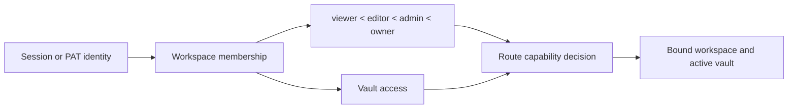

# Authentication, workspaces, and sharing

## Operating modes

`personal` mode is the default local single-user experience. Authentication is
bypassed unless effective policy requires it. `org` mode requires identity and
workspace membership. Exposed deployments may force authentication regardless
of the friendly mode label.

The frontend gate selects login or application UI, but all authorization is
enforced in backend dependencies and services.

## Session and token authentication

Email/password login verifies a password hash and issues a signed JWT in an
HttpOnly, SameSite=Lax cookie. Accepted API clients may also send an
`Authorization` bearer token. Personal Access Tokens use a separate opaque
format; only a SHA-256 hash and display prefix are stored.

The signing secret must be strong on exposed deployments. The backend refuses
to start with the public development fallback when the effective deployment
requires protection.

## Authorization model

Roles provide ordered baseline capabilities. VaultAccess narrows or grants
access to a registered vault. A request-provided workspace, user, or vault ID is
never trusted without resolving the authenticated identity and memberships.

Workspace bootstrap is concurrency-safe so simultaneous first requests do not
create duplicate default workspaces, users, or memberships. Placeholder and
auto-provisioned accounts are explicitly marked; registration cannot claim them
by email as a weak identity proof.

Workspace context resolution keeps its public FastAPI dependency stable while
separate helpers own membership selection, accessible-vault filtering, storage
path resolution, and capability decoding. This keeps authorization decisions
explicit without changing headers, status codes, or active-vault behavior.

## Public sharing

A share link is an opaque row that binds page, workspace, vault, creator,
permission, expiry, and revocation. `/s/:token` is intentionally outside the
authenticated frontend shell. The public backend resolver uses the stored vault
identity because an anonymous request has no active-vault cookie or header.

Revocation is soft so the system retains an audit record. Expired or revoked
links reveal no page content. Public asset resolution inherits the same share
scope rather than accepting an arbitrary path.

## Public API

PAT-authenticated routes apply token scopes plus normal workspace/vault
authorization. Token plaintext is shown only at creation. Revocation prevents
future use without needing to delete its audit row.

## Invariants

- Identity, workspace membership, role, vault access, and requested operation
  all participate in authorization.
- Cookies are HttpOnly; the frontend does not need to read the JWT.
- Password and token hashes are one-way values.
- A client-supplied `X-User-ID` cannot become an account-creation or privilege
  escalation path.
- Public share content is limited to the stored page/vault scope.
- Personal-mode convenience cannot weaken an exposed multi-user deployment.

## Verification focus

Run central-gate, enforcement-flag, account, placeholder, email-case, password,
PAT, public-surface, workspace-race, membership, and sharing tests. Browser QA
checks login/logout, account updates, workspace switching, and anonymous share
access in a clean session.
