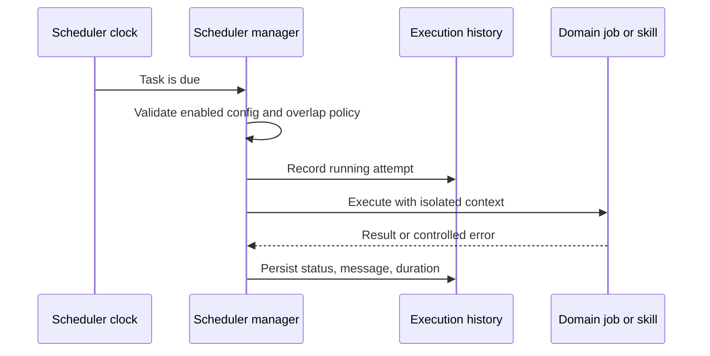

# Automation and scheduling

## Responsibility

The scheduler executes configured recurring and one-shot tasks, records history,
exposes operational state, and coordinates domain jobs such as synchronization,
publishing, ingestion, maintenance, and planning refresh.

Scheduler task metadata, persisted runtime state, and the optional notification
boundary are strictly typed in dedicated modules. The manager remains below the
source-size guardrail and validates legacy persisted task dictionaries before
constructing runtime tasks.

## Task model

A task definition has stable identity, enabled state, schedule, operation,
configuration, and execution policy. Task history records start, completion,
status, message, and duration. Definitions and connection settings are aligned
before execution so a job cannot accidentally use a removed or different
integration.

## Execution flow

Task functions must be idempotent where repetition is possible. The manager
guards overlapping instances according to task policy and uses fresh database
or provider contexts. A process restart reconciles schedules from persisted
configuration instead of trusting only in-memory state.

The manager owns scheduling lifecycle, persistence, overlap control, and task
history. `task_handlers.py` owns dispatch policy and the larger operational task
bodies, including bounded maintenance. This keeps task execution reusable and
strictly typed without coupling it back to the scheduler thread lifecycle.

## Academic synchronization and review updates

`academic_repository_sync` is a durable, resumable job for local OAI indexes.
Its cursor, counts, error, cancellation state, and last successful synchronization
are persisted outside the request process. An administrator explicitly starts
the first harvest; after it completes, daily incremental scheduling resumes from
the repository's last completed checkpoint and applies OAI tombstones.

Saved review strategies may also schedule `academic_review_update` jobs. A run
replays the versioned strategy, records exact per-source activity and partial
errors, and registers only candidates whose deterministic identity is new to
that review. The next run is persisted with the review configuration rather
than held only by the scheduler process.

## Vault automations

Vault automation rules combine triggers, conditions, and actions. Derived field
formulas and rollups are deterministic evaluation, not arbitrary code
execution. External or destructive actions use the same authorization and
confirmation boundaries as interactive actions.

## Autonomous quality work

Maintenance and quality loops are bounded operational tasks. They may diagnose,
generate reports, or apply changes within their declared scope. They do not gain
broader filesystem, secret, Git, or publishing authority because they are
scheduled.

## Daily audio generation

The Reader podcast service uses typed model and language selection, bounded
sentence-level TTS workers, and atomic MP3 replacement. Background generation
captures the selected Vault explicitly and refuses to start when no Vault is
active, so output cannot fall through to an ambiguous local path.

## Invariants

- Disabled or invalid tasks do not execute.
- A task run has one durable history outcome.
- Retries do not duplicate external effects without an idempotency strategy.
- Connection deletion or reassignment updates dependent schedules.
- Scheduling uses explicit time zone semantics.
- Job exceptions are isolated from the scheduler loop.
- Background work does not reuse request-scoped database sessions.
- A cancelled OAI harvest keeps its durable cursor and can be resumed.
- Scheduled review refreshes are idempotent for the same deduplicated work.

## Verification focus

Test config resilience, connection alignment, planning schedules, task history,
overlap prevention, time zones, retry/idempotency, OAI resume and cancellation,
tombstones, and review new-result detection, plus the Playwright automation
scout. A representative scheduled integration should run end to end against a
safe fixture or test account.
