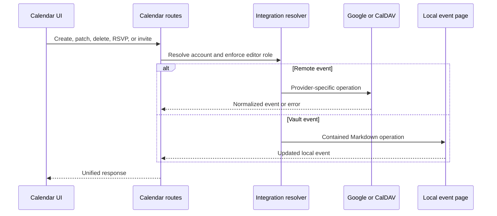

# Calendar and meetings

## Responsibility

Calendar aggregates local Vault events with connected Google Calendar and
CalDAV accounts. It supports calendar selection, event CRUD, invitations,
RSVPs, free/busy queries, geocoding, reminders, hidden-event state, ICS export,
meeting recording, transcription, and AI-generated notes.

## Event aggregation

The route layer resolves workspace context and selected integrations, then
normalizes provider events and local Markdown events into a shared response.
Provider identifiers remain paired with their account/calendar origin; an ID
alone is not globally unique enough for mutation.

Hidden events are local overlay records. Hiding does not delete a provider
event. Unhide removes the overlay so the next aggregation includes it again.

## Mutation flow

Google all-day events use an exclusive end date, while the Gnosi form presents
an inclusive last day. Conversion happens exactly once at the provider
boundary: requests add one day before writing to Google, and responses remove
one day before rendering. A birthday occurrence is patched through its
recurring master; dates owned by Google Contacts remain provider-controlled,
while supported fields such as the title can still be updated.

## Reminders and meeting notes

Reminder settings select lead time and behavior. Collection merges upcoming
events and deduplicates concurrent requests so duplicate reminders are not
created. The frontend watcher displays active reminders and can navigate to the
calendar or dismiss them.

Meeting recording uploads bounded audio to a background workflow. Status polling
separates recording, transcription, summarization, note creation, completion,
and failure. Generated notes are written through Vault-safe operations and
retain event/source context.

## Invariants

- Provider event identity includes account and calendar context.
- Provider-exclusive all-day ends never leak into the inclusive UI model.
- Contact-owned birthday dates are preserved when patching recurring events.
- Calendar writes require an editor-capable context.
- Path-based local events remain inside the active vault.
- Hiding is local and reversible; deletion uses the authoritative provider.
- Reminders are race-safe and do not duplicate for the same event/window.
- Missing transcription or AI providers fail the meeting job, not the calendar.
- ICS output uses normalized time zones and does not expose private credentials.

## Verification focus

Test local path containment, event normalization, recurrence, hidden state,
reminder races, account selection, time zones, and Playwright create/edit/delete
flows. Meeting QA should record or upload a fixture, observe background status,
and verify the resulting Vault page.
