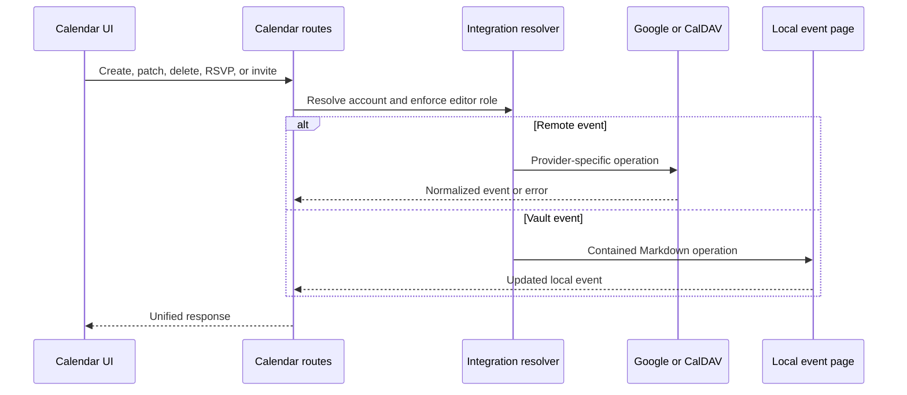

# Calendar and meetings

## Responsibility

Calendar aggregates local Vault events with connected Google Calendar and
CalDAV accounts. It supports calendar selection, event CRUD, invitations,
RSVPs, free/busy queries, geocoding, reminders, hidden-event state, ICS export,
meeting recording, transcription, and AI-generated notes.

The HTTP boundary is strictly typed while preserving the existing response
contract. Photon label normalization, URL rejection, result validation, and
deduplication belong to the Calendar geocoding domain rather than the route
module; provider payloads remain validated at that adapter boundary.

The hybrid provider service is strictly typed and keeps Google as one adapter
beside generic CalDAV. CalDAV account detection therefore supports Nextcloud,
iCloud, Fastmail, Radicale and compatible servers through configured URLs,
without introducing storage-provider-specific workspace behavior.

The optional Google-to-Vault mirror narrows calendar and event payloads before
filesystem work, requires a configured Vault, uses provider event IDs as stable
filenames and contains account/calendar folders beneath `Calendar/External`.
Missing identities are skipped and each calendar folder removes only stale
Markdown rows from the bounded synchronization window.

## Event aggregation

The route layer resolves workspace context and selected integrations, then
normalizes provider events and local Markdown events into a shared response.
Provider identifiers remain paired with their account/calendar origin; an ID
alone is not globally unique enough for mutation.

Hidden events are local overlay records. Hiding does not delete a provider
event. Unhide removes the overlay so the next aggregation includes it again.

## Mutation flow

## Reminders and meeting notes

Reminder settings select lead time and behavior. Collection merges upcoming
events and deduplicates concurrent requests so duplicate reminders are not
created. The frontend watcher displays active reminders and can navigate to the
calendar or dismiss them.

Reminder persistence narrows its JSON state into explicit settings, notified
keys and active reminder objects. Time parsing accepts provider values at one
boundary, attendee labels are normalized to strings, and AI output is converted
before storage. The existing whole-cycle lock and fresh-state merge remain the
authority for scheduler/API races.

Meeting recording uploads bounded audio to a background workflow. Status polling
separates recording, transcription, summarization, note creation, completion,
and failure. Generated notes are written through Vault-safe operations and
retain event/source context. The background service normalizes the legacy Vault
route result to a concrete mapping before reading the created page identifier;
dynamic compatibility handlers do not leak into the typed job boundary.

## Invariants

- Provider event identity includes account and calendar context.
- Calendar writes require an editor-capable context.
- Path-based local events remain inside the active vault.
- Hiding is local and reversible; deletion uses the authoritative provider.
- Reminders are race-safe and do not duplicate for the same event/window.
- Missing transcription or AI providers fail the meeting job, not the calendar.
- ICS output uses normalized time zones and does not expose private credentials.

## Verification focus

Test local path containment, event normalization, recurrence, hidden state,
reminder races, account selection, time zones, and Playwright create/edit/delete
flows. Meeting QA should record or upload a fixture, observe background status,
and verify the resulting Vault page.
