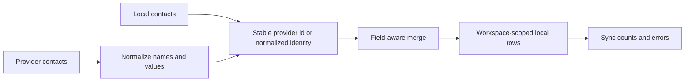

# Contacts

## Responsibility

Contacts provides a local normalized address book over manual records and
connected Google, CardDAV, and compatible sources. It supplies search and
recipient/attendee autocomplete to Mail and Calendar.

## Data model

A contact has stable local identity, workspace, type, display name, primary
email and phone, organization fields, notes, structured multi-value emails,
phones and addresses, provider identifiers, source, photo, tags, timestamps,
and synchronization state.

Provider-specific payloads are normalized before merge. vCard processing
unfolds continuation lines, decodes values, and escapes separators without
changing user data.

## Synchronization and merge

The critical merge rule is preservation of local-only enrichment. A remote sync
may update provider-owned values but must not blank tags, notes, manually added
values, or another provider's identity merely because the current payload omits
them. Deletion policy is provider-specific and not inferred from a partial list.

## Cross-domain use

Mail searches contacts for recipients and entity linking. Calendar searches
contacts for attendees. These consumers receive normalized display data and do
not access provider credentials or raw synchronization payloads.

## Invariants

- Every query and mutation is workspace-scoped.
- Remote identifiers are namespaced by provider/source.
- Repeated syncs do not create duplicates for the same provider record.
- Local enrichment survives provider refresh.
- Multi-value fields preserve type labels and preferred values.
- Contact deletion and remote deletion are separate effects unless an explicit
  bidirectional policy is selected.

## Verification focus

Run merge, vCard unfold/escape, provider normalization, case-insensitive email,
and workspace tests. Playwright verifies list, detail, create/edit, search, and
cross-navigation without depending on a real provider account.
