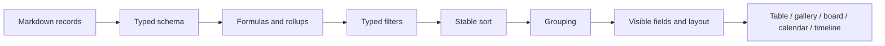

# Database views and project planning

## Structured knowledge model

A Gnosi database is a schema and view layer over pages, normally rooted in a
Vault folder. Page front matter contains record values. Registry data defines
field types, view configurations, formulas, rollups, relations, options,
display settings, and actions.

At least one main view is an invariant. Startup and read-time repair paths
restore it when legacy or interrupted writes leave a table without a valid
view.

## System audit dates

Every table owns read-only creation and last-modification properties. New
tables localize their labels from the request language or the current
interface language in Settings, and keep both properties at the end of the
schema. Record creation stamps both values; later saves preserve creation and
refresh modification.

The idempotent migration recognizes only explicit system types and known
legacy labels, so unrelated `date` fields and internal `created_at` or
`last_edited_at` metadata remain untouched. Deterministic Notion clones can
backfill authoritative audit timestamps by mapping configured database and
page UUIDs, without title matching. The complete Notion index is fetched
before writes, and each changed registry or Markdown file is backed up.

## Table and view name hygiene

Registry table and saved-view labels are normalized at load and write
boundaries. Decorative emoji and pictographic symbols are removed while
accents and meaningful punctuation are retained. The locked main view is
always named exactly after its owning table, and its `is_main` marker remains
authoritative.

## Table navigation hierarchy

The Vault sidebar presents each table as a parent node with two independent
child groups: `Content` contains the table's records and `Views` contains its
saved views. Both groups are collapsed by default, as are table nodes and
top-level navigation sections, so a table with many records or views remains
scannable. Expanding one group must not implicitly expand the other; each
section keeps its own persisted state and all labels go through the frontend
localization catalog.

## View pipeline

Typed values must be compared as their declared field type. Text input alone
cannot represent every filter value; date, checkbox, number, relation, select,
and multi-value fields normalize through field-aware operators.

Derived-field evaluation has an explicit order. Formulas that depend on raw
values run before rollups that aggregate relations, and dependent formulas are
resolved without allowing cycles to recurse indefinitely. Backend and frontend
representations must agree on checkbox truthiness, percentages, empty values,
and option identifiers.

Read-time virtual fields use typed graph projections and computation contexts.
Structural edges exclude unresolved and semantic proposal nodes; NetworkX
metrics are narrowed when they enter the shared cache, while degree, hub,
orphan and inverse task-progress values expose stable primitive results. The
canonical frontmatter key remains the registry property name without slugging.

Canonical database behavior is split by responsibility. `tables/rules/` owns
formula, rollup, lookup and automation evaluation; `tables/catalogs/` owns
option normalization, semantic roles and the global status catalog; and the
small modules under `vault/views/` own snapshot syntax, materialization,
filters, sorting and joins. The historical `rule_engine.py`,
`option_catalogs.py` and `view_snapshot.py` imports remain thin compatibility
facades, including the late-bound path and relation-decoration test seams.

Cross-record changes are serialized per table by
`tables/formula_recalculation.py`. Concurrent requests are coalesced into a
pending pass; every visible row is recomputed, changed Markdown is written, and
the page index and response cache are refreshed only after successful writes.

Saved-view sort criteria are applied in array order with a stable multi-key
comparison. Empty property values always follow populated values in both
ascending and descending directions, matching imported Notion view semantics.
Frontend views and backend Markdown snapshots use the same rule so their
record order cannot drift.

When `VaultDashboard` renders a table tab, it passes the table registry's
enabled functionalities through `VaultViewBody` to `VaultTable`. The table tab,
standalone table, split pane, and embedded view therefore expose the same
configured row actions. Omitting that prop chain hides an action even when the
registry and API correctly report it as enabled.

## Schema evolution and concurrency

Schema revisions protect a client from saving an older field list over a newer
one. Renaming a field updates filters, sorts, formulas, actions, and saved-view
references. Renaming a table detects flat-folder filename collisions before
moving content.

Registries are written atomically and refreshed after batch metadata changes.
Cached snapshots are invalidated when source records or the schema revision
changes.

Per-page view routes validate the registry root, source table, filter field and
page-on-disk identity before mutation. Their read-modify-write cycle shares the
canonical registry lock and refreshes the facade cache after an atomic save;
optional Obsidian section synchronization remains a typed best-effort adapter.
Stable `view_id` takes precedence over headings during upsert so parallel embeds
cannot overwrite each other.

Bulk field edits, Zotero Extra promotion, and template application share one
typed page-mutation service. Each target is isolated, checks an optional ETag,
refreshes the page index after a write, and reports skips, conflicts, and errors
without aborting the remaining rows.

Page-property editors use field-aware controls. `select` and `status` fields
render as single-value option pickers; status catalogs are strict and do not
expose inline option creation or deletion. The table grid and page-property
panel must preserve the same field type and option semantics.

Status values introduced by action rules are persisted idempotently through the
table domain. Registry failures are logged but never turn the originating rule
into a failed user action.
The pure rule boundary resolves fields by id, current name or alias, evaluates
declared prerequisites without treating absent data as a denial, preserves the
frontmatter key already in use, and seeds missing status options deterministically.
Button rules remain distinct from change-triggered automations.

The Planning HTTP boundary is strictly typed while preserving its frozen
OpenAPI contract. Active-vault resolution fails explicitly when no vault is
selected, and recurrence materialization uses bounded iterator consumption for
RRULE occurrences while preserving stable task identifiers and ETag checks.

## Project planning

Planning consumes structured task fields and produces an authoritative schedule
rather than duplicating scheduling logic in the UI. The engine normalizes
dependencies, calendars, durations, constraints, resources, deadlines,
progress, and scheduling direction. It then calculates dates, slack, critical
tasks, warnings, and resource allocations.

The deterministic engine now separates fact normalization, one-task forward
scheduling, constraint diagnostics, successor indexing, the backward slack pass,
ALAP placement and payload serialization. This keeps persisted facts immutable
while preserving partial schedules and diagnostics for recoverable graph errors.

Period durations retain both their numeric value and configured unit (`hours`,
`days`, or `years`). Calendar years are added as calendar-year offsets, which
keeps a start year plus eight years at the corresponding end year, including
negative years. The property editor removes redundant actual-date fields,
recalculates the end whenever the start, duration, or predecessor changes, and
uses a searchable multi-select for predecessors. Legacy `durationDays` values
remain available for compatibility with older records and schedule snapshots.

The frontend renders the result and editing controls. It does not independently
recompute critical-path semantics. Cached schedules are keyed by relevant input
state and live in local data, not the vault source records.

## Failure behavior

- Invalid formulas return a controlled field error rather than aborting the
  table response.
- Broken relations remain visible as unresolved values when possible.
- Missing views trigger a deterministic main-view repair.
- Planning cycles, impossible constraints, or missing calendars produce
  diagnostics and partial results where safe.
- An outdated schema revision returns a conflict and requires reload/merge.

## Verification focus

Test typed filter parity, schema revision conflicts, field and table renames,
formula/rollup ordering, relation synchronization, snapshot sorting, option
catalog actions, scheduling constraints, critical paths, and dashboard E2E
rendering.
