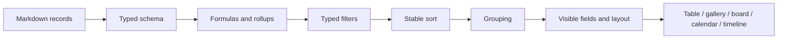

# Database views and project planning

## Structured knowledge model

A Gnosi database is a schema and view layer over pages, normally rooted in a
Vault folder. Page front matter contains record values. Registry data defines
field types, view configurations, formulas, rollups, relations, options,
display settings, and actions.

Each active Vault resolves to one locally stored SQLite engine and typed session
factory. The engine registry is keyed by Vault path, uses a typed SQLAlchemy
declarative base, runs schema migration before first connection and disposes
pooled connections on Vault deletion. SQLite files remain outside cloud-synced
Vault storage.

At least one main view is an invariant. Startup and read-time repair paths
restore it when legacy or interrupted writes leave a table without a valid
view.

## Creating database groups

The welcome screen's Create a DB button and the sidebar's Add database control
share one creation action. Both create a registry database group through
`/api/vault/databases`, refresh the registry and leave page documents unchanged.
The name is trimmed; cancel and blank names do not write, and a failed request
keeps the group prompt available for retry.

A table is a separate object created inside a selected group, with its main
view. Legacy pages marked `is_database: true` remain supported by the page API;
they are not silently converted, deleted or reinterpreted by the welcome action.

## System audit dates

Every table owns read-only creation and last-modification properties. New
tables localize their labels from the request language or the current
interface language in Settings, and keep both properties at the end of the
schema. Record creation stamps both values; later saves preserve creation and
refresh modification.

The idempotent migration recognizes only explicit system types and known
legacy labels, so unrelated `date` fields and internal `created_at` or
`last_edited_at` metadata remain untouched. Deterministic Notion clones can
backfill authoritative audit timestamps by mapping configured database and
page UUIDs, without title matching. The complete Notion index is fetched
before writes, and each changed registry or Markdown file is backed up.

## Table and view name hygiene

Registry table and saved-view labels are normalized at load and write
boundaries. Decorative emoji and pictographic symbols are removed while
accents and meaningful punctuation are retained. The locked main view is
always named exactly after its owning table, and its `is_main` marker remains
authoritative.

## Table navigation hierarchy

The Vault sidebar presents each table as a parent node with two independent
child groups: `Content` contains the table's records and `Views` contains its
saved views. Both groups are collapsed by default, as are table nodes and
top-level navigation sections, so a table with many records or views remains
scannable. Expanding one group must not implicitly expand the other; each
section keeps its own persisted state and all labels go through the frontend
localization catalog.

## View pipeline

`VaultTable.tsx` delegates to the typed `vault-table` controller and layout.
The shared `VaultViewBody` table adapter preserves valid row-array identity,
unknown metadata extensions and selection callbacks. Cell editing, keyboard
navigation, virtualized rows and schema-option updates remain separate modules
with regression tests. `SchemaConfigModal.tsx` delegates schema editing and
autosave to `schema-config`, retaining field IDs, option colors and defaults.
These internal changes do not alter saved views or portable page metadata.

```mermaid
flowchart LR
    Pages["Markdown records"] --> Schema["Typed schema"]
    Schema --> Derived["Formulas and rollups"]
    Derived --> Filter["Typed filters"]
    Filter --> Sort["Stable sort"]
    Sort --> Group["Grouping"]
    Group --> Projection["Visible fields and layout"]
    Projection --> Table["Table / gallery / board / calendar / timeline"]
```

Typed values must be compared as their declared field type. Text input alone
cannot represent every filter value; date, checkbox, number, relation, select,
and multi-value fields normalize through field-aware operators.

Derived-field evaluation has an explicit order. Formulas that depend on raw
values run before rollups that aggregate relations, and dependent formulas are
resolved without allowing cycles to recurse indefinitely. Backend and frontend
representations must agree on checkbox truthiness, percentages, empty values,
and option identifiers.

Read-time virtual fields use typed graph projections and computation contexts.
Structural edges exclude unresolved and semantic proposal nodes; NetworkX
metrics are narrowed when they enter the shared cache, while degree, hub,
orphan and inverse task-progress values expose stable primitive results. The
canonical frontmatter key remains the registry property name without slugging.

Canonical database behavior is split by responsibility. `tables/rules/` owns
formula, rollup, lookup and automation evaluation; `tables/catalogs/` owns
option normalization, semantic roles and the global status catalog; and the
small modules under `vault/views/` own snapshot syntax, materialization,
filters, sorting and joins. The historical `rule_engine.py`,
`option_catalogs.py` and `view_snapshot.py` imports remain thin compatibility
facades, including the late-bound path and relation-decoration test seams.

The table HTTP boundary consumes those strict collection, lifecycle, schema,
option, view and contained-path contracts directly. It no longer recasts their
results, so each domain module remains the sole owner of its return type while
the flat historical route inventory and OpenAPI document stay unchanged.

The transitional table composition graph now injects concrete option lists,
typed join definitions and a protocol-compatible Markdown rematerializer. The
adapter preserves late-bound legacy decoration while rejecting a non-text
snapshot result instead of allowing it to cross into persistence.

Cross-record changes are serialized per table by
`tables/formula_recalculation.py`. Concurrent requests are coalesced into a
pending pass; every visible row is recomputed, changed Markdown is written, and
the page index and response cache are refreshed only after successful writes.

Saved-view sort criteria are applied in array order with a stable multi-key
comparison. Empty property values always follow populated values in both
ascending and descending directions, matching imported Notion view semantics.
Frontend views and backend Markdown snapshots use the same rule so their
record order cannot drift.

When `VaultDashboard` renders a table tab, it passes the table registry's
enabled functionalities through `VaultViewBody` to `VaultTable`. The table tab,
standalone table, split pane, and embedded view therefore expose the same
configured row actions. Omitting that prop chain hides an action even when the
registry and API correctly report it as enabled.

## Search scope

Table searches default to the current view. The search scope selector can widen
a nonempty query to the entire source table, including records excluded by view
filters or joins, without changing the saved view. Clearing the query restores
the current view's scope and filters. An empty result explains the active scope
and offers an action to search the entire table.

Embedded views use the shared record matcher for both rows and counts. They
reload through the shared vault API when another page is saved or the window
regains focus, keeping the search mounted during refreshes instead of reusing a
separate five-minute table cache.

## Schema evolution and concurrency

Schema revisions protect a client from saving an older field list over a newer
one. Renaming a field updates filters, sorts, formulas, actions, and saved-view
references. Renaming a table detects flat-folder filename collisions before
moving content.

Registries are written atomically and refreshed after batch metadata changes.
Cached snapshots are invalidated when source records or the schema revision
changes.

Per-page view routes validate the registry root, source table, filter field and
page-on-disk identity before mutation. Their read-modify-write cycle shares the
canonical registry lock and refreshes the facade cache after an atomic save;
optional Obsidian section synchronization remains a typed best-effort adapter.
Stable `view_id` takes precedence over headings during upsert so parallel embeds
cannot overwrite each other. Read, upsert and deletion results pass through
dedicated Pydantic models before returning the same legacy dictionaries; the
request schema and frozen OpenAPI document are unchanged.

Bulk field edits, Zotero Extra promotion, and template application share one
typed page-mutation service. Each target is isolated, checks an optional ETag,
refreshes the page index after a write, and reports skips, conflicts, and errors
without aborting the remaining rows.

Page-property editors use field-aware controls. `select` and `status` fields
render as single-value option pickers; status catalogs are strict and do not
expose inline option creation or deletion. The table grid and page-property
panel must preserve the same field type and option semantics.

Status values introduced by action rules are persisted idempotently through the
table domain. Registry failures are logged but never turn the originating rule
into a failed user action.
The pure rule boundary resolves fields by id, current name or alias, evaluates
declared prerequisites without treating absent data as a denial, preserves the
frontmatter key already in use, and seeds missing status options deterministically.
Button rules remain distinct from change-triggered automations.

The Planning HTTP boundary is strictly typed while preserving its frozen
OpenAPI contract. Active-vault resolution fails explicitly when no vault is
selected, and recurrence materialization uses bounded iterator consumption for
RRULE occurrences while preserving stable task identifiers and ETag checks.

## Project planning

The strictly typed `features/planning/` frontend owns the planning page and
its behavior tests behind a public lazy entry. The timeline renderer remains
shared with Vault views. Route ownership does not alter scheduling requests,
baseline creation, work logs, or explicit leveling-proposal approval.

Planning consumes structured task fields and produces an authoritative schedule
rather than duplicating scheduling logic in the UI. The engine normalizes
dependencies, calendars, durations, constraints, resources, deadlines,
progress, and scheduling direction. It then calculates dates, slack, critical
tasks, warnings, and resource allocations.

The deterministic engine now separates fact normalization, one-task forward
scheduling, constraint diagnostics, successor indexing, the backward slack pass,
ALAP placement and payload serialization. This keeps persisted facts immutable
while preserving partial schedules and diagnostics for recoverable graph errors.

The coalesced scheduler keeps Markdown parsing, saving and ETag checks behind a
narrow late-bound Vault port, with typed source records for every candidate
write. It validates plugin-state shape before reading settings and writes only
automatic boundaries whose source ETag is unchanged. Resource rate history and
assignment overrides are narrowed at the planning-store boundary, so allocation
and leveling calculations remain strictly typed without changing persisted
numbers or schedule semantics.

Period durations retain both their numeric value and configured unit (`hours`,
`days`, or `years`). Calendar years are added as calendar-year offsets, which
keeps a start year plus eight years at the corresponding end year, including
negative years. The property editor removes redundant actual-date fields,
recalculates the end whenever the start, duration, or predecessor changes, and
uses a searchable multi-select for predecessors. Legacy `durationDays` values
remain available for compatibility with older records and schedule snapshots.

The frontend renders the result and editing controls. It does not independently
recompute critical-path semantics. Cached schedules are keyed by relevant input
state and live in local data, not the vault source records.

## Failure behavior

- Invalid formulas return a controlled field error rather than aborting the
  table response.
- Broken relations remain visible as unresolved values when possible.
- Missing views trigger a deterministic main-view repair.
- Planning cycles, impossible constraints, or missing calendars produce
  diagnostics and partial results where safe.
- An outdated schema revision returns a conflict and requires reload/merge.

## Verification focus

Test typed filter parity, schema revision conflicts, field and table renames,
formula/rollup ordering, relation synchronization, snapshot sorting, option
catalog actions, scheduling constraints, critical paths, and dashboard E2E
rendering.

## Genograms

The optional [Genograms plugin](genograms.md) adds linked family-network tables,
per-view SVG diagrams and local SVG/PNG/PDF exports through the native view renderer.

## Gallery reading and view settings

Embedded view settings start from the effective configuration already displayed, preserving filters, sorting and appearance while the catalog loads. Failed lookups offer retry and cannot save defaults. Gallery cards support full width and content-driven height, with one page scroll. Space enters an expanded group; Escape returns to its header and collapses it. View-usage scans run through `asyncio.to_thread`, retaining vault context while keeping cloud-backed file reads off the HTTP event loop. Regression coverage includes modal hydration, delayed catalog responses, keyboard focus, and the usage-scan worker.

Every embedded view type offers a saved height policy in General settings: limited (up to 70% of the window, then internal scrolling) or content-sized (the page scrolls). The setting follows the active tab and works with shared registry views and inline sections. Existing views keep their previous behavior; feeds default to content-sized and other types to limited. Full-width gallery cards have no minimum height, so short notes remain compact. Table/list horizontal scrolling and sticky columns remain owned by the table. The height limit is adjustable from 1 to 100% of the window (70% by default) and is retained when switching modes. `heightPercent` is validated on load and save and applied as a viewport-height cap.

Page properties use the registered field type for controls and icons. Checkboxes preserve both boolean states, and numeric zero remains visible. Edits persist numeric and boolean values without converting them to text. Stable field IDs take precedence over legacy names when reading and are saved under the current name. Formula and rollup results use the shared evaluators; derived fields and audit values remain read-only. A page lock or viewer role also disables empty dates, periods and option selectors. Rich text retains line breaks, and Zotero properties offer the same resource-opening action as table cells.

The page keeps the field order saved in the table configuration, including keyboard navigation and compact previews. The title field is not duplicated as a local property. Manage Fields lists page-only properties separately, shows their values and can remove them from this page without changing the table schema. Local deletions save immediately, restore their value on failure and preserve pending property edits.

The view dialog always shows its source table. A new view opened without an active table allows selecting one and enables the corresponding fields, filters, sorting and grouping options. Views with a configured table keep that source.

The embedded Add view action offers a new view or an existing view from the same table. Existing views are added as tabs without duplication or configuration changes; already displayed tabs are excluded. The selected tab and membership persist when reopening the page. New views inherit the embedded source table.

Grouping selectors include every registered or discovered field type. Gallery, table/list and Kanban grouping preserve zero and false, split and deduplicate multi-value fields, resolve stable field IDs and page titles, and keep empty values separate. Relations retain distinct IDs while displaying page names; structured values use canonical keys and readable labels. Formulas and rollups use the shared evaluators, and checkbox labels are localized. Kanban dragging is limited to writable string-valued fields so grouping by a number, date or computed result cannot corrupt its type. Embedded tab hints are suppressed while an options menu is open.

Numeric fields now share progress rendering on pages, tables, gallery, Kanban and feed. Field configuration offers a number, progress bar or progress ring. Percent fields and checked-percentage rollups default to a bar; zero is visible and empty values remain empty. The indicator bounds its drawing to 0–100 without changing the stored value, and computed percentages with a percent suffix are supported. The configurable maximum supports both fractional values (0.5 of 1 is 50%) and values already expressed out of 100.

### Table-local status catalogs

Status fields keep their own options unless `config.catalog_ref` explicitly links
them to a shared catalog. Existing links to the global `status` catalog remain
valid. Choosing the field's own catalog in the schema editor copies the shared
options into the field without changing other tables. The editor saves this
scope change before renaming or removing option values. Catalog maintenance,
record editors and action-rule persistence all honor the explicit reference;
local status options are never merged into the global catalog automatically.
Regression coverage: `backend/tests/test_status_catalog_isolation.py` and
`frontend/src/features/vault/schema/schema-config/SchemaConfigOptions.test.tsx`.

## Interactive record timeline

The record timeline uses localized calendar boundaries, a resizable sticky title column, collapsible phases and a viewport-sized project overview. Move a task by dragging its bar, resize either boundary, or drag its end connection point onto a successor to create a finish-to-start dependency. The controller writes the configured period or start/end fields through the same metadata callback used by the table, preserves period progress and existing dependencies, and recognizes predecessor relation columns. Scheduling considers all table records, including filtered-out successors, rejects dependency cycles and propagates converging branches against the latest predecessor finish. The dependency and resulting dates are saved together per record; failed batches restore completed writes where possible and report incomplete restoration. Undo restores changed fields during the current view session. Embedded timelines retain their own zoom and navigation controls and own their scroll cap. Keyboard arrows move a focused bar, Shift+arrow adjusts its end, and Escape cancels the current drag.

The timeline footer is outside the vertical row scroller and stays visible while the containing page scrolls. Its persistent horizontal scrollbar synchronizes with the timeline in both directions, including navigation controls and task dragging.
