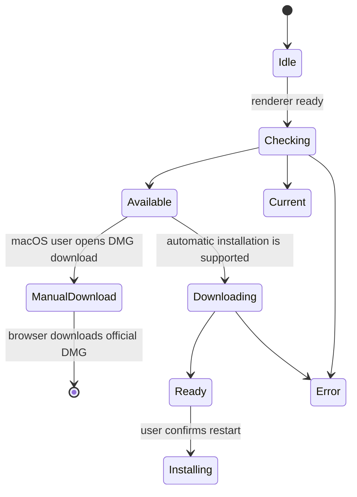

# Desktop and companion clients

## Electron desktop

Electron packages Gnosi as a desktop application. The main process owns backend
startup, process cleanup, window lifecycle, packaged-resource paths, update
checks, installer delivery, installation, and privileged desktop actions. The renderer
receives a narrow preload API rather than direct Node.js access.

The bundled Python backend must be ready before the renderer treats the app as
usable. Startup failures are surfaced with diagnostics and cleanup prevents
orphaned backend processes after the window exits.

## Update state machine

Checks are disabled in development. Downloads never begin merely because a
release exists. The compact renderer notice does not open the release history,
and version changes do not open that history during application startup. Users
can still open release notes explicitly from the Control Center.
On macOS, current ad-hoc signatures do not provide the stable designated
requirement required by Squirrel.Mac, so the explicit action opens the official
architecture-specific DMG directly. Windows and Linux retain the automatic
download and installation state machine. The main process stores the latest
updater state so a renderer that subscribes late can recover it through IPC.

Seamless macOS restart-and-install must remain disabled until releases use a
stable Apple Developer ID signature and notarization. This policy prevents an
installer that passes standalone `codesign` verification from being offered as
automatically installable when its per-build ad-hoc code-directory hash cannot
match the currently installed application.

Release artifacts include installers and updater metadata for macOS, Windows,
and Linux. Version preparation keeps frontend and Electron manifests aligned;
tags are created only from reviewed `main` commits.

The private release workflow packages macOS Intel and Apple Silicon in separate
matrix jobs. Each job runs on the matching macOS 15 architecture and builds one
native PyInstaller backend before invoking electron-builder for that same
target. This prevents a host-native Python executable from being copied into
the other architecture's application. Release runners are pinned instead of
using `macos-latest`, whose migration to macOS 26 changed DMG creation to APFS
and broke electron-builder's mount-and-customize phase.
Every release job also passes the Python command provisioned by
`actions/setup-python` explicitly to the backend builder. This keeps binary
extensions and their collected OpenSSL libraries on one interpreter ABI instead
of allowing a newer runner-level Python to override the release environment.

Electron's builder file list is an explicit runtime boundary. The cross-platform
`afterPack` hook inspects the final `app.asar` and rejects a package that omits
the main process, preload, native-menu, backend-launch, or update-policy module. This installed-
artifact check complements source tests and prevents a valid source tree from
producing an application that fails before its first window opens.

The packaged backend path resolves to the PyInstaller executable itself on
macOS and Linux, and to its `.exe` counterpart on Windows. The main process
spawns that resolved file directly; it never treats the executable as another
directory level. The clean build installs the canonical E2E runtime
requirements, including provider and API dependencies, then starts the frozen
executable as a cross-platform smoke test before the desktop package can
proceed.

The installed desktop process supplies `GNOSI_LOCAL_DATA` under Electron's
per-user application-data directory, unless an explicit override exists. This
keeps native packages away from Docker-only `/app/data`. Readiness polling uses
the unauthenticated `/api/health` endpoint so startup does not wait on a
protected application endpoint. Frozen backends disable Uvicorn's filesystem
reload watcher; native source development retains reload behavior.

The release catalog, localized notes, generated changelog, Electron manifest,
frontend manifest, and monorepo lockfile form one versioned unit. The
deterministic synchronizer updates the three version fields only after the
catalog and changelog validate.

## Application mark

`frontend/public/favicon.svg` defines the Gnosi application mark: a centered
white G with clear blue margin inside a rounded blue gradient. The Electron
icon generator produces the PNG, ICNS, and ICO variants from the same visual
proportions so the browser, macOS, Windows, and Linux clients do not present a
different or edge-to-edge glyph. Regenerate these derived resources whenever
the canonical mark changes; do not edit a packaged application bundle.

## Release preparation

`frontend/src/content/releases.json` is the canonical bundled release history.
The version synchronizer keeps the frontend manifest, Electron manifest, and
frontend workspace entry in the monorepo lockfile identical. A stable entry
prepared before publication deliberately omits `downloadUrl`; that field is
added only after the immutable tag and its platform artifacts exist.
Because the frontend manifest version is a high-impact desktop boundary, every
release-preparation pull request also refreshes this reviewed contract and its
localized mirrors, even when the patch does not change runtime behavior.
Before preparing the next stable patch, the preceding stable entry must already
link to its published release so the bundled history remains complete across
sequential upgrades. Patch notes include only fixes merged after that preceding
tag; they do not repeat already published changes.
Changelog validation normalizes line endings before comparison so an equivalent
Windows CRLF checkout does not fail the cross-platform packaging gate.

Before tagging, the release PR must pass frontend validation, backend tests,
native browser QA, and the engineering-documentation gate. After merge, the
reviewed commit must reach the public repository through the sync workflow and
pass release readiness there. The private source workflow is the sole owner of
official tags, cross-platform artifacts, signed catalogs, release notes, and
the draft in the public repository. The synchronized public desktop workflow is
manual-only so it can validate packaging without racing or duplicating an
official tag build. The resulting macOS, Windows, and Linux artifacts are
inspected before publication.

## Web clipper

The browser extension extracts the current page's title, URL, selected or
readable content, and supported metadata, then sends a bounded request to the
Gnosi API. The backend performs authentication, sanitization, deduplication,
and Vault writes. The extension does not receive arbitrary Vault filesystem
access.

## LibreOffice and Word citation clients

The LibreOffice extension registers a protocol handler and calls Gnosi's
citation endpoints from the office process. The Word helper maintains the
task-pane/add-in state required to access the same local service. Both clients
treat citation insertion and bibliography refresh as explicit document
mutations.

Office-specific APIs are isolated behind traversal and insertion helpers so
tests can fake the UNO or add-in boundary without requiring the full office
application for every unit test.

## Invariants

- Renderer code has no unrestricted Node.js or filesystem capability.
- IPC exposes named operations with validated inputs.
- Update download, installer opening, and installation require explicit user actions.
- Packaged resource paths differ from development paths and are resolved at
  runtime.
- Companion clients authenticate to the backend and remain within their narrow
  capture or citation scope.
- Release drafts are inspected before publication.

## Verification focus

Run Electron syntax/build checks, packaged backend smoke tests, updater state
tests, extension build validation, citation traversal tests, and platform CI.
Local macOS packaging cannot prove Windows or Linux artifacts.
