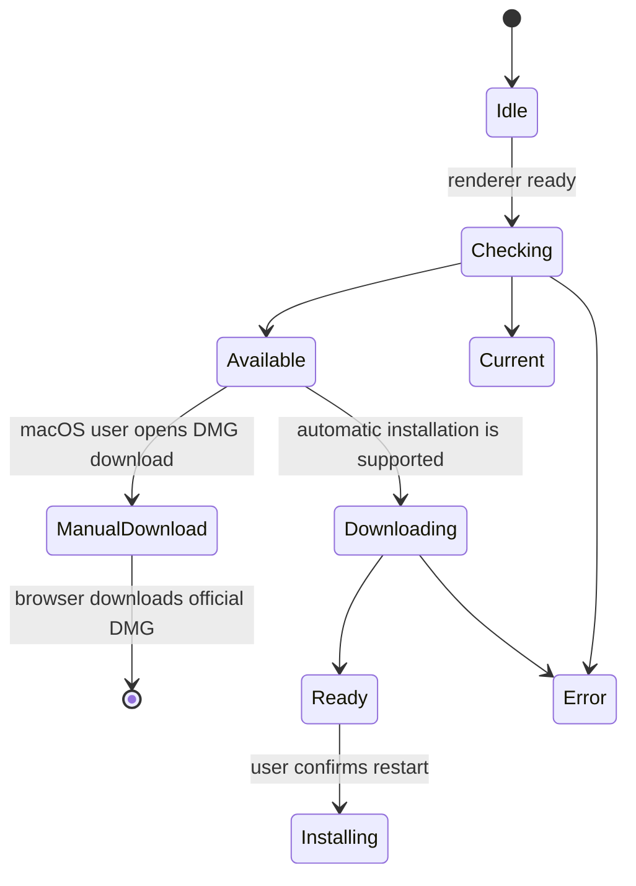

# Desktop and companion clients

## Release source identity

After the pinned Node setup, release preflight verifies that the requested tag
exists locally and resolves to the exact `github.sha` commit also checked out
as HEAD. The full tag refs are fetched without switching the source checkout.
The same check covers annotated and lightweight tags, tag pushes and manual
dispatch. Missing tags, non-commit targets, malformed input and any mismatch
stop preflight before project dependency installation and packaging.

`desktop/scripts/release-source-identity.cjs` uses local Git only and never
moves refs, checks out a tag or fetches on its own. This gate does not certify
Docker, installers or 2.x upgrades, and does not prevent later remote tag
movement. Those acceptance checks and tag protection remain separate release
requirements; local fixtures are not evidence of a successful GitHub run.

## Electron desktop

Electron packages Gnosi as a desktop application. The main process owns backend
startup, process cleanup, window lifecycle, packaged-resource paths, update
checks, installer delivery, installation, and privileged desktop actions. The renderer
receives a narrow preload API rather than direct Node.js access.

Renderer-side menu installation and the update notice belong to `app/desktop/`.
Release-note presentation belongs to the control-center feature and consumes the
same release JSON. These boundaries preserve preload method names, events, update
actions, version identifiers, and download destinations.

The bundled Python backend must be ready before the renderer treats the app as
usable. Startup failures are surfaced with diagnostics and cleanup prevents
orphaned backend processes after the window exits.

## Owned startup and reviewed backend resources

The production launcher waits for the child it actually spawned, not just any
listener on port 5002. Each launch replaces `GNOSI_DESKTOP_INSTANCE` with a fresh
process marker. `/api/health` returns it in `x-gnosi-desktop-instance` only on a
successful response; the existing JSON and public API remain unchanged. This is
process correlation, not authentication. Readiness requires a live child and a
complete, bounded matching response. Redirects, unrelated HTTP 200 responses,
malformed JSON, timeouts and early exits fail startup and trigger owned-child
cleanup. Packaged mode never falls back to system Python if its executable is
missing.

Activation, New Window, Settings and update checks cannot bypass readiness or
shutdown. Quitting during startup cannot open a late window. The pre-render
failure dialog has English, Catalan, Spanish and French recovery messages using
the OS locale; React and its translation provider are not available at this
point. Diagnostic details remain in the application log.

Seven IPC handlers use checked request/response contracts and validate the
trusted sender before decoding arguments or invoking privileged dependencies.
The form-filler handler remains in `main.js`; the extracted handler set does
not imply complete main-process type coverage.

`backend_resources.py` selects individual reviewed runtime files and discovers
Python modules without importing the application. It preserves Alembic scripts
and templates, agent instructions, dynamic translation skills, example plugins
and citation styles. Source configuration, vaults, local databases, secrets and
generated tools are not recursively copied into the bundle. Missing or changed
resources, unreviewed files in selected resource trees, unsafe paths and
prohibited content stop packaging rather than being silently filtered.

The policy checks PyInstaller's actual analysis before collection, the frozen
output before and after copying, and the final Electron `python/` resources
before signing. Paths containing spaces remain separate process arguments.
These source and fixture checks do not certify an installer: real frozen
startup, installation and 2.x upgrade tests on every supported target, plus
the native and Docker acceptance matrix, remain required for release.

OpenAPI generation also activates `GNOSI_VALIDATION_ROOT` before importing
application configuration. The same validated temporary selectors disable
environment-file, repository-configuration and credential-store reads during
this build step; deterministic schema generation must not consult user data.

## Update state machine

Checks are disabled in development. Downloads never begin merely because a
release exists. The compact renderer notice does not open the release history,
and version changes do not open that history during application startup. Users
can still open release notes explicitly from the Control Center.
On macOS, current ad-hoc signatures do not provide the stable designated
requirement required by Squirrel.Mac, so the explicit action opens the official
architecture-specific DMG directly. Windows and Linux retain the automatic
download and installation state machine. The main process stores the latest
updater state so a renderer that subscribes late can recover it through IPC.

Seamless macOS restart-and-install must remain disabled until releases use a
stable Apple Developer ID signature and notarization. This policy prevents an
installer that passes standalone `codesign` verification from being offered as
automatically installable when its per-build ad-hoc code-directory hash cannot
match the currently installed application.

Release artifacts include installers and updater metadata for macOS, Windows,
and Linux. Version preparation keeps frontend and Electron manifests aligned;
tags are created only from reviewed `main` commits.

The canonical release workflow packages macOS Intel and Apple Silicon in separate
matrix jobs. Each job runs on the matching macOS 15 architecture and builds one
native PyInstaller backend before invoking electron-builder for that same
target. This prevents a host-native Python executable from being copied into
the other architecture's application.
The macOS matrix is architecture-closed: each local runner passes exactly one
CLI architecture, and the shared electron-builder macOS targets must not
declare an architecture list. This prevents a host-native frozen Python backend
from being packaged into an Electron application for the opposite architecture.
Manual releases check out the workflow run commit (`github.sha`), and the
requested tag must resolve to that same commit. Packaging fixes added after
an existing tag require a new reviewed release tag; do not publish different
source under the old tag. The Windows job exposes the standard
`Program Files\\Git\\cmd` installation before checkout when the runner service
does not inherit it through `PATH`, preventing the REST ZIP fallback.
Its generated run scripts use a job-scoped PowerShell execution-policy bypass,
so restrictive service defaults cannot reject the ephemeral `.ps1` files
without weakening the VM-wide policy. Release steps must not call
`Set-ExecutionPolicy -Scope LocalMachine`: a more specific Windows policy can
override that setting and make the pre-check fail with
`ExecutionPolicyOverride`, even though the job-scoped bypass is already active.
The Linux release is architecture-closed as well: the local runner and its
PyInstaller backend are ARM64, and electron-builder receives `--arm64`
explicitly. An x64-labelled package must never be emitted from this runner,
because it would contain a backend executable for the opposite architecture.
Release runners are pinned instead of using `macos-latest`, whose migration to
macOS 26 changed DMG creation to APFS
and broke electron-builder's mount-and-customize phase.
Every release job also passes the Python command provisioned by
`actions/setup-python` explicitly to the backend builder. This keeps binary
extensions and their collected OpenSSL libraries on one interpreter ABI instead
of allowing a newer runner-level Python to override the release environment.
The final publication job provisions the same pinned Node.js runtime before
rendering public release notes; self-hosted Linux runners do not guarantee a
global `node` command.
Each backend build creates a uniquely named virtual environment under the host
temporary directory. Packaging attempts never reuse a repository-local virtual
environment, because Windows can retain handles from a terminated PyInstaller
process and reject removal of that directory. Final temporary-environment
cleanup is best-effort; a retained handle cannot block the next invocation.
Because `cryptography` 49 and later no longer publish macOS x86_64 wheels, the
Intel package uses the final compatible universal2 line (`48.0.1`) while other
platforms retain the current dependency floor. The frozen-backend installer
requires a binary `cryptography` distribution; it must fail rather than compile
against a runner OpenSSL that can collide with PyInstaller's collected library.

Electron's builder file list is an explicit runtime boundary. The cross-platform
`afterPack` hook inspects the final `app.asar` and rejects a package that omits
the main process, preload, native-menu, backend-launch, or update-policy module. This installed-
artifact check complements source tests and prevents a valid source tree from
producing an application that fails before its first window opens.

The packaged backend path resolves to the PyInstaller executable itself on
macOS and Linux, and to its `.exe` counterpart on Windows. The main process
spawns that resolved file directly; it never treats the executable as another
directory level. The clean build installs runtime dependencies and the desktop
dependency group from the frozen `uv.lock`, then starts the frozen
executable as a cross-platform smoke test before the desktop package can
proceed.

The installed desktop process supplies `GNOSI_DATA_DIR` under Electron's
per-user application-data directory and exports `GNOSI_LOCAL_DATA` only as a
3.x compatibility alias. This keeps native packages away from Docker-only
`/data`. Readiness polling uses
the unauthenticated `/api/health` endpoint so startup does not wait on a
protected application endpoint. Frozen backends disable Uvicorn's filesystem
reload watcher; native source development retains reload behavior.

The release catalog, localized notes, generated changelog, root, desktop and
frontend manifests, Python project metadata, and the pnpm/uv locks form one
versioned unit. The deterministic synchronizer updates version fields only
after the catalog and changelog validate.

## Application mark

`frontend/public/favicon.svg` defines the Gnosi application mark: a centered
white G with clear blue margin inside a rounded blue gradient. The Electron
icon generator produces the PNG, ICNS, and ICO variants from the same visual
proportions so the browser, macOS, Windows, and Linux clients do not present a
different or edge-to-edge glyph. Regenerate these derived resources whenever
the canonical mark changes; do not edit a packaged application bundle.

## Release preparation

`frontend/src/features/control-center/releases/releases.json` is the canonical bundled release history.
The version synchronizer keeps the root, frontend, desktop and Python versions
identical. A stable entry
prepared before publication deliberately omits `downloadUrl`; that field is
added only after the immutable tag and its platform artifacts exist.
Because the frontend manifest version is a high-impact desktop boundary, every
release-preparation pull request also refreshes this reviewed contract and its
localized mirrors, even when the patch does not change runtime behavior.
Before preparing the next stable patch, the preceding stable entry must already
link to its published release so the bundled history remains complete across
sequential upgrades. Patch notes include only fixes merged after that preceding
tag; they do not repeat already published changes.
Changelog validation normalizes line endings before comparison so an equivalent
Windows CRLF checkout does not fail the cross-platform packaging gate.

Before tagging, the release PR must pass frontend validation, backend tests,
native browser QA, and the engineering-documentation gate. After merge, the
canonical public workflow builds the reviewed commit. The release workflow is
the sole owner of official tags, cross-platform artifacts, signed catalogs,
release notes and drafts. The resulting macOS, Windows and Linux artifacts are
inspected before publication.

The v2.0.0 preparation follows this boundary: its localized bundled notes and
generated changelog ship with the synchronized manifests, while the immutable
tag and platform download link are added only after the reviewed main commit
has passed the official release workflow.

The v2.0.1 patch also keeps the frozen backend's canonical runtime requirements
complete and sends official tags through the configured self-hosted runner
matrix. This makes the release workflow validate the same local environments
that produce the platform artifacts.

The v2.0.5 preparation adds a mandatory metadata preflight before platform
packaging. Gnosi 3 extends that contract to the root, desktop, frontend and
Python manifests plus the single pnpm and uv locks.

The v2.0.6 preparation makes the local release deterministic before dispatch.
Every build uses Node 22.22.2 and clean lockfile installs. A reusable preflight
checks version alignment, available disk, idle architecture-specific runners,
and concurrent release runs. Platform jobs are deliberately serialized as
Linux, macOS ARM64, macOS X64, and Windows because the runners share one
physical Mac host; this prevents virtual machines and native packaging from
competing for memory, CPU, and disk. Workflow-level concurrency also prevents
two release attempts from overlapping.

## Web clipper

The browser extension extracts the current page's title, URL, selected or
readable content, and supported metadata, then sends a bounded request to the
Gnosi API. The backend performs authentication, sanitization, deduplication,
and Vault writes. The extension does not receive arbitrary Vault filesystem
access.

## LibreOffice and Word citation clients

The LibreOffice extension registers a protocol handler and calls Gnosi's
citation endpoints from the office process. The Word helper maintains the
task-pane/add-in state required to access the same local service. Both clients
treat citation insertion and bibliography refresh as explicit document
mutations.

Office-specific APIs are isolated behind traversal and insertion helpers so
tests can fake the UNO or add-in boundary without requiring the full office
application for every unit test.

## Invariants

- Renderer code has no unrestricted Node.js or filesystem capability.
- IPC exposes named operations with validated inputs.
- Update download, installer opening, and installation require explicit user actions.
- Packaged resource paths differ from development paths and are resolved at
  runtime.
- Companion clients authenticate to the backend and remain within their narrow
  capture or citation scope.
- Release drafts are inspected before publication.

## Local release acceptance

The packaged-backend smoke now requires an HTTP 200 response from `/api/health`
with `status: ok`, `mode: FastAPI` and the fresh probe identity in `gnosi_mode`.
A live process, an occupied port, a redirect or another running Gnosi instance
cannot satisfy this check. The probe uses a disposable vault/data directory,
loopback port and a sanitized environment, disables scheduled work, then stops
and reaps its child on success or failure. `GNOSI_VALIDATION_ROOT` is only for
these disposable probes: all data selectors must remain inside that root;
local/shared environment files and every credential-store operation are disabled.
Do not set it for normal development or installed applications.

Synthetic subprocess tests and a source FastAPI run validate this readiness
contract; they do not certify a frozen executable or its installer. Every target
platform still needs its actual packaged backend and update acceptance checks.

The PR documentation job runs the frozen documentation toolchain in check-only
mode against the exact PR base commit, with read-only repository permissions.
It cannot repair stale catalogs or deploy documentation; publication remains a
separate main-branch workflow.

## Verification focus

Before publication, the release job installs the locked desktop production
dependencies with lifecycle scripts disabled, downloads each architecture into
its own directory, and runs `release-artifacts.cjs collect`. Collection checks
the tag against the checked-out desktop version, verifies manifest references
and SHA-512 hashes, rejects missing or colliding assets, and combines both Mac
architectures into one `latest-mac.yml`. Public indexes and release publication
run only after this check succeeds. Local fixture tests verify this wiring but
do not replace the real platform build and update matrix.

Run Electron syntax/build checks, packaged backend smoke tests, updater state
tests, extension build validation, citation traversal tests, and platform CI.
Local macOS packaging cannot prove Windows or Linux artifacts.
