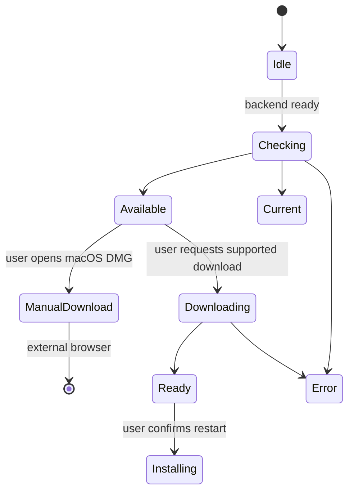

# Desktop and companion clients

## Responsibilities and development modes

Electron packages the React frontend and Python backend as one desktop
application. Its main process owns the backend child, windows, application
protocol, update state and privileged actions. The renderer uses a bounded
preload API, never unrestricted Node.js or filesystem access.

Native browser development and Electron development are different entry points:

| Mode | Frontend | Backend owner |
| --- | --- | --- |
| Native browser | Vite at `http://localhost:5173` | Root `pnpm dev` starts Vite and uvicorn |
| Electron development | An independently started Vite at `http://localhost:5173` | `pnpm desktop:dev` starts its own uvicorn child on 5002 |
| Packaged Electron | Bundled frontend at `app://gnosi/index.html` | Bundled `python/cervell_backend`, or `cervell_backend.exe` on Windows |

Do not run the native backend alongside Electron development: the desktop
supervisor will not adopt another process on port 5002. Electron development
does not start Vite and does not request uvicorn reload. Launch it through
`uv run --frozen --no-sync pnpm desktop:dev` after synchronizing the Python
environment, so its `python3` or Windows `python` resolves inside that environment.
The trusted development origin is HTTP localhost:5173; set
`VITE_DEV_HTTPS=false` for that Vite session. A Word add-in HTTPS session is a
separate configuration, not an interchangeable desktop origin.

The [desktop README](https://github.com/ismigar/Gnosi/blob/main/desktop/README.md)
contains setup and recovery instructions. React menu bindings and the update
notice belong to `frontend/src/app/desktop/`; release-note presentation belongs
to the control-center feature. Changing internal ownership must not change IPC
names, update actions or download destinations.

## Startup, windows and IPC

Before opening Chromium or starting services, `profile-startup.js` obtains
the single-instance lock and prepares the existing profile. A conflict or
ambiguous recovery state stops startup; it is not permission to erase files.

Each backend launch supplies a fresh `GNOSI_DESKTOP_INSTANCE`. The supervisor
requires a live owned child and a complete, bounded successful health response
with the matching `x-gnosi-desktop-instance` header. That header correlates the
process; it does not authenticate a user or change the public health JSON.
Timeouts, redirects, malformed responses, early exit and unrelated HTTP 200
responses fail startup and clean up the owned child. A missing packaged
executable never falls back to system Python.

New Window, Settings, Dock activation and delayed window display cannot bypass
backend readiness or shutdown. Closing the last macOS window does not quit the
application; quitting stops its backend. On other platforms, closing all windows
quits the app. Startup failure messages are available in English, Catalan,
Spanish and French before React loads; technical details stay in logs.

Main windows use `contextIsolation: true`, `sandbox: true` and
`nodeIntegration: false`. Only the current top-level frame of a registered
window at the trusted development or packaged origin can invoke privileged IPC.
Navigation and redirects cannot retain that bridge on another origin.
HTTP(S) links requested in a new window are opened externally.

Form filling accepts only a credential-free HTTPS start URL and pins its exact
origin before loading. Navigation and redirect guards are installed before the
load starts; cleartext and cross-origin destinations are blocked. The final
`webContents` URL is checked again immediately before each synthetic profile
injection, so redirected content receives no profile bytes.

The packaged protocol serves frontend assets and proxies `/api/` to the local
backend. It validates the application authority, prevents filesystem traversal
and uses the session cookie jar instead of forwarding raw renderer cookie
headers. Preserve this behavior when changing routing or streaming adapters.

All eight extracted handlers have checked request/response contracts.
Form filling lives in the already packaged `ipc-handlers.js`; the main process
provides its native window factory and logger. Sender validation still precedes
payload access and opening a separate sandboxed window without a preload bridge.
URL validation, event ordering, profile serialization and the injected script
remain unchanged and are covered by synthetic differential tests. The script
inside the string is not type-checked. This does not prove real website behavior,
complete main-process typing, installer acceptance or approval of arbitrary
form destinations.
Preload subscriptions return idempotent disposers; compatibility removal methods
remain available to older renderers.

## Local data and profile recovery

The packaged backend selects the first nonempty value in this order:
`GNOSI_DATA_DIR`, `GNOSI_LOCAL_DATA`, `LOCAL_DATA_DIR`, then Electron's
existing `userData` directory. It sets the canonical variable and preserves an
existing compatibility alias. The desktop fallback is not necessarily the
native Python platform default, and does not relocate an old installation.
Use absolute overrides and preserve both the Electron profile and any separate
backend data directory before an update.

The scoped package name `@gnosi/desktop` is mapped back to the legacy runtime
name `gnosi`; explicit profile/session locations remain in use. The bundle ID
remains `com.gnosi.cervell-digital`.

Profile protection preserves obsolete `databases` directories as opaque bytes
under `.<profile-name>.gnosi-electron-recovery/databases.saved`, beside each
profile. Atomic no-replace moves and journals prevent an existing destination
from being overwritten. Separate user-data and session-data profiles are checked.
Unsupported filesystem primitives, missing native modules, overlapping data
paths or ambiguous journals stop startup. This preserves bytes, not the removed
WebSQL feature. Do not restore that tree under the old name while running newer
Electron, or delete journals to force startup.

For known cookie schemas 19–22, the migration stages only the cookie database,
validates integrity, schema, row count and a byte-aware projected digest, then
activates schema 23 before Chromium opens it. The exact original is retained at
`.Cookies.gnosi-cookie-recovery/original.sqlite`, beside `Cookies`.
Unknown, corrupt, conflicting or custom encrypted stores fail closed.
There is no whole-profile copy, guessed decryption key or plaintext fallback.

Explicit cookie rollback requires stopped clients and a completed forward
migration. It preserves newer cookies as `rollback.current.sqlite`, restores a
verified original through its own journal and prevents automatic remigration.
Keep all recovery files until acceptance; never stamp schema versions or delete
cookie databases. The README describes interrupted recovery and isolated
old → target → target probes. Fixture success does not prove real profile,
OS-secret-store or application-database migration on another machine.

## Updates and user actions

`update-policy.js` selects manual installation on macOS and the automatic
download/install path on other platforms. Development disables update checks.
Production checks after successful startup, but both `autoDownload` and
`autoInstallOnAppQuit` are false: a release becoming available or the app
quitting does not start an unsolicited installation.

On macOS the explicit action opens the official architecture-specific DMG URL.
Current packaging uses ad-hoc signing; automatic restart-and-install remains
disabled pending a reviewed stable Developer ID and notarization setup.
Successful `codesign` verification alone is not updater acceptance.
The Windows/Linux policy likewise does not prove installation works for every
artifact format; test the actual installed target.

The main process retains the latest update state for renderers that subscribe
late. Background checks do not open release history. Users open it explicitly
from the Control Center; version changes do not open it during startup.

## Toolchain and packaging boundaries

The workspace pins Node 22.22.2 and pnpm 11.19.0. Desktop dependencies currently
pin Electron 43.4.1, electron-builder 26.15.3 and ASAR 4.3.0. Electron's embedded
Node runtime is separate from the workspace build runtime. The explicit
`install:runtime` command installs its binary; do not enable every dependency
install script to repair an absent runtime.

Build the frontend before desktop packaging. `build-python.sh` requires
Python 3.11 exactly, accepts `GNOSI_PYTHON_CMD` when explicitly configured,
and creates a unique temporary environment using the frozen root `uv.lock`
and `desktop` dependency group. It generates a PyInstaller spec, validates the
analysis and bundle, copies the verified output into `desktop/dist-python/`
and runs the isolated packaged-backend smoke. It does not consume a separate
requirements file or the developer's existing environment.

The resource policy reads source without importing the app. It preserves
Alembic resources, agent instructions, dynamic translation skills, example
plugins and citation styles. It rejects missing, changed, unreviewed or unsafe
resources rather than recursively bundling vaults, databases, configuration,
secrets or generated tools. The `afterPack` hook checks the actual ASAR and
Python resources before signing. Its complete cold scan remains fail-closed and
has a ten-minute process deadline so newly copied Windows bundles are not killed
during first-access inspection. Assets belong under `desktop/assets/`;
generated bundles belong under `desktop/dist/` and `desktop/dist-python/`.

The root project declares uv `required-environments` for macOS arm64 and x64,
Linux arm64 and Windows x64. Regenerate `uv.lock` with uv so its resolution
markers may select different wheel-compatible dependency versions per target;
never edit the lock manually. Every selected binary dependency must publish a
wheel for its target before packaging starts.

PyInstaller reports implicit namespace packages with source `-`. The resource
policy accepts that sentinel only for third-party roots. An unknown namespace
under the owned `backend`, `pipeline`, `config`, `frontend` or `extensions`
roots still fails closed, while a dependency namespace such as `jaraco` is not
misclassified as repository source.

The packaged plugin verifier imports its immutable public trust root from
`backend/security/plugin_trust_root.py`. Marketplace release tooling reuses that
constant, but its private-key environment loader remains outside the desktop
resource plan. PyInstaller analysis must fail if the marketplace signing module
enters the runtime bundle.

| Configured target | Runner architecture | Installer and update artifacts |
| --- | --- | --- |
| macOS arm64 | Self-hosted macOS ARM64 | `Gnosi-<version>-arm64.dmg`, ZIP, `latest-mac.yml` |
| macOS x64 | Self-hosted macOS X64 | `Gnosi-<version>-x64.dmg`, ZIP, `latest-mac.yml` |
| Linux arm64 | Self-hosted Linux ARM64 | AppImage, DEB, `latest-linux-arm64.yml` |
| Windows x64 | Self-hosted Windows X64 | `Gnosi-<version>-Setup.exe`, `latest.yml` |

Match the frozen backend to the target architecture. macOS targets must not
silently package both architectures using one host-native backend. Linux passes
`--arm64`; Windows uses x64 NSIS. These jobs do not pin a macOS OS version and
do not cover Linux x64 or Windows arm64. Both macOS jobs are serialized; Windows
waits for macOS while Linux can run alongside it. Concurrency is per Git ref,
not a global lock proving host capacity.

Windows receives a job-scoped PowerShell execution-policy bypass and provisions
Git before checkout when necessary; do not weaken machine-wide policy.
The backend build uses quoted interpreter arguments, platform-specific temporary
venv layouts and best-effort cleanup. The Python manifest currently constrains
macOS x86_64 `cryptography` to the 48.x line; the current uv invocation does not
enforce binary-only installation. Verify wheel/ABI provenance on the actual
runner instead of assuming that constraint or substituting its Python/OpenSSL.

All desktop build scripts, including root `package:desktop` and
`build:desktop` aliases, disable builder publication with `--publish never`.
They prepare local artifacts; they do not certify or publish a release.

## Version preparation and candidate-only distribution

The bundled history is
`frontend/src/features/control-center/releases/releases.json`.
Root, frontend and desktop manifests, Python metadata, locks, localized notes
and the changelog must agree before release. `sync-release-version.cjs`
prepares all four inputs before writing only their version fields. Unreadable
inputs, unsupported version assignments or ambiguous duplicates fail before
any write. Nested JSON versions, comments and line endings are preserved;
an identical version does not rewrite files. The TOML locator supports a
single-line quoted `[project].version`, not full TOML validation. Lock refresh
still validates the Python project. Separate writes are not a crash-safe
transaction: an I/O failure or interruption can leave partial changes. Review
the diff against the preparation branch's recorded baseline before retrying.
Catalog/changelog validation and review of refreshed locks remain required.

`desktop/release.sh` prepares versions and local artifacts. It neither creates
a tag nor publishes a release. Use an explicit preparation branch and keep
unrelated changes out of it. New packaging fixes require a new reviewed tag,
not different source published under an old tag. Add platform download links
only once the corresponding immutable public artifacts actually exist.

`desktop/release-version.js` is the shared release-version boundary for the
updater and artifact collector. It uses the SemVer implementation locked with
`electron-updater`, accepts canonical build metadata, and rejects surrounding
whitespace, `v` prefixes and invalid or non-canonical versions. Packaging and
update policy must not introduce a second parser.

`Build Release Candidate` is an optional, manual-only workflow. Pushing a
version tag never starts hosted Actions. When explicitly dispatched, it verifies
that the requested tag exists and peels to the exact checked-out `github.sha`.
Malformed input, missing tags, non-commit targets or mismatches stop before
dependency installation. The identity helper uses local Git and does not move
refs or fetch by itself. Remote tag protection remains a separate requirement.
The zero-hosted-budget publication path builds and verifies all four platform
groups locally and publishes only those exact artifacts; do not dispatch the
optional hosted workflow without explicit budget approval.
The same preflight also requires the tag version to match the root, frontend,
desktop and Python manifests before CI or any architecture build starts.

The workflow then calls the existing CI at the same commit without inheriting
secrets. Architecture builds require its success. CI includes documentation,
frontend, backend, native smoke and Docker image builds. PR documentation is
checked against the exact PR base; candidates check current catalogs and all
strict locale portals at their own SHA, not a fictional PR impact review.

Collection downloads only the four named architecture artifacts, excluding
previous candidates on reruns. It installs frozen collector dependencies with
lifecycle scripts disabled, checks version, references and SHA-512 hashes,
rejects missing/colliding files and merges both macOS update manifests.
Index generation, release-note rendering and candidate upload follow validation.
Marketplace generation is mandatory and fail-closed: the signing key must match
the bundled `gnosi-official` public key. A separate pre-upload verifier checks
both detached index signatures, every package signature and SHA-256 digest, the
exact announced ZIP sets and nonempty release notes.

The final Actions artifact is `candidate-<tag>-<sha>-<attempt>`, retained for
five days. It contains installers, update metadata, indexes and release notes.
It is not confidential storage and must never contain user data or secrets.
The workflow has read-only repository permissions and does not create GitHub
drafts, publish releases or modify existing public assets or updater channels.

Public distribution stays disabled pending full native, Docker, installer and
2.x upgrade acceptance and a separately reviewed publication path. A successful
candidate is not permission to publish 3.0.0.

## Web and office clients

The web clipper sends `POST /api/public/clip` with a Personal Access Token and
reads prompting/destination configuration from `GET /api/public/clip/config`.
The backend chooses the vault destination; the extension does not obtain
arbitrary filesystem access. Its token and backend URL are stored in extension
local storage. Browser packaging and store acceptance are separate from desktop
installer acceptance.

The Word task pane lives in `frontend/public/word-addin/` and uses Office.js.
Its API calls use the pane's origin and an explicitly configured bearer token;
a healthy public endpoint does not prove authorized citation access.
The manifest's HTTPS origin and trusted certificate must match its deployment.
Tools in `extensions/office/word-cite/` modify document/package references or
the user's Word template for optional pane persistence. Those are explicit
document/configuration mutations, not a normal Gnosi startup action.

The LibreOffice client is a Python/UNO protocol handler using standard-library
`urllib`. It reads `api_token` from its own configuration or
`GNOSI_API_TOKEN`; do not assume it shares the browser session.
Both clients use the vault citation-formatting endpoints and the backend's
Pandoc/CSL pipeline. Context-sensitive formatting needs document keys in order,
including repeated citations. Writer refresh traverses nested tables; headers
and footers contribute bibliography keys but are not rewritten by ordered refresh.
Office host behavior must be tested in the actual supported host, not inferred
from traversal fixtures.

## Acceptance and troubleshooting

The packaged-backend smoke requires bounded HTTP 200 health with
`status: ok`, `mode: FastAPI` and its fresh `gnosi_mode` probe identity.
It uses disposable data and vault paths, disables operational automation,
and reaps its child on success or failure. `GNOSI_VALIDATION_ROOT` validates
all selectors and blocks local/shared environment files and credential-store
access. OpenAPI generation uses the same isolation. Never set this flag for
normal development or installed applications.

Source contracts, fake hosts and a source FastAPI run do not prove a frozen
installer or actual upgrade. Before public distribution, verify each real
target's installation, first launch, IPC, cookie/profile preservation,
database integrity, update path and recovery, plus authenticated browser flows
and Docker startup/persistence. Local macOS success cannot certify another target.

| Symptom | Inspect next | Do not do |
| --- | --- | --- |
| Electron development stays blank | Vite HTTP origin, frozen Python PATH, owned backend startup log | Start a second backend on 5002 |
| Profile protection stops startup | Exact error, both original/recovery paths, stopped clients | Delete journals, cookies or old data |
| Packaged backend is missing | PyInstaller output and final resource policy | Fall back to system Python |
| macOS offers a DMG | Current manual-install policy and architecture | Treat signing verification as automatic-update acceptance |
| Office can reach health but citations fail | Bearer token, API origin and actual protected response | Disable authentication to hide a client failure |

Run the repository's desktop contracts, strict IPC check, documentation gate
and relevant isolated smoke commands. Inspect browser/desktop output and logs,
not just exit codes. Keep target-platform evidence separate from synthetic tests.
