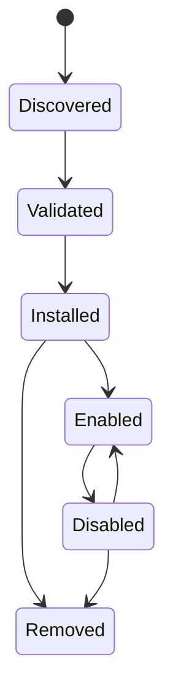

# Integrations and plugins

## Responsibility

Integrations connect user accounts and external systems. Plugins extend Gnosi
with declarative contributions and bounded executable behavior. MCP servers
contribute agent tools through a separate protocol boundary.

The integrations HTTP boundary is strictly typed without changing its public
payloads. Mail and DAV connection tests validate required string credentials
before opening sockets. DAV URLs may target private self-hosted networks such
as Nextcloud, while loopback, link-local, multicast, reserved, and unspecified
addresses remain blocked.

## Integration persistence

The integration manager stores non-secret account configuration and references
to secrets under local data. Each machine reconnects accounts independently.
Settings APIs list masked connection state, validate configuration, test
connectivity, choose defaults, and disconnect providers without exposing raw
tokens.

Google and Microsoft OAuth callbacks create or update provider records. IMAP,
SMTP, CalDAV, Drupal, Notion, and similar adapters normalize their own settings
into the common integration registry where possible.

Google OAuth keeps pending PKCE verifiers in a bounded, expiring state map and
rejects callbacks whose state is absent or expired before token exchange. The
configuration and account payloads are typed at the adapter boundary; typing
exceptions are limited to the untyped Google SDK calls and the four historical
route return annotations whose absence is required to preserve the byte-stable
OpenAPI response schemas.

The Google People adapter narrows discovery responses to Gnosi contact records,
refreshes and persists access tokens through the integration manager, preserves
ETag-aware updates, and normalizes primary names, addresses, organizations,
photos and provider timestamps. Untyped SDK objects remain confined to this
adapter and do not cross its typed service functions.

Microsoft OAuth applies the same bounded-state rule: generated authorization
states expire after ten minutes and are consumed before token exchange. Token
and Graph profile JSON are narrowed inside the route adapter, blocking stale
configuration before network calls and persisting the historical mail-account
shape without changing redirects or OpenAPI.

Hosted Notion MCP uses OAuth 2.1 dynamic client registration and PKCE. Its typed
boundary validates discovery and registration objects, requires a returned
client id, preserves the initiating frontend origin, and stores access,
refresh, client and pending-state values only through IntegrationManager's
secret-aware operations. Disconnect clears all three Notion OAuth records.

## Backend ownership and compatibility

The configuration domain owns the 23 built-in and third-party plugin HTTP
operations. `backend/domains/configuration/api/plugins.py` translates HTTP
requests, `plugin_lifecycle.py` owns dependency-aware activation and runtime
transitions, `plugin_models.py` owns the Pydantic contracts, and
`plugin_state.py` is the single owner of the per-process locks and normalized
per-Vault state store.

The typed `backend/domains/plugins/` package owns manifest validation,
contained installation paths, ZIP staging and rollback, deterministic export,
grant normalization, and the newline-JSON Node sandbox. Historical
`backend/services/plugin_system.py` and `plugin_sandbox.py` remain thin
facades. They own the compatibility constants, injected host-handler registry,
runner path, and late-bound seams; lifecycle and sandbox state is not duplicated
across the boundary.

The Notion integration is owned by `backend/domains/notion`. Its typed modules
separate REST import conversion, embedded-view recreation, exact-clone phases,
workspace discovery, route-level filesystem/registry persistence, and
read-only clone verification. `backend/api/notion_routes.py` remains the HTTP
translation and clone-progress state boundary. The three historical
`backend/services/notion_{importer,clone,view_recreator}.py` paths are explicit
compatibility facades; imports, globals and late-bound monkeypatch seams remain
available while the canonical implementation lives in the domain package.
Notion route order, methods, paths, payload schemas, descriptions and the
deterministic OpenAPI document remain byte-stable.

`backend/api/vault_routes.py` remains a temporary composition facade for
legacy imports. It injects path, persistence, runtime, model-selection, and
mutation-lock collaborators and re-exports the historical models and handlers.
The load, save, lifecycle, summary-model, and mutation-lock seams remain
dynamically replaceable for plugins and tests. Domain modules never import the
facade. Route order, paths, methods, status codes, payload schemas, operation
identifiers, and the generated OpenAPI contract remain frozen during this
structural migration.

The plugin dispatcher and sandbox facade share one typed two-argument host
handler contract: bounded arguments plus the calling plugin id. Vault RPCs now
import canonical page, registry and configuration owners lazily, preserving
cycle avoidance while removing dynamic compatibility-facade calls.

The built-in web clipper keeps its mapping logic pure. Destination columns are
resolved by immutable id, current name or historical alias; explicit opt-outs
remain distinct from automatic role detection. Only promptable stored fields
are accepted, extension values are coerced by schema type, and stale or derived
columns are discarded before the normal Vault write boundary.

## Plugin lifecycle

Plugin packages declare identity, version, compatibility, permissions,
contributions, and integrity information. Installation validates paths,
manifest structure, signatures where required, and declared effects. Enabling
reconciles managed settings, AI profiles, skills, or tools idempotently.
Disabling suspends managed contributions while preserving user-owned overrides.

The Vault configuration composition layer now consumes the strict return types
of plugin state, lifecycle and summary services directly. It retains late-bound
facade seams for tests and extensions, but no longer casts already-typed state,
so persistence and runtime refresh contracts have one authoritative owner.

Built-in secondary capabilities use the same per-Vault lifecycle boundary. The
authoritative registry declares dependencies, routes, UI surfaces and Settings
destinations. `.gnosi/plugins.json` schema version 2 records explicit
`enabled_builtin` and `enabled_third_party` lists while retaining `disabled` for
older clients. Migration from an older or missing schema is atomic and
idempotent: every optional capability starts disabled and all settings,
permissions and unknown forward-compatible records are retained.

Lifecycle changes go through the general
`POST /api/vault/plugins/{id}/lifecycle` contract. A change with prerequisites
or enabled dependents first returns a structured conflict; an administrator
then confirms the grouped activation or cascade. Disabled routes fail before
their feature implementation runs, and scheduled external work checks the same
registry. Core maintenance, Markdown, database calendar views, contact fields,
media attachments and drawings do not depend on these plugins.

Plugins Settings owns installation, activation, permission grants, updates and
removal. Configuration for active capabilities is exposed under Connections,
Knowledge or Advanced. A configure action opens that destination directly and
capabilities without global configuration do not create empty pages.

Executable plugin behavior runs through a sandbox boundary with a constrained
environment and timeout. Plugins do not receive the complete host environment
or arbitrary secret access.

Direct networking stays disabled in both plugin runtimes. A granted `network`
capability exposes only the host RPC, which rejects private destinations and
bounds methods, redirects, time, and response size. UI frames keep
`connect-src 'none'`; the parent calls the same backend boundary after checking
the plugin's declared and granted permissions.

Third-party plugins may declare the additive `ui:settings` permission and call
`gnosi.registerSettingsPanel(...)`. Active and granted panels appear in the
dynamic Extensions group, render inside the existing opaque-origin iframe
sandbox and disappear as soon as the plugin is disabled, revoked or removed.
Reading or writing the plugin's own configuration additionally requires the
existing `settings` permission. The host API remains at major version 2.

## Marketplace distribution

The official plugin index and its detached signature are published as GitHub
Release assets. Remote catalog installation requires a trusted signed index and
every selected package requires both SHA-256 integrity and a trusted detached
Ed25519 signature. Installed provenance records the source URL, checksum, and
verified publisher. Local ZIP installation remains available for development,
but starts disabled with no grants.

Installed plugins can be exported as deterministic ZIPs. Public submission is
an administrator operation sent to an explicitly configured moderation broker;
Gnosi never embeds a GitHub write token. The broker quarantines the package and
publishes it only after CI and human review.

## MCP boundary

Configured MCP servers are independent processes or remote endpoints. Startup
discovers their tool schemas and normalizes them into the agent catalog. Retry
and `Retry-After` handling are bounded. One failed server is recorded without
discarding tools from healthy servers.

## Example and companion integrations

The repository includes example plugin packaging, a Drupal MCP proxy, the
LibreOffice citation extension, and a Word citation helper. These are separate
clients with narrow backend contracts; they do not share backend filesystem or
credential access automatically.

## Invariants

- Integration secrets live outside Git and the synchronized vault.
- Disconnecting removes or revokes the local credential reference and selected
  defaults consistently.
- Plugin-managed and user-managed values remain distinguishable.
- Archive extraction and plugin paths cannot escape their installation root.
- Compatibility and permission validation occurs before activation.
- Official indexes and remote packages fail closed when integrity metadata is missing.
- Direct plugin sockets and browser connections never bypass the host RPC.
- A disabled capability cannot start a new route, sync, automation or external effect.
- Disabling or migrating never deletes plugin data, settings, credentials or profiles.
- MCP tool origin and effect remain visible after catalog normalization.

## Verification focus

Run plugin manifest, signing, sandbox, state-race, AI contribution, MCP routing,
retry, and connector tests. A live integration test uses a dedicated test
account and must not mutate production data unintentionally.
