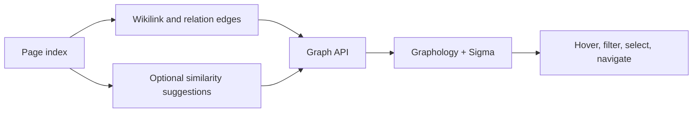

# Knowledge graph

## Responsibility

`backend/domains/graph/` owns scanning, node and edge construction, projection,
adapters, and service orchestration. `graph_service.py` is the stable facade
used by the API, agent, and scheduler.

The graph projects explicit knowledge relationships and optional semantic
suggestions into an interactive network. It supports navigation and discovery;
it is derived from the Vault and is not a separate source of truth.

## Graph construction

Nodes originate from indexed pages. Edges originate from wikilinks, relations,
tags or other configured metadata, and optional similarity results. Graph
service reads prefer index metadata and guard direct file access so an
unavailable directory produces a partial graph instead of a total failure.

Unresolved wikilink targets remain representable as distinct nodes. They are
not silently discarded or merged by display label because doing so would hide
broken knowledge relationships.

## Semantic overlay

Semantic suggestions compare document representations and produce scored
candidates. Suggestions are an overlay: accepting or materializing a relation
must use an explicit content-writing flow. Model unavailability disables the
overlay without changing the explicit graph.

## Frontend rendering

`GraphViewer` maps graph data into Graphology and Sigma. Layout settings control
force simulation, repulsion, attraction, gravity, collision avoidance, label
thresholds, edge thickness, cluster colors, and isolated-node placement.

Hover emphasis is intentionally limited to one hop. Multi-hop emphasis makes
dense graphs unreadable and obscures the selected neighborhood. Isolated nodes
receive enough padding and stable positioning to remain visible.

## Invariants

- Node identity uses stable page identity, not title alone.
- Display labels may collide; identifiers may not.
- Derived semantic edges are distinguishable from explicit relationships.
- Layout state cannot modify Vault content.
- Partial scans are labeled and are not cached as complete.
- Directory-level `EDEADLK` and `EAGAIN` failures are isolated.

## Verification focus

Test unresolved nodes, isolated nodes, cluster legend consistency, front-matter
fallback, semantic suggestion thresholds, cloud-directory failures, one-hop
hover behavior, and graph navigation back to the correct page.
