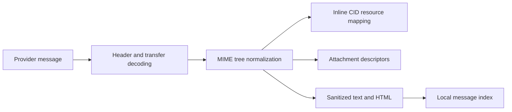

# Mail

## Responsibility

Mail integrates IMAP/SMTP accounts, local message indexing, folders, search,
tags, saved views, drafts, attachments, replies, contact lookup, AI drafting and
entity extraction. Provider credentials remain local per machine.

## Synchronization

Account integrations describe protocol and OAuth/credential references. A full
or incremental sync reads provider messages, normalizes identifiers and MIME
content, and writes local index rows. IMAP IDLE workers hold one connection per
eligible account and trigger incremental refresh when the server announces
changes.

Google and Microsoft provider adapters expose the same typed Gnosi message,
attachment, draft, label, and send boundaries. Dynamic SDK payloads are narrowed
inside each adapter; the only local typing exceptions are the exact untyped
third-party discovery calls, never the service API consumed by Gnosi.
OAuth refresh accepts only a concrete non-empty token before persisting it.
Google's untyped credential constructor and refresh call are isolated and
documented inside that adapter; IMAP and SMTP receive standard-library
connection types at the XOAUTH2 boundary.

Batch ingestion uses savepoints so a malformed message cannot roll back earlier
messages. Message and thread identity must remain stable across repeated syncs.
Per-thread UI metadata is persisted as a validated JSON object under the local
secrets/data boundary. Read-modify-write operations share one lock so concurrent
tabs cannot silently discard each other's fields; malformed root or thread
entries fail closed without affecting valid records.
Folder names are provider values; the UI translates known semantic folders
without changing persisted comparison values.

The legacy Gmail-to-Vault exporter narrows discovery payloads at its service
boundary, requires a configured Mail directory before any filesystem access,
and deduplicates by provider message id. Multipart text, HTML, categories,
labels and attachment presence retain their historical Markdown/frontmatter
representation; a missing Vault fails closed without creating files elsewhere.
Every synchronized note retains `database_table_id: mail`, and frontmatter is
serialized through `yaml.dump` rather than hand-built string escaping.

## MIME and content safety

HTML is sanitized before rendering. Inline CID images are resolved against the
correct MIME part and preserved when quoted content is included in replies.
Remote images and attachments remain explicit resources rather than arbitrary
HTML access to local paths.

The inline-image boundary uses typed MIME asset descriptors and a common
`Message` root for text, related and mixed trees. It accepts only decoded byte
payloads, normalizes optional content types, and leaves asset URLs unchanged
when no active Vault or materialized file is available.
The same `MimeAsset` and `InlineImage` contracts flow unchanged through Gmail,
Microsoft Graph and SMTP senders. Quoted assets are promoted to inline images
by explicitly filling every required field and generating a fresh Content-ID.

## Compose and send

The block editor creates a draft representation that is converted to mail-safe
HTML and text. Sender identity, recipients, reply headers, quoting, attachments,
and provider account are validated server-side. Draft save and send are
different effects; sending crosses an external boundary and returns provider
diagnostics on failure.

## Local relational state

The mail database stores messages, tags, message-tag associations, and saved
views. Saved views contain visible fields, typed filters, logic, grouping,
sorting, and available actions as JSON within SQLite rows.
Create and partial-update schemas remain separate Pydantic contracts so an
update may omit its name without weakening the create requirement; their HTTP
and OpenAPI shapes remain compatible with 2.x clients.

## Invariants

- Sync is idempotent for a provider message identifier.
- A failed message uses a savepoint and does not abort the account batch.
- Tags and saved views are local application state, not provider labels unless
  an explicit mapping exists.
- Reply headers preserve thread identity.
- CID references point to the correct inline part after quoting or forwarding.
- Deleting or moving a provider message requires the authenticated account and
  a validated folder/message target.
- Secret values never enter message rows or frontend configuration responses.

## Verification focus

Test MIME decoding, HTML sanitization, CID rendering and replies, ingestion
savepoints, tags, view filters, drafts, identity resolution, and a real or
stubbed provider send. Playwright verifies paste, compose, and quoted reply
behavior.
