# Grounded notebooks

## Responsibility

Grounded notebooks provide a dedicated `/notebooks` workspace for asking
questions about the attachments and URLs held by selected records in the
configured References table. They combine a searchable notebook library, a
paginated source panel, settings, and the same streaming chat transport used by
the floating assistant.

The record body, title, tags, and other metadata are not evidence. Gnosi reads
record metadata only to locate values in fields whose table schema is an
attachment/file or URL type. A notebook never edits or deletes its source
record, attachment, or original URL.

The first release does not provide audio summaries, Studio, generated notes,
or source editing.

## Actors and access

| Actor | Private notebook | Workspace notebook |
| --- | --- | --- |
| Creator | Discover, read, converse, manage sources and settings | Discover, read, converse, manage sources and settings |
| Workspace editor | Not discoverable | Discover, read, converse |
| Workspace viewer | Not discoverable | Discover and read the transcript and sources |

Every request is also scoped to the active Vault and workspace. Private access
does not implicitly extend to administrators in a different user principal.
Only the creator can change membership, settings, or delete the notebook.

## Source and revision flow

```mermaid
flowchart LR
    Selection["Configured References table\nselected record IDs"] --> Fields["Attachment and URL\nfields only"]
    Fields --> Fingerprint["Record and source\nfingerprints"]
    Fingerprint --> Queue["Durable notebook\ningestion job"]
    Queue --> Extract["Existing secure\nextractors"]
    Extract --> Draft["Inactive SQLite\nrevision"]
    Draft --> Index["FTS5 and deterministic\nlocal vectors"]
    Index --> Switch["Atomic active-revision\nswitch"]
    Switch --> Tools["Read-only notebook\ntools"]
    Tools --> Chat["Grounded answer\nwith citations"]
```

Notebook creation stores the References table identity that was active at that
time. Later creation and source additions use the currently configured table,
while an existing notebook remains attached to its original table.

Opening a notebook, asking a notebook-backed question, or requesting a manual
refresh compares current source values with the active revision. Repeated
triggers are coalesced by the durable job queue. Unchanged sources reuse their
chunks; changed sources are re-extracted. An incomplete revision is never made
visible. After the first successful revision, chat continues against the last
complete revision while a refresh runs.

URL sources are revalidated only after
`GNOSI_NOTEBOOK_URL_REFRESH_TTL_SECONDS` (six hours by default). Gnosi sends
persisted ETag and Last-Modified validators through the same SSRF-safe,
redirect-validating downloader and falls back to a bounded response-content
hash when a server does not provide validators. An unchanged check records an
audit outcome but does not activate a new evidence revision.

Removing a Resource deletes notebook membership immediately. Retrieval and
whole-notebook analysis join against current membership, so removed evidence is
excluded before a replacement revision is ready.

## Persistence and recovery

Notebook state is instance-local under `LOCAL_DATA/system/notebooks.sqlite3`.
The repository contains notebook definitions, ACL entries, resource membership,
revisions, sources, chunks, FTS5 rows, durable analyses, and the conversation
principals created by each mode. Rows are scoped by a hash of the Vault path and
the workspace identifier.

The durable worker registers `notebook_ingest` and `notebook_analysis` handlers.
Queued or expired leased jobs resume after process restart. Revision activation
is transactional. If a previously indexed source fails to refresh, its last
valid representation remains available with `stale` status; a new failed
source is reported and excluded.

Attachments use the existing materialization, OneDrive warm-up, path
containment, size limits, document extraction, OCR, and media extraction
boundaries. Web retrieval keeps SSRF protection, validates every redirect, and
treats page content as untrusted data rather than model instructions.

## Retrieval, analysis, and citations

Each chat turn is pinned to one positive, completed revision on the server. The
notebook workflow exposes only these contextual operations:

- inspect bounded source metadata;
- search notebook chunks with FTS5 and the existing deterministic local vector;
- read exact evidence by stable chunk identifier;
- start, inspect, and read a durable hierarchical analysis over the pinned
  revision.

Source-dependent questions must perform a real notebook search before the
model can synthesize an answer. The workflow does not receive Vault mutation,
MCP, skill mutation, or external-action tools. Hierarchical analysis maps over
bounded evidence batches and reduces their summaries instead of placing
hundreds of sources in one prompt.

Citations carry the notebook Resource, revision, source, chunk, and locator.
PDF evidence uses the `gnosi-cite` navigation contract so the reader can open
the cited page or fragment. Web evidence links to the original validated URL.

## Conversation namespaces

Private-per-member mode derives one checkpoint principal per user. Shared mode
derives one authorized notebook principal and serializes concurrent turns with
the existing thread lock. Shared messages include their author and the history
is append-only; only the creator can clear it. Changing modes does not merge
histories: returning to a previous mode restores that namespace.

Notebook deletion enumerates all registered derived principals and deletes
their checkpoint threads before cascading notebook indexes, revisions, and
analysis rows. Original Vault data is outside this deletion boundary.

## HTTP contracts

| Endpoint | Purpose |
| --- | --- |
| `GET/POST /api/notebooks` | Paginated library and creation from Resource IDs |
| `GET/PATCH/DELETE /api/notebooks/{id}` | Detail, settings, and derived-data deletion |
| `GET /api/notebooks/resources` | Alphabetical paginated selector with type, author, and tag facets from the configured References table |
| `GET/POST /api/notebooks/{id}/sources` | Inspect or add Resource membership |
| `DELETE /api/notebooks/{id}/sources/{resource_id}` | Exclude one Resource immediately |
| `POST /api/notebooks/{id}/refresh` | Coalesced explicit refresh or retry |
| `GET /api/notebooks/{id}/conversation` | Canonical active-mode transcript |
| `POST /api/chat` | Streaming conversation with an authorized notebook context |

Notebook-backed chat ignores client attempts to choose the revision,
checkpoint principal, or session namespace. The server derives all three after
authorization and rejects mixed notebook contexts, attachments, mentions, and
skill overrides.

## User interface behavior

The multi-select action appears only when the open table identity equals the
configured References table identity. It is never enabled by a fixed name or
ID. The creation dialog accepts a title, visibility, conversation mode, and up
to one thousand selected Resource IDs. Creation and add-source selectors sort
the full matching catalog accent-insensitively before pagination and expose
schema-derived type, author, and tag filters. Filter metadata is selection-only
and never enters notebook evidence. Pages marked as table templates are
excluded by the selector, request validation, and ingestion snapshots.
Records with no attachment or public HTTP URL values are also excluded; the
selector reports how many were omitted instead of offering an unusable choice.

Desktop layout shows sources, embedded chat, and settings together. Mobile
layout presents the same panels as tabs. The UI polls only the visible active
notebook: ingestion progress uses a short interval while a job is active, and
the transcript uses a bounded interval for collaborative updates. Inactive
notebooks are not polled.

Workspace viewers receive the canonical transcript in a visibly read-only
chat without composer, retry, edit, or rewind actions. Only editors can send a
turn, and only the creator sees manual refresh and other management controls.

## Failure behavior and operations

The first conversation stays blocked until at least one source exists in a
complete active revision. Per-Resource and per-source states expose `pending`,
`indexing`, `available`, `stale`, and `error`; manual refresh provides retry.
Errors do not replace a complete active revision.

Operators can inspect the notebook SQLite repository and durable job queue
below `LOCAL_DATA`, but must not move either into a shared Vault. Backend code
reloads in native development; dependency changes still require a backend
LaunchAgent restart. The same configuration-derived paths are used in native
and Docker deployments.

## Verification boundaries

Unit coverage proves source-field exclusion, incremental reuse, immediate
membership removal, citation identity, ACL isolation, checkpoint namespaces,
positive revision validation, read-only notebook tools, and durable pinned
analysis. It also exercises PDF, URL, OCR, large-chunk, expired-lease recovery,
conditional web validation, and a 300-Resource ingestion job. Frontend and
Playwright coverage prove read-only permissions, omitted empty Resources, the
configured-table bulk action, selectors, grounded chat, a navigable citation,
and automatic source refresh.
Release verification also requires a clean backend start, frontend build, and
desktop plus mobile browser flow.

Current load limits are one thousand Resources per create/add request, two
hundred selector rows per page, fifty retrieval results, and bounded analysis
batches. Notebook configuration and derived indexes are local to one Gnosi
instance and are not synchronized across installations.
