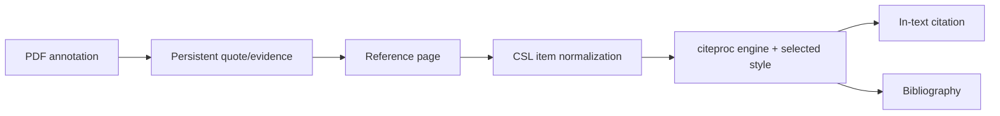

# Reader, references, and citations

The strictly typed `features/reader/` and `features/literature/` frontend
domains own their respective pages, local components, state, and tests.
Each exposes a public lazy entry, keeping feed reading and bibliographic
search independently loaded. Literature styles retain their existing cascade
order under the feature. Shared request adapters, Zotero integration, provider
configuration and citation rendering are not duplicated into these domains.

Reader routing, storage, analysis, and source access now live in
`backend/domains/reader/`; literature repositories, search, synchronization and
storage live in `backend/domains/literature/`. Existing API and service modules
remain compatibility facades with unchanged public contracts.

Vault-dependent Reader analysis, result access, resume, cancellation, article
backfill and podcast generation all pass through one active-Vault guard. Missing
context returns a recoverable service-unavailable response before creating a
job or thread; valid Vault paths and all existing route payloads remain stable.
Podcast generation consumes the canonical typed database-session generator
directly and closes it in the existing `finally` boundary; no cast or duplicate
session factory sits between Reader orchestration and persistence.

Literature HTTP routes, canonical models, and systematic-review services are
strictly typed. PRISMA counting, screening transitions, open-access evidence,
and CSV/JSON/Markdown/SVG exports live in the pure `review_logic.py` domain;
the historical service functions remain compatibility facades.

## Automatic covers and resource templates

Creating a resource from a source loads the target table's templates before
matching the detected Zotero item type, including translated type labels. The
matching template supplies content and defaults; imported metadata takes
precedence, while an existing template cover is preserved. An unmatched type
uses the table default template. New records never inherit template flags.

ISBN lookups retain the edition cover supplied by Open Library. DOI and other
web lookups use the publisher's declared image through the existing public-URL
fetch boundary. Covers are optional: missing images never discard reference
metadata. If an uploaded PDF has no proposed or template cover, the browser
renders its first page to a bounded JPEG and uploads it to Assets/Covers before
creating the resource. The original PDF remains attached. Rendering or cover
upload failures do not block creation. Online covers remain external URLs;
PDF-generated covers are local assets. Metadata enrichment previews proposed
covers and does not preselect replacement of an existing cover.

A single progress notification remains visible after the lookup dialog closes. It
reports preparation, PDF upload, cover generation, saving, and opening as each
stage starts. The same notification becomes a success only after the record has
opened, or an error if creation fails. Identifier imports use the applicable
stages without showing file or cover progress.

## Responsibility

This domain combines feed/newsletter reading with a Zotero-compatible reference
manager, CSL citation rendering, identifier and web import, PDF/EPUB reading,
and annotations that can become citable evidence.

## Reference ingestion

Crossref, Open Library, arXiv, PubMed and HTML metadata have separate typed
normalizers under `backend/domains/vault/citations/normalizers/`. They preserve
canonical Zotero payloads and pure-function behavior, while
`backend/services/lookup_normalizers.py` remains the import-compatible facade.

References enter through DOI, ISBN, arXiv, PMID, BibTeX, RIS, files, or web URLs.
Identifier resolvers and Zotero translation-server produce provider-specific
metadata. Normalizers map it to the configured reference schema, generate a
stable citation key, deduplicate candidates, and write a Vault record.

`backend/services/references_io.py` is the typed, deterministic BibTeX/RIS
boundary. Small parser, normalization, field-mapping, and serialization helpers
preserve field order, escaping, item-type resolution, and the public import/export
contract without hidden persistence or network access.
The pure import deduplicator uses explicit metadata and identifier-index shapes;
its priority remains citation key, DOI, ISBN and normalized title, and an entry
created earlier in the same import is added idempotently to those same indexes.
CSL catalog entries and the declarative Zotero-to-Recursos mapper expose explicit
serializable contracts while retaining arbitrary provider extras at the external
JSON boundary. Managed Brain citation highlights use SQLAlchemy's typed mapping;
the only untyped exception is localized to the optional `pypdfium2` adapter,
which does not publish a `py.typed` marker.

The read-only lookup orchestration lives in the citations domain, preserves the
DOI → arXiv → PMID → ISBN → URL priority, and routes user URLs through the
SSRF-hardened downloader before suggesting any field.
The designated Resources table is read from one canonical configuration; only
legacy vaults that have never been configured may auto-adopt the first table
with a Citation Key, under the same lock used by Settings.

Translation-server is an optional sidecar. Native operation may run without it;
identifier-specific resolvers and existing references continue to work. Web
translation failures return actionable errors rather than an empty successful
record.

`citations/pdf_fallback.py` derives a citable record from embedded PDF metadata
when identifier resolution fails. `citations/web_capture.py` owns Zotero result
selection and mapping, while `platform/translation_server.py` owns HTTP transport.

## Federated academic discovery

The built-in Resources plugin owns repository configuration while
`/api/vault/reference-table` remains the single source of truth for the target
Resources table. `/literature` runs each selected connector independently and
streams partial results; a quota or provider failure is attached to that source
without discarding healthy results.

`backend/domains/literature/connectors/` owns bounded HTTPS transport, request
auditing, canonical normalization, OAI-PMH/custom JSON support, citation graph
lookups, and provider-family adapters. `backend/services/academic_connectors.py`
is a compatibility facade only. Its typed runtime port resolves facade
collaborators at call time so existing tests and integrations can still replace
network, validation, parser, and dispatch seams without duplicating mutable
state.

The Dimensions adapter treats `dimensions_api_key` as an API key. Each search
first posts `{ "key": "..." }` to `https://app.dimensions.ai/api/auth`, validates
the returned token, then posts the UTF-8 DSL query to `/api/dsl/v2` with
`Authorization: JWT <token>`. Tokens are obtained per search and are not persisted.
An enabled Dimensions API subscription is still required.

The shared POST transport keeps HTTPS validation, timeouts, response-size limits,
and safe credential/rate-limit errors. It rejects redirects rather than forwarding
the key or token. Request audits record the actual HTTP method and never include
request bodies or authorization headers. Missing or malformed authentication
tokens and provider query errors are reported as connector failures.
`backend/tests/test_dimensions_connector.py` verifies this exchange and its failure
paths with mocked HTTP responses; live access requires an enabled API key.

`AcademicWork` is the canonical connector contract. Deterministic unions use,
in order, normalized DOI, PMID or PMCID, versionless arXiv identifier, ISBN-13,
and normalized title plus year plus first-author surname. A fuzzy title match is
only a warning. Merged works retain every source occurrence, open location,
provider-specific citation count, field provenance, and conflicting variant.

Preview is read-only. Full-text attachment is a separate manual action and is
offered only for a verified open location. Import maps the merged work through
the shared Zotero-compatible Resources mapper and repeats identity matching
inside an atomic lock. When a matching Resources record exists, the API returns
that record instead of creating a duplicate.

The import adapter narrows all provider-owned nested objects—publication,
identifiers, dates, open-access locations and Zotero extras—through one mapping
boundary before conversion. Creator payloads remain intentionally heterogeneous
only at the Zotero seam; deterministic work keys, citation-key injection,
notebook membership and duplicate reuse keep their existing behavior.

## Literature reviews

Systematic review state is stored in four idempotently managed Vault tables:
`Literature Reviews`, `Literature Activities`, `Literature Candidates`, and
append-only `Literature Decisions`. Search strategies, exact provider queries,
partial errors, AI operations, screening decisions, and exports therefore
remain auditable and synchronized with the principal vault.

Single-reviewer and dual-blind screening share the same phase model. In blind
mode, one reviewer's decision is hidden until both reviewers submit; conflicts
move to explicit consensus. AI may propose editable queries, rerank, screen, or
synthesize retrieved metadata, but cannot exclude a candidate or claim evidence
beyond the title, abstract, or full text actually supplied.
Both the token-overlap fallback and optional local-embedding reranker use one
typed ranking record shape, preserving score and original-rank ordering across
the two implementations.

OAI indexes and temporary search state are reconstructible and live below
`LOCAL_DATA`; protocols, histories, candidates, decisions, and audit artifacts
remain in the principal vault. Repository credentials use the native Keychain
or deployment environment and are never written to the vault or plugin state.
Filtered OAI rows retain the connector's canonical typed work list without a
post-hoc cast. Optional PDF OCR and EPUB parsing keep their only typing
exceptions on the exact `pypdfium2` and `ebooklib` imports, whose packages do
not publish `py.typed`; dynamic objects do not escape the document adapter.

## Citation path

CSL values are derived from reference front matter using explicit field
mappings. Name lists, dates, item types, escaped BibTeX/LaTeX, and Zotero
`extra` metadata require normalization. The pinned schema protects compatible
item types and fields from upstream drift.

`backend/domains/vault/citations/exporting.py` owns Markdown cleanup, citation
subset resolution, bibliography-marker replacement, Pandoc invocation and
download packaging for Vault exports. The compatibility route retains its
public signature and injects late-bound filesystem, CSL and process ports.

## Reader and annotations

The bundled Zotero reader displays PDF and EPUB content. Gnosi owns the bridge
that locates files, serves safe byte ranges, receives annotations, and links
selected evidence back to Vault records. Annotation rows include source URI,
page, type, geometry, text, comment, tags, stable managed key, and timestamps.

File endpoints validate containment and handle cloud hydration. Persistent
annotation identifiers prevent a generated quote from duplicating every time a
document is reopened.

## Feeds and newsletters

Reader models store sources, articles, read state, extracted full content, and a
newsletter account. Feed ingestion uses transaction savepoints so one malformed
entry cannot roll back the whole batch. Excerpts and full-text extraction are
separate; truncation at ingest must not permanently discard recoverable source
content.

## Reader navigation and Resources capture

The article list keeps read and unread articles visible. Arrow Up and Arrow
Down move focus between articles and scroll the focused row into view. After
focus remains on a row for 500 ms, Reader opens that article and marks it read.
Moving focus, switching sources or leaving the list cancels the pending opening;
clicking opens immediately. Read-state updates preserve the selected article and
list position. Article bodies load on demand, and a late response for a previous
selection cannot replace the current body.

The manual mark-read action is replaced by Add to Resources when the Resources
plugin is enabled. The action waits for the complete article body and checks
`/api/vault/reference-table`; an unconfigured destination produces an actionable
error without creating a record. Saving calls `/api/vault/literature/imports`
with the title, publication date, source name, original URL and body text. The
existing importer resolves the designated table and handles persistence; Reader
does not introduce a second table setting or a separate record-writing path.

News uses `newspaper-article`, mapped to Zotero's `newspaperArticle`. When no
stronger bibliographic identifier is available, news deduplication uses the
original HTTP(S) URL without its fragment before considering title, year and
author. The stored work key lets repeated imports reuse the existing resource
even if the article appears under a different local Reader ID. The save button
blocks overlapping submissions, reports success and permits retry after failure.

## Invariants

- Citation keys remain stable unless the user explicitly changes identity data.
- Import is deduplicated by authoritative identifiers and normalized metadata.
- A federated source failure cannot invalidate results already returned by other sources.
- Fuzzy similarity never merges academic works automatically.
- Citation metrics remain separate by provider and are never added together.
- AI suggestions never become final screening decisions without a human action.
- Reader file paths cannot escape allowed roots.
- An annotation's document identity and page geometry survive restarts.
- Vendored reader internals are treated as upstream code; local integration
  modifications are explicit and reproducible.
- Passwords from legacy newsletter configuration are treated as secrets even
  when an old model still exposes a compatibility field.

## Verification focus

Run citation-key, PubMed, item-type, CSL-style, BibTeX escaping, reference I/O,
annotation, path-containment, import deduplication, and feed savepoint tests.
Add connector normalization, OAI token and tombstone, SSRF/XML, partial-error,
review-blinding, concurrent import, and PRISMA count tests. Browser validation
must open an actual fixture document and exercise a citation or annotation
round trip, then run one progressive literature search, inspect provenance, and
import a deduplicated result.
