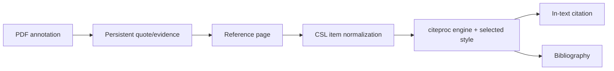

# Reader, references, and citations

## Responsibility

This domain combines feed/newsletter reading with a Zotero-compatible reference
manager, CSL citation rendering, identifier and web import, PDF/EPUB reading,
and annotations that can become citable evidence.

## Reference ingestion

References enter through DOI, ISBN, arXiv, PMID, BibTeX, RIS, files, or web URLs.
Identifier resolvers and Zotero translation-server produce provider-specific
metadata. Normalizers map it to the configured reference schema, generate a
stable citation key, deduplicate candidates, and write a Vault record.

The read-only lookup orchestration lives in the citations domain, preserves the
DOI → arXiv → PMID → ISBN → URL priority, and routes user URLs through the
SSRF-hardened downloader before suggesting any field.
The designated Resources table is read from one canonical configuration; only
legacy vaults that have never been configured may auto-adopt the first table
with a Citation Key, under the same lock used by Settings.

Translation-server is an optional sidecar. Native operation may run without it;
identifier-specific resolvers and existing references continue to work. Web
translation failures return actionable errors rather than an empty successful
record.

## Federated academic discovery

The built-in Resources plugin owns repository configuration while
`/api/vault/reference-table` remains the single source of truth for the target
Resources table. `/literature` runs each selected connector independently and
streams partial results; a quota or provider failure is attached to that source
without discarding healthy results.

`AcademicWork` is the canonical connector contract. Deterministic unions use,
in order, normalized DOI, PMID or PMCID, versionless arXiv identifier, ISBN-13,
and normalized title plus year plus first-author surname. A fuzzy title match is
only a warning. Merged works retain every source occurrence, open location,
provider-specific citation count, field provenance, and conflicting variant.

Preview is read-only. Full-text attachment is a separate manual action and is
offered only for a verified open location. Import maps the merged work through
the shared Zotero-compatible Resources mapper and repeats identity matching
inside an atomic lock. When a matching Resources record exists, the API returns
that record instead of creating a duplicate.

## Literature reviews

Systematic review state is stored in four idempotently managed Vault tables:
`Literature Reviews`, `Literature Activities`, `Literature Candidates`, and
append-only `Literature Decisions`. Search strategies, exact provider queries,
partial errors, AI operations, screening decisions, and exports therefore
remain auditable and synchronized with the principal vault.

Single-reviewer and dual-blind screening share the same phase model. In blind
mode, one reviewer's decision is hidden until both reviewers submit; conflicts
move to explicit consensus. AI may propose editable queries, rerank, screen, or
synthesize retrieved metadata, but cannot exclude a candidate or claim evidence
beyond the title, abstract, or full text actually supplied.

OAI indexes and temporary search state are reconstructible and live below
`LOCAL_DATA`; protocols, histories, candidates, decisions, and audit artifacts
remain in the principal vault. Repository credentials use the native Keychain
or deployment environment and are never written to the vault or plugin state.

## Citation path

CSL values are derived from reference front matter using explicit field
mappings. Name lists, dates, item types, escaped BibTeX/LaTeX, and Zotero
`extra` metadata require normalization. The pinned schema protects compatible
item types and fields from upstream drift.

`backend/domains/vault/citations/exporting.py` owns Markdown cleanup, citation
subset resolution, bibliography-marker replacement, Pandoc invocation and
download packaging for Vault exports. The compatibility route retains its
public signature and injects late-bound filesystem, CSL and process ports.

## Reader and annotations

The bundled Zotero reader displays PDF and EPUB content. Gnosi owns the bridge
that locates files, serves safe byte ranges, receives annotations, and links
selected evidence back to Vault records. Annotation rows include source URI,
page, type, geometry, text, comment, tags, stable managed key, and timestamps.

File endpoints validate containment and handle cloud hydration. Persistent
annotation identifiers prevent a generated quote from duplicating every time a
document is reopened.

## Feeds and newsletters

Reader models store sources, articles, read state, extracted full content, and a
newsletter account. Feed ingestion uses transaction savepoints so one malformed
entry cannot roll back the whole batch. Excerpts and full-text extraction are
separate; truncation at ingest must not permanently discard recoverable source
content.

## Invariants

- Citation keys remain stable unless the user explicitly changes identity data.
- Import is deduplicated by authoritative identifiers and normalized metadata.
- A federated source failure cannot invalidate results already returned by other sources.
- Fuzzy similarity never merges academic works automatically.
- Citation metrics remain separate by provider and are never added together.
- AI suggestions never become final screening decisions without a human action.
- Reader file paths cannot escape allowed roots.
- An annotation's document identity and page geometry survive restarts.
- Vendored reader internals are treated as upstream code; local integration
  modifications are explicit and reproducible.
- Passwords from legacy newsletter configuration are treated as secrets even
  when an old model still exposes a compatibility field.

## Verification focus

Run citation-key, PubMed, item-type, CSL-style, BibTeX escaping, reference I/O,
annotation, path-containment, import deduplication, and feed savepoint tests.
Add connector normalization, OAI token and tombstone, SSRF/XML, partial-error,
review-blinding, concurrent import, and PRISMA count tests. Browser validation
must open an actual fixture document and exercise a citation or annotation
round trip, then run one progressive literature search, inspect provenance, and
import a deduplicated result.
