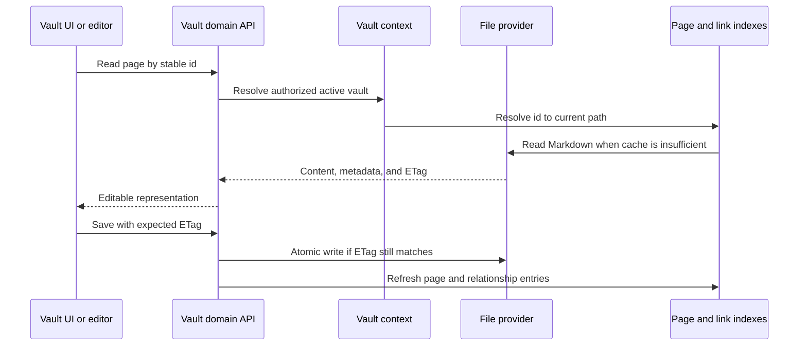

# Vault and files

## Responsibility

The Vault domain maps portable Markdown and assets to pages, folders,
attachments, searches, schemas, histories, trash, exports, citations, and
multi-vault selection. It is the largest domain and the primary owner of data
sovereignty.

## Page lifecycle

Page identity is separate from title and path. Front matter is normalized at
write boundaries while user-authored keys are preserved. Internal-only state
belongs in `.gnosi` sidecars when exposing it in front matter would pollute or
destabilize portable content.

`pages/markdown_writer.py` is the canonical serialization boundary: it recovers
or creates a missing stable ID, maps schema keys to storage names, strips
virtual fields, writes internal state to the sidecar, decorates portable
relations and materializes view snapshots before the atomic file write.

## Backend boundary

Page reads and writes, previews, duplication, history, and trash are implemented
under `backend/domains/vault/pages`, while asset uploads, icons and image
serving live under `backend/domains/vault/assets`. Contained file serving,
Library/raw/thumbnail routes, local-file tokens, property uploads, portable
links and physical deletion live under `backend/domains/vault/files`. These
packages separate strict request schemas, route adapters, application services,
repositories, and the single owners of mutable locks, caches and token stores.
New Vault behavior belongs in the corresponding domain boundary.

`backend/api/vault_routes.py` remains a temporary compatibility and composition
facade while the rest of the legacy router is split. It injects existing
platform operations and re-exports supported Python symbols, but it does not own
the extracted page handlers. The migration preserves HTTP paths, status codes,
payloads, dependencies, background callbacks, and the deterministic OpenAPI
document. Each extraction must reduce the facade's source guardrail allowance;
it may never add a new exception for code under `backend/domains`.

Translation lifecycle behavior is owned by `backend/domains/vault/translation`:
optional provider loading, cloud-file recovery, row and whole-page translation,
minimal metadata effects, and stale-child propagation are separate typed
services. Drupal row publishing is owned by `backend/domains/vault/drupal`,
which separates field and identity mapping, local media preparation, Markdown
and wikilink conversion, language caches, title matching, and idempotent node
synchronization. The compatibility router retains the original FastAPI
decorators, route docstrings and late-bound Python seams, while the Drupal
connector remains the external transport boundary. These moves do not change
paths, payloads, status codes, background tasks or route order.

## Indexes and caches

The page index accelerates listing, identifier resolution, front-matter access,
and search. The wikilink index resolves inbound links so page renames can update
references. Body and parsed-document caches avoid repeated reads. Every cache
is derived and must tolerate a cold rebuild.

`links/document_inventory.py` owns the per-vault TTL inventory used by global
links. It excludes history and trash, isolates unreadable files, includes JSON
dashboards, and falls back to a disk walk while the provider index is unavailable.

Startup first loads valid disk snapshots, then starts refresh work. A partial
file-provider scan is marked partial and cannot replace a known complete cache.
Per-file failures are isolated so one online-only or orphaned placeholder does
not remove the rest of the vault from a response.

`pages/index_entries.py` owns bounded front-matter reads, cloud-lock retries and
cache-entry normalization. `pages/index_service.py` owns discovery, refresh,
reverse-ID maps and deduplicated snapshots. `pages/resolver.py` owns stable-ID,
canonical UUID, indexed-title and bounded cold-scan resolution.
`pages/tags.py` owns the provider-neutral aggregation of front-matter and
semantic table tags, including per-page deduplication. The
compatibility router injects the active-vault, registry, calendar and cache
ports, so none of these services imports the HTTP facade.

## File providers

The provider abstraction selects local, generic macOS File Provider, OneDrive,
iCloud Drive, Google Drive, Nextcloud, or Dropbox-aware behavior. Normal domain
code still works with `Path`; the adapter adds placeholder detection,
hydration, availability, and path mapping. Set `GNOSI_FILES_PROVIDER`
explicitly when automatic path detection is ambiguous.

The files-on-demand runtime is provider-neutral. Google Drive, iCloud and
Nextcloud do not inherit OneDrive recovery behavior; only `OneDriveProvider`
may restart the OneDrive client after a bounded hydration failure. Native macOS
providers use a GUI-session `open` action by default. Docker deployments may
use a configured host helper because container reads cross another boundary.

Dropbox File Provider paths are detected explicitly. An unknown service under
macOS `~/Library/CloudStorage` uses the side-effect-free `fileprovider` adapter;
any fully synchronized or ordinary mounted folder uses `local`. A new named
adapter is needed only for a different placeholder signal or a vendor-specific
hydration mechanism. `GNOSI_DATA_DIR` remains local regardless of the vault
provider.

Only portable Vault Markdown and attachments may live in a synchronized tree.
SQLite databases, locks, derived caches, secrets and `GNOSI_DATA_DIR` stay on
local application storage. A fully synchronized Nextcloud folder behaves as
`local`; virtual-file deployments use the matching provider or the generic
`fileprovider` adapter. WebDAV and direct cloud APIs are transfer or backup
transports, not live storage for SQLite. Backup destination and Vault provider
are configured independently.

## Attachments and file-valued properties

Writes choose an allowed target under the active vault, normalize names, avoid
collisions, and return portable metadata. File links are re-rooted at read time
for the current host. Upload and delete operations validate containment; a
client-provided path is never sufficient authorization.

The assets/files route handlers are canonical domain exports. The legacy vault
router registers them at their historical positions and injects narrow ports
for registry lookups, path resolution and provider selection. It must not own a
second local-token mapping, custom-icon lock or file-stream semaphore. Repeated
`/local-file/{token}` decorators retain their original bottom-up route order,
and every structural move must preserve streaming headers and the exact OpenAPI
document.

## Trash and destructive operations

Ordinary deletion is recoverable: pages and related assets move through the
Vault trash model. Purge is distinct and removes content plus derived metadata
and inverse relations. `trash/purge.py` owns the irreversible filesystem pass,
history, metadata-sidecar and comment cleanup behind late-bound facade ports.
Vault registry deletion removes the logical registry row
by default; physical folder deletion requires a separate explicit signal and
stronger containment checks.

## Vault templates

The template repository is a signed runtime catalog; package assets are not
tracked in the application Git repository. Creating from a template verifies
the detached index signature, package SHA-256, publisher signature, manifest,
file inventory, archive limits, paths, file types, and links before writing.
Extraction occurs in a sibling staging directory under the Vaults root. The
completed directory is moved into place atomically and only then registered in
the management database, so a failure cannot expose a partial Vault.

Export is allowlist-based and deterministic. It excludes `.gnosi`, plugins,
trust stores, mail, trash, history, executable content, environment files,
links, unreadable files, and oversized content. A preview lists every included
and excluded file and scans bounded text files for credential-like values.
Findings require explicit acknowledgement. Recommended plugins are identifiers
in the manifest; executable plugin code never travels inside a Vault template.

Public submission is separate from export and requires administrator access.
It uses an optional moderation broker rather than a GitHub credential embedded
in Gnosi.

## Concurrency invariants

- Stale ETags reject overwrites.
- Registry and daily-note creation use race-safe rechecks.
- Page, registry, link-index, and sidecar updates remain consistent after a
  rename or deletion.
- Absolute paths received from a client are resolved under approved roots.
- Symlinks and path traversal cannot escape the selected vault boundary.
- Template extraction cannot publish a partial directory or register it early.
- Template exports cannot include runtime state or executable plugin content.
- Markdown round trips preserve escape-sensitive content and wikilink syntax.

## Frontend

`VaultDashboard` owns navigation history and selects page, table, drawing,
gallery, board, calendar, timeline, feed, or reader surfaces. `VaultShell`
provides the frame; specialized components implement editors and views. The
frontend caches interaction state but treats backend page content and ETags as
authoritative.

## Verification focus

Run ETag concurrency, path containment, safe I/O, registry race, rename,
trash/purge, attachment numbering, relation, index refresh, and representative
Playwright Vault flows. Cloud-provider incidents also require a real placeholder
read because local fixture tests cannot reproduce File Provider behavior.
