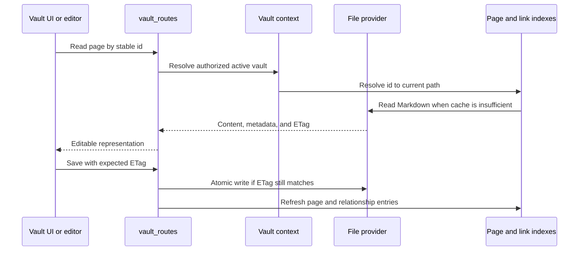

# Vault and files

## Responsibility

The Vault domain maps portable Markdown and assets to pages, folders,
attachments, searches, schemas, histories, trash, exports, citations, and
multi-vault selection. It is the largest domain and the primary owner of data
sovereignty.

## Page lifecycle

Page identity is separate from title and path. Front matter is normalized at
write boundaries while user-authored keys are preserved. Internal-only state
belongs in `.gnosi` sidecars when exposing it in front matter would pollute or
destabilize portable content.

## Indexes and caches

The page index accelerates listing, identifier resolution, front-matter access,
and search. The wikilink index resolves inbound links so page renames can update
references. Body and parsed-document caches avoid repeated reads. Every cache
is derived and must tolerate a cold rebuild.

Startup first loads valid disk snapshots, then starts refresh work. A partial
file-provider scan is marked partial and cannot replace a known complete cache.
Per-file failures are isolated so one online-only or orphaned placeholder does
not remove the rest of the vault from a response.

## File providers

The provider abstraction selects local, generic macOS File Provider, OneDrive,
iCloud Drive, Google Drive, Nextcloud, or Dropbox-aware behavior. Normal domain
code still works with `Path`; the adapter adds placeholder detection,
hydration, availability, and path mapping. Set `GNOSI_FILES_PROVIDER`
explicitly when automatic path detection is ambiguous.

The files-on-demand runtime is provider-neutral. Google Drive, iCloud and
Nextcloud do not inherit OneDrive recovery behavior; only `OneDriveProvider`
may restart the OneDrive client after a bounded hydration failure. Native macOS
providers use a GUI-session `open` action by default. Docker deployments may
use a configured host helper because container reads cross another boundary.

Dropbox File Provider paths are detected explicitly. An unknown service under
macOS `~/Library/CloudStorage` uses the side-effect-free `fileprovider` adapter;
any fully synchronized or ordinary mounted folder uses `local`. A new named
adapter is needed only for a different placeholder signal or a vendor-specific
hydration mechanism. `GNOSI_DATA_DIR` remains local regardless of the vault
provider.

## Attachments and file-valued properties

Writes choose an allowed target under the active vault, normalize names, avoid
collisions, and return portable metadata. File links are re-rooted at read time
for the current host. Upload and delete operations validate containment; a
client-provided path is never sufficient authorization.

## Trash and destructive operations

Ordinary deletion is recoverable: pages and related assets move through the
Vault trash model. Purge is distinct and removes content plus derived metadata
and inverse relations. Vault registry deletion removes the logical registry row
by default; physical folder deletion requires a separate explicit signal and
stronger containment checks.

## Vault templates

The template repository is a signed runtime catalog; package assets are not
tracked in the application Git repository. Creating from a template verifies
the detached index signature, package SHA-256, publisher signature, manifest,
file inventory, archive limits, paths, file types, and links before writing.
Extraction occurs in a sibling staging directory under the Vaults root. The
completed directory is moved into place atomically and only then registered in
the management database, so a failure cannot expose a partial Vault.

Export is allowlist-based and deterministic. It excludes `.gnosi`, plugins,
trust stores, mail, trash, history, executable content, environment files,
links, unreadable files, and oversized content. A preview lists every included
and excluded file and scans bounded text files for credential-like values.
Findings require explicit acknowledgement. Recommended plugins are identifiers
in the manifest; executable plugin code never travels inside a Vault template.

Public submission is separate from export and requires administrator access.
It uses an optional moderation broker rather than a GitHub credential embedded
in Gnosi.

## Concurrency invariants

- Stale ETags reject overwrites.
- Registry and daily-note creation use race-safe rechecks.
- Page, registry, link-index, and sidecar updates remain consistent after a
  rename or deletion.
- Absolute paths received from a client are resolved under approved roots.
- Symlinks and path traversal cannot escape the selected vault boundary.
- Template extraction cannot publish a partial directory or register it early.
- Template exports cannot include runtime state or executable plugin content.
- Markdown round trips preserve escape-sensitive content and wikilink syntax.

## Frontend

`VaultDashboard` owns navigation history and selects page, table, drawing,
gallery, board, calendar, timeline, feed, or reader surfaces. `VaultShell`
provides the frame; specialized components implement editors and views. The
frontend caches interaction state but treats backend page content and ETags as
authoritative.

## Verification focus

Run ETag concurrency, path containment, safe I/O, registry race, rename,
trash/purge, attachment numbering, relation, index refresh, and representative
Playwright Vault flows. Cloud-provider incidents also require a real placeholder
read because local fixture tests cannot reproduce File Provider behavior.
