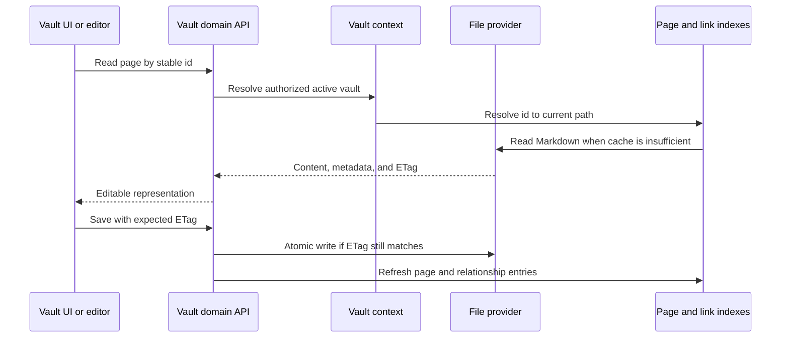

# Vault and files

Autosave serializes page writes within the web client. A stale page version returns a conflict (409), not a missing-page error (404), even when the conditional read omits the body. Missing pages still return 404; conflicts never silently overwrite newer content.

## Comment and translation contracts

Comment persistence validates only the stored dictionary/list root; unknown keys,
nested values and record identity remain intact. HTTP models still validate
responses. `comments/composition.py` builds late-bound dependencies at the original
registration point and supports facade-first or comment-first imports. Markdown
imports preserve native ID slicing for filename collisions. SSE subscriptions
remain vault-scoped and remove their own queues on cancellation.

Translation helpers, lookup, metadata effects and row/page services use open
metadata without asserting string-only YAML keys. The lifecycle checks actual
callback owners and a lazy connector protocol; captured dependencies stay
captured and replaceable members stay late-bound. Page creation receipts use a
read-only named-field contract, distinct from mutable metadata. Registered write
handlers retain their asynchronous return and optional injected context. Web
Clipper receipts pass through the existing response model without field coercion.

These changes preserve provider error boundaries, sorted disk recovery, duplicate
target-language behavior and status-write ordering. Synthetic tests exercise
provider doubles, not live cloud accounts. Drupal composition and translation HTTP
now check actual dependency owners; this does not certify the entire backend,
a real Drupal server or a cloud-provider migration.

## Drupal transport and HTTP contracts

Drupal field mapping, media preparation, language discovery, title matching and
row synchronization retain open metadata and opaque connector identifiers.
Constructed response envelopes have explicit types; decoded transport values are
not assumed to have an application schema. Field order, partial errors, cached
identifier identity and native malformed-input errors are preserved. Dependency
factories capture the connector and error classes, but resolve replaceable
members when called. Pillow remains an optional, lazily loaded dependency.

Translation routes preserve existing request and response schemas. Drupal bulk
publishing stringifies every identifier and keeps duplicates; bulk translation
filters non-text identifiers and deduplicates trimmed strings. Single-row
publishing still defaults to pushing media. Text inputs retain their false-value
fallbacks and native errors for malformed JSON. Non-JSON Python callers whose
custom strip operation returns a non-string receive an explicit type error;
this HTTP-only check does not normalize YAML or plugin metadata. Generated valid
JSON with the wrong response shape reaches HTTP validation, not the provider-error
fallback. Synthetic transports and temporary files verify these contracts without
reading credentials, publishing content or calling an external provider.

## Responsibility

The Vault domain maps portable Markdown and assets to pages, folders,
attachments, searches, schemas, histories, trash, exports, citations, and
multi-vault selection. It is the largest domain and the primary owner of data
sovereignty.

Local handwriting recognition is an optional ingestion adapter at the Vault
boundary. Model and processor objects remain isolated as third-party runtime
values; the service exposes a typed result containing text, raw recognition,
line values, model identity, and correction status without changing the public
upload contract. Status, warmup and recognition dictionaries are validated by
dedicated Pydantic response models before retaining their historical mapping
shape for direct callers and the byte-stable OpenAPI surface.

## Page lifecycle

Page identity is separate from title and path. Front matter is normalized at
write boundaries while user-authored keys are preserved. Internal-only state
belongs in `.gnosi` sidecars when exposing it in front matter would pollute or
destabilize portable content.

Sidecar reads and writes use one explicit metadata mapping contract, including
split, merge and portable-persistence results. The shared tolerant frontmatter
fallback returns top-level scalar values as typed objects when YAML recovery is
needed; nested malformed content remains deliberately ignored. These contracts
do not coerce user values or change the existing cloud-file safeguards.

`pages/markdown_writer.py` is the canonical serialization boundary: it recovers
or creates a missing stable ID, maps schema keys to storage names, strips
virtual fields, writes internal state to the sidecar, decorates portable
relations and materializes view snapshots before the atomic file write.
`services/field_resolver.py` owns that schema-key mapping contract. It accepts
immutable field IDs, current names and historical aliases, resolves conflicts
deterministically, and emits only current human-readable names at storage and
response boundaries while preserving unrelated local metadata.

`pages/save_helpers.py` owns complete-save metadata preparation, destination
selection, existing-ID reuse and version-before-write behavior.
`pages/patch_helpers.py` owns ETag-aware reads, PATCH metadata preparation,
file relocation and coordinated updates to page, body, citation and parsed
document caches. The eight historical private helper names remain thin
compatibility facades, and every replaceable collaborator or mutable cache is
resolved through a late-bound typed port.

## Open metadata and validated HTTP

Internal registry and page documents use `dict[object, object]`: historic YAML
can contain non-text keys and extension values without a declared schema.
Dictionary guards preserve identity; sidecar merges and storage-name mapping
retain unknown fields. This is distinct from public HTTP validation.
`PageInfo` retains its original string-key validation and OpenAPI schema while
index construction and assignment preserve the open document. Page-response
caches store the existing page objects without cloning their metadata or locks.

`backend/utils/open_values.py` isolates native operations on opaque inputs.
Its input-only typing exceptions preserve Python's iteration, numeric, length
and mapping protocols and their errors; they never assert a returned record
shape. Tests compare callback timing, legacy sequences, malformed values and
shared-object identity. This removes broad dynamic namespaces from registry
and page-foundation composition, not every remaining legacy type in the backend.

## Preview and write contracts

`pages/preview_routes.py` checks facade dependencies against their actual owners.
Short and full preview payloads share one typed cache envelope and preserve opaque
title, icon and cover values. Materialization precedes reading; only errno 35
uses the existing retry schedule. Concurrent requests share the same result,
and cache storage precedes notification of waiting requests.

Complete and partial saves retain open metadata, nullable ETags, shallow-copy
timing and callback lookup before argument evaluation. Citation helpers preserve
dictionary identity for both textual and non-textual keys. The document inventory
and path resolver retain their original mutation and malformed-input behavior.

Two historical edge cases are characterized, not changed by this refactor:
a PATCH helper ETag conflict reaches the existing 404 before the service's 409
branch; cancelling a preview owner removes its in-flight entry without completing
its shared future. These are compatibility limitations, not successful concurrency
acceptance. Public schemas and normal write behavior remain unchanged.

## Backend boundary

Page reads and writes, previews, duplication, history, and trash are implemented
under `backend/domains/vault/pages`, while asset uploads, icons and image
serving live under `backend/domains/vault/assets`. Contained file serving,
Library/raw/thumbnail routes, local-file tokens, property uploads, portable
links and physical deletion live under `backend/domains/vault/files`. These
packages separate strict request schemas, route adapters, application services,
repositories, and the single owners of mutable locks, caches and token stores.
New Vault behavior belongs in the corresponding domain boundary.

The transitional `pages/runtime.py` boundary preserves the historical route
module's dynamic state while requiring an active Vault before constructing
filesystem paths or rule engines. Its request models now bind directly to
Pydantic, avoiding runtime-dependent base classes without changing their
public module identity or the generated HTTP contract.

`backend/domains/media` owns media-root resolution, provider-conscious recursive
scanning and its persistent derived cache, synchronized metadata and saved-view
sidecars, filters, pagination, the lazy folder tree, contained uploads, EXIF
extraction, and stable file serialization. `backend/services/media_service.py`
remains the compatible Python facade: it preserves the historical class,
singleton, callable shape, descriptors, state and errors while resolving
mutable state and replaceable collaborators late. Its internal constructor now
has an explicit `None` return annotation, removing its former constructor
typing exception without changing construction behavior. The facade
validates that an active vault exists before crossing a filesystem boundary and
uses the typed media contracts for roots, scans, queries, uploads, EXIF data and
serialized file information. Domain modules never import the HTTP router or
the compatibility facade.

Media HTTP routes import the shared router and stable services directly.
`media/composition.py` preserves late lookup of the service and duplicate-page
callbacks through named ports; file tokens and locks retain their canonical
owners. The concrete media service is checked against its route-side contract
without casting results. Provider JSON leaves remain unchanged for direct
callers, while the existing HTTP models validate the public response. The single
facade cast and upstream legacy metadata annotations remain explicit debt.

Drawing routes import the shared router and typed drawing/history services
directly. `drawings/composition.py` limits remaining late-bound collaborators to
`DrawingVaultPort`: paths, trash, serialization and history callbacks. The port
has no `Any` members; its single compatibility cast remains transitional until
the legacy providers are independently composed. It does not prove complete
typing of the wider facade or the shared historical request model. Return values
are not normalized merely for typing: direct callers retain the original drawing
data, while HTTP response models enforce the existing contract. Backups, recovery,
permissions, callback timing, metadata values and route ordering are preserved.

Page preview and save composition likewise share one narrowed router for title
resolution and delegated preview/write registration. Cache identity, alias
matching, active-vault checks and generated route schemas remain unchanged.

Translation and Drupal synchronization routes narrow their late-bound router at
the module boundary as well. Single-row, bulk, matching, generated-button and
page translation operations preserve role checks, background work and external
error mapping while remaining visible to strict typing.

Table-scoped storage has explicit owners. `assets/table_paths.py` owns contained
asset paths, per-property directories, revisions and collision-safe rename
helpers; `assets/persistence.py` owns recursive metadata ingestion and contained
record-asset deletion; `assets/quarantine.py` owns crash-safe table deletion and
startup recovery. `tables/folders.py` owns creation and migration of the table's
physical `BD/<database>/<table>` directory. These modules receive narrow
filesystem and registry ports from the compatibility facade and never import
the HTTP router.

`tables/routes.py` now owns the 23 historical database, table, option-catalog,
saved-view and folder-schema operations in their original order. Its strict
handlers delegate to the existing row, lifecycle, property, option and view
services; `tables/composition.py` is the immutable dependency bundle for those
routes and for row query/metadata enrichment. `tables/security.py` exposes only
the two typed workspace authorization factories, avoiding a static dependency
from the table domain on the broad legacy authentication composition. The
legacy router registers the domain routes flat for compatibility with route
inventory consumers and re-exports the supported Python callables.

`backend/api/vault_routes.py` is a compatibility bootstrap rather
than an implementation owner. Typed modules under `backend/domains/vault`
own the remaining API, annotation, citation, drawing, Drupal, file, knowledge,
link, media, page, registry, table, and translation behavior. The bootstrap
loads and registers those owners in historical source order, while
`facade_bridge.py` preserves supported imports, mutable globals, and late-bound
monkeypatch seams. The parent router still exposes the same flat `APIRoute`
inventory and byte-identical deterministic OpenAPI. The facade therefore needs
no source-guardrail allowance.

`pages/foundation.py` declares its functions before loading the facade. Its
`initialize_foundation` entry point binds the existing providers once at the
original bootstrap position, including when the page module is imported first.
Repeated calls retain the same dependency records, captured callbacks and route
order; binding another facade is rejected. Isolated tests compare both import
orders, resolved annotations and complete Vault OpenAPI, and exercise legacy
YAML keys, sidecars and file relocation. This removes an initialization cycle;
it does not claim that the remaining legacy metadata contracts are fully typed.

Translation lifecycle behavior is owned by `backend/domains/vault/translation`:
optional provider loading, cloud-file recovery, row and whole-page translation,
minimal metadata effects, and stale-child propagation are separate typed
services. The shared pure helper boundary canonicalizes source identities,
detects translatable changes and language fields, reuses existing option labels,
and translates only textual image subfields while retaining their source asset.
Drupal row publishing is owned by `backend/domains/vault/drupal`,
which separates field and identity mapping, local media preparation, Markdown
and wikilink conversion, language caches, title matching, and idempotent node
synchronization. The compatibility router retains the original FastAPI
decorators, route docstrings and late-bound Python seams, while the Drupal
connector remains the external transport boundary. These moves do not change
paths, payloads, status codes, background tasks or route order.

Translation providers are loaded inside their existing request-time error
boundaries through imports of their actual typed owners, without module-shaped
type assertions. The returned functions retain identity, native keyword APIs
and late replacement behavior. The page-provider protocols describe the shared
positional content/language contract and keyword-only credential argument.
Missing modules or members retain the same HTTP errors; unavailable credentials
retain the existing empty-key fallback. Loading these adapters does not load
translation models or read credentials at application startup.

Table authorization uses the real `workspace_service` types. The initially
captured `get_workspace_context` dependency and later `require_role` lookups
retain their original identity and timing; role checks return the same
`WorkspaceContext` instance or the same permission error. No role thresholds,
authentication rules or workspace-selection behavior are changed.

## Indexes and caches

The page index accelerates listing, identifier resolution, front-matter access,
and search. The wikilink index resolves inbound links so page renames can update
references. Body and parsed-document caches avoid repeated reads. Every cache
is derived and must tolerate a cold rebuild.

`links/document_inventory.py` owns the per-vault TTL inventory used by global
links. It excludes history and trash, isolates unreadable files, includes JSON
dashboards, and falls back to a disk walk while the provider index is unavailable.
`links/document_cache.py` owns the persistent, mtime-keyed Markdown body and
parsed-frontmatter caches. The router only supplies the active cache paths,
parser and safe JSON writer, so cache behavior is independent of the file provider.
`links/relation_sync.py` owns the idempotent filesystem and cache updates for
direct-to-inverse relation changes. Pure schema matching remains a separate
typed rule port: it resolves relation fields by normalized current names and
aliases, requires one unambiguous inverse field, and emits only add/remove
operations over canonical relation IDs. The compatibility router supplies
late-bound page IO.

Startup first loads valid disk snapshots, then starts refresh work. A partial
file-provider scan is marked partial and cannot replace a known complete cache.
Per-file failures are isolated so one online-only or orphaned placeholder does
not remove the rest of the vault from a response.

`pages/index_entries.py` owns bounded front-matter reads, cloud-lock retries and
cache-entry normalization. `pages/index_service.py` owns discovery, refresh,
reverse-ID maps and deduplicated snapshots. `pages/resolver.py` owns stable-ID,
canonical UUID, indexed-title and bounded cold-scan resolution.
`pages/tags.py` owns the provider-neutral aggregation of front-matter and
semantic table tags, including per-page deduplication. The
compatibility router injects the active-vault, registry, calendar and cache
ports, so none of these services imports the HTTP facade.

The registry runtime references the actual typed callback and state owners,
uses the standard context-manager decorator for mutation cycles and treats a missing active Vault
as an absent cloud attachment root. Registry/table route order, locking, caches
and provider-specific attachment candidates remain unchanged.

The core Vault API imports its router and services directly and limits remaining
late-bound collaborators to `CoreVaultPort`. Page creation accepts open metadata
without coercion; index insertion updates the existing cache owner. User labels
retain the name, email and identifier fallback. Daily-note creation carries the
already-authorized workspace user into the canonical page service, rather than
calling an HTTP handler with an unresolved dependency default. Explicit plugin
overrides retain their historical two-argument signature. Role and plugin checks,
existing-note retrieval, the creation lock and public HTTP schemas are unchanged.

Citation formatting, search, catalog and export composition use explicit record
and callable contracts without result casts. Registry properties retain their
identity; read-only consumers accept mapping/sequence interfaces. Imported
references receive the authorized user's context when using the canonical page
handler, while late two-argument overrides remain supported. Deduplication,
formats, downloads and Pandoc error behavior are unchanged. All runtimes store the
references-table designation at `GNOSI_DATA_DIR/config/references.json`. Existing
source-tree settings require `scripts/migrate-reference-config.py`: its explicit
no-clobber migration preserves exact bytes, unknown fields and the original, with
a private journal and recoverable rollback. Startup checks readiness before
database migrations or workers. Disposable validation never consults legacy files.

Metadata lookup, PDF recognition, URL translation, Zotero promotion, bulk
updates and citation catalog/search registration share that same narrowed HTTP
boundary. Provider fallbacks, editor permissions and citation-key uniqueness
remain late-bound and behavior-compatible.

Citation lookup uses direct service imports and checked aliases of the actual
callback owners under `TYPE_CHECKING`; runtime overrides remain late-bound. No
module or result cast is needed for this composition. Tests verify both import
orders, exact HTTP schemas, callback replacement during a lookup and preservation
of unknown metadata. Citation title fallback retains Python's native errors via
`citations/title_regex.py`; its single documented type-check exception applies
only to native validation of invalid input, never to returned application data.
Remaining legacy types in upstream registry/page providers are separate debt.

Markdown import, inline comments, synchronized blocks, link navigation and
unlinked mentions share a typed page-synchronization router. Request models use
Pydantic directly while retaining their historical module identity, preserving
schema names, SSE behavior and OpenAPI output.

PDF annotation CRUD imports the shared router, authorization and persistence
dependencies directly. Named `TypedDict` payloads describe the dictionaries
returned to Python callers without casts or `Any`. Stored rectangles retain
the original JSON decoding behavior; HTTP response models still validate their
shape. Request and response schema identities, source URI filtering, page and
creation-time ordering, editor permissions, null/omitted update semantics and
the SQLite schema remain unchanged. Isolated SQLite and HTTP tests cover both
facade-first and domain-first import order.

Vault administration now fails explicitly with a service-unavailable response
when the primary Vault path is absent, rather than constructing a path from
`None`. Legacy response annotations remain frozen, and logical rename crosses
the old ORM descriptor boundary without changing disk folders, slugs, purge
rules or path-containment checks.

Vault template catalog, installation, export and moderated submission expose
typed request and response boundaries. Handlers validate every mapping before
returning it while disabling response-model publication on the compatibility
routes, so the frozen FastAPI schemas and direct-call dictionary contract do
not drift. Signature checks, privacy findings, deterministic packages and
rollback on registration failure remain unchanged.

## File providers

The provider abstraction selects local, generic macOS File Provider, OneDrive,
iCloud Drive, Google Drive, Nextcloud, or Dropbox-aware behavior. Normal domain
code still works with `Path`; the adapter adds placeholder detection,
hydration, availability, and path mapping. Set `GNOSI_FILES_PROVIDER`
explicitly when automatic path detection is ambiguous.

The files-on-demand runtime is provider-neutral. Google Drive, iCloud and
Nextcloud do not inherit OneDrive recovery behavior; only `OneDriveProvider`
may restart the OneDrive client after a bounded hydration failure. Native macOS
providers use a GUI-session `open` action by default. Docker deployments may
use a configured host helper because container reads cross another boundary.

Dropbox File Provider paths are detected explicitly. An unknown service under
macOS `~/Library/CloudStorage` uses the side-effect-free `fileprovider` adapter;
any fully synchronized or ordinary mounted folder uses `local`. A new named
adapter is needed only for a different placeholder signal or a vendor-specific
hydration mechanism. `GNOSI_DATA_DIR` remains local regardless of the vault
provider.

Only portable Vault Markdown and attachments may live in a synchronized tree.
SQLite databases, locks, derived caches, secrets and `GNOSI_DATA_DIR` stay on
local application storage. A fully synchronized Nextcloud folder behaves as
`local`; virtual-file deployments use the matching provider or the generic
`fileprovider` adapter. WebDAV and direct cloud APIs are transfer or backup
transports, not live storage for SQLite. Backup destination and Vault provider
are configured independently.

## Attachments and file-valued properties

Writes choose an allowed target under the active vault, normalize names, avoid
collisions, and return portable metadata. File links are re-rooted at read time
for the current host. Upload and delete operations validate containment; a
client-provided path is never sufficient authorization.

The assets/files route handlers are canonical domain exports. The legacy vault
router registers them at their historical positions and injects narrow ports
for registry lookups, path resolution and provider selection. It must not own a
second local-token mapping, custom-icon lock or file-stream semaphore. Repeated
`/local-file/{token}` decorators retain their original bottom-up route order,
and every structural move must preserve streaming headers and the exact OpenAPI
document.

File-valued metadata is normalized recursively without changing its list or
object shape. Existing `Assets/` paths and remote HTTP URLs remain references;
data URLs and approved local files are copied atomically into the property's
asset directory. Physical cleanup resolves every candidate below the active
Vault's `Assets` root before unlinking it, so a front-matter traversal string
cannot escape the Vault.

## Trash and destructive operations

`drawings/service.py` owns Tldraw and legacy Excalidraw discovery, reads,
cooldown-limited history snapshots, atomic writes and recoverable deletion.
Filesystem work runs outside the event loop, and deletion reuses the same Vault
trash sidecar contract as pages.

Ordinary deletion is recoverable: pages and related assets move through the
Vault trash model. Purge is distinct and removes content plus derived metadata
and inverse relations. `trash/purge.py` owns the irreversible filesystem pass,
history, metadata-sidecar and comment cleanup behind late-bound facade ports.
Vault registry deletion removes the logical registry row
by default; physical folder deletion requires a separate explicit signal and
stronger containment checks.

Deleting a table first atomically moves every table-owned asset tree to
`.gnosi/pending-cleanup/table-assets/in-progress-*` and writes a contained
manifest. The registry commit then renames that directory to `ready-*` before a
background purge. Startup recovery restores an in-progress quarantine when the
table still exists, purges it when the durable registry proves deletion, and
leaves unreadable or unknown entries untouched. Asset revisions cover symlinks
without following their targets and prevent deletion after a stale preview.

## Vault templates

The template repository is a signed runtime catalog; package assets are not
tracked in the application Git repository. Creating from a template verifies
the detached index signature, package SHA-256, publisher signature, manifest,
file inventory, archive limits, paths, file types, and links before writing.
Extraction occurs in a sibling staging directory under the Vaults root. The
completed directory is moved into place atomically and only then registered in
the management database, so a failure cannot expose a partial Vault.

Archive validation is decomposed into bounded entry validation, manifest
decoding, inventory comparison, and payload-integrity checks. These pure typed
steps retain the same fail-closed package contract while keeping every helper
below the backend complexity limit.

Export is allowlist-based and deterministic. It excludes `.gnosi`, plugins,
trust stores, mail, trash, history, executable content, environment files,
links, unreadable files, and oversized content. A preview lists every included
and excluded file and scans bounded text files for credential-like values.
Findings require explicit acknowledgement. Recommended plugins are identifiers
in the manifest; executable plugin code never travels inside a Vault template.

Public submission is separate from export and requires administrator access.
It uses an optional moderation broker rather than a GitHub credential embedded
in Gnosi. Broker-specific extra receipt fields remain lossless through an
extra-permitting response model; catalog failure payloads retain their legacy
shape for offline and signature-error recovery.

## Concurrency invariants

`daily/service.py` owns provider-neutral folder/table discovery, date
normalization, template seeding, listing and the atomic daily-note
get-or-create workflow. The compatibility router keeps the public FastAPI
decorators and injects late-bound page commands so existing plugins and tests
retain their seams.

- Stale ETags reject overwrites.
- Registry and daily-note creation use race-safe rechecks.
- Page, registry, link-index, and sidecar updates remain consistent after a
  rename or deletion.
- Absolute paths received from a client are resolved under approved roots.
- Symlinks and path traversal cannot escape the selected vault boundary.
- Template extraction cannot publish a partial directory or register it early.
- Template exports cannot include runtime state or executable plugin content.
- Markdown round trips preserve escape-sensitive content and wikilink syntax.

## Frontend

`VaultDashboard` owns navigation history and selects page, table, drawing,
gallery, board, calendar, timeline, feed, or reader surfaces. `VaultShell`
provides the frame; specialized components implement editors and views. The
frontend caches interaction state but treats backend page content and ETags as
authoritative.

The reviewed relocation places `VaultDashboard.tsx` and its orchestration in
`features/vault/dashboard/` (the entry itself is at the feature root).
Table composition and cell editing live in `features/vault/views/vault-table/`;
schema fields and options in `features/vault/schema/schema-config/`; and page
properties, rich documents, effects and persistence in
`features/vault/editor/block-editor/`. Reusable rendering, record hooks and
view controls belong to `shared/editor/`, `shared/records/` and
`shared/record-views/`; they never import Vault UI. A module is public only
through the feature root or its exact reviewed manifest entry; being a
composition file does not make it public. These ownership changes preserve API
routes and storage formats; integration verification remains separate.

Markdown-to-visual transitions publish pending drafts before mounting the rich
editor, preventing stale parent content from replacing an unsaved edit.
Metadata-only saves omit the body; default formulas preserve nested relation
and plugin values. Regression tests cover these handoffs alongside schema
option identifiers, table row identity and unknown metadata extensions.

## Verification focus

Run ETag concurrency, path containment, safe I/O, registry race, rename,
trash/purge, attachment numbering, relation, index refresh, and representative
Playwright Vault flows. Cloud-provider incidents also require a real placeholder
read because local fixture tests cannot reproduce File Provider behavior.
