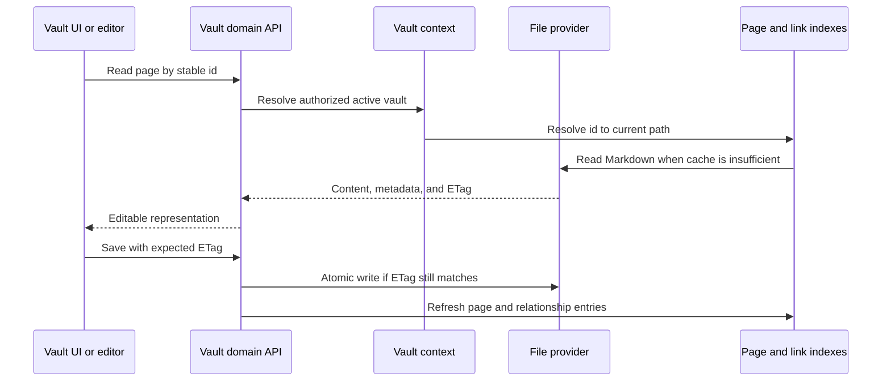

# Vault and files

## Responsibility

The Vault domain maps portable Markdown and assets to pages, folders,
attachments, searches, schemas, histories, trash, exports, citations, and
multi-vault selection. It is the largest domain and the primary owner of data
sovereignty.

Local handwriting recognition is an optional ingestion adapter at the Vault
boundary. Model and processor objects remain isolated as third-party runtime
values; the service exposes a typed result containing text, raw recognition,
line values, model identity, and correction status without changing the public
upload contract.

## Page lifecycle

Page identity is separate from title and path. Front matter is normalized at
write boundaries while user-authored keys are preserved. Internal-only state
belongs in `.gnosi` sidecars when exposing it in front matter would pollute or
destabilize portable content.

`pages/markdown_writer.py` is the canonical serialization boundary: it recovers
or creates a missing stable ID, maps schema keys to storage names, strips
virtual fields, writes internal state to the sidecar, decorates portable
relations and materializes view snapshots before the atomic file write.
`services/field_resolver.py` owns that schema-key mapping contract. It accepts
immutable field IDs, current names and historical aliases, resolves conflicts
deterministically, and emits only current human-readable names at storage and
response boundaries while preserving unrelated local metadata.

`pages/save_helpers.py` owns complete-save metadata preparation, destination
selection, existing-ID reuse and version-before-write behavior.
`pages/patch_helpers.py` owns ETag-aware reads, PATCH metadata preparation,
file relocation and coordinated updates to page, body, citation and parsed
document caches. The eight historical private helper names remain thin
compatibility facades, and every replaceable collaborator or mutable cache is
resolved through a late-bound typed port.

## Backend boundary

Page reads and writes, previews, duplication, history, and trash are implemented
under `backend/domains/vault/pages`, while asset uploads, icons and image
serving live under `backend/domains/vault/assets`. Contained file serving,
Library/raw/thumbnail routes, local-file tokens, property uploads, portable
links and physical deletion live under `backend/domains/vault/files`. These
packages separate strict request schemas, route adapters, application services,
repositories, and the single owners of mutable locks, caches and token stores.
New Vault behavior belongs in the corresponding domain boundary.

The transitional `pages/runtime.py` boundary preserves the historical route
module's dynamic state while requiring an active Vault before constructing
filesystem paths or rule engines. Its request models now bind directly to
Pydantic, avoiding runtime-dependent base classes without changing their
public module identity or the generated HTTP contract.

`backend/domains/media` owns media-root resolution, provider-conscious recursive
scanning and its persistent derived cache, synchronized metadata and saved-view
sidecars, filters, pagination, the lazy folder tree, contained uploads, EXIF
extraction, and stable file serialization. `backend/services/media_service.py`
remains the compatible Python facade: it preserves the historical class,
singleton, signatures, descriptors, state and errors while resolving mutable
state and replaceable collaborators late. The facade now validates that an
active vault exists before crossing a filesystem boundary and uses the typed
media contracts for roots, scans, queries, uploads, EXIF data and serialized
file information. Domain modules never import the HTTP router or the
compatibility facade.

The transitional media HTTP module narrows the dynamically imported legacy
router once to a concrete `APIRouter`. Route decorators and delegated asset,
file, icon and property registrations all use that same typed instance, keeping
registration order and the OpenAPI contract stable without scattering type
exceptions across individual handlers.

The drawings boundary applies the same single-router narrowing to drawing CRUD
and delegated history registration. Drawing backups, soft deletion, recovery
windows, permissions and route ordering remain owned by their existing domain
services while the HTTP composition surface is strict.

Page preview and save composition likewise share one narrowed router for title
resolution and delegated preview/write registration. Cache identity, alias
matching, active-vault checks and generated route schemas remain unchanged.

Translation and Drupal synchronization routes narrow their late-bound router at
the module boundary as well. Single-row, bulk, matching, generated-button and
page translation operations preserve role checks, background work and external
error mapping while remaining visible to strict typing.

Table-scoped storage has explicit owners. `assets/table_paths.py` owns contained
asset paths, per-property directories, revisions and collision-safe rename
helpers; `assets/persistence.py` owns recursive metadata ingestion and contained
record-asset deletion; `assets/quarantine.py` owns crash-safe table deletion and
startup recovery. `tables/folders.py` owns creation and migration of the table's
physical `BD/<database>/<table>` directory. These modules receive narrow
filesystem and registry ports from the compatibility facade and never import
the HTTP router.

`tables/routes.py` now owns the 23 historical database, table, option-catalog,
saved-view and folder-schema operations in their original order. Its strict
handlers delegate to the existing row, lifecycle, property, option and view
services; `tables/composition.py` is the immutable dependency bundle for those
routes and for row query/metadata enrichment. `tables/security.py` exposes only
the two typed workspace authorization factories, avoiding a static dependency
from the table domain on the broad legacy authentication composition. The
legacy router registers the domain routes flat for compatibility with route
inventory consumers and re-exports the supported Python callables.

`backend/api/vault_routes.py` is now a 283-line compatibility bootstrap rather
than an implementation owner. Typed modules under `backend/domains/vault`
own the remaining API, annotation, citation, drawing, Drupal, file, knowledge,
link, media, page, registry, table, and translation behavior. The bootstrap
loads and registers those owners in historical source order, while
`facade_bridge.py` preserves supported imports, mutable globals, and late-bound
monkeypatch seams. The parent router still exposes the same flat `APIRoute`
inventory and byte-identical deterministic OpenAPI. The facade therefore needs
no source-guardrail allowance.

Translation lifecycle behavior is owned by `backend/domains/vault/translation`:
optional provider loading, cloud-file recovery, row and whole-page translation,
minimal metadata effects, and stale-child propagation are separate typed
services. The shared pure helper boundary canonicalizes source identities,
detects translatable changes and language fields, reuses existing option labels,
and translates only textual image subfields while retaining their source asset.
Drupal row publishing is owned by `backend/domains/vault/drupal`,
which separates field and identity mapping, local media preparation, Markdown
and wikilink conversion, language caches, title matching, and idempotent node
synchronization. The compatibility router retains the original FastAPI
decorators, route docstrings and late-bound Python seams, while the Drupal
connector remains the external transport boundary. These moves do not change
paths, payloads, status codes, background tasks or route order.

## Indexes and caches

The page index accelerates listing, identifier resolution, front-matter access,
and search. The wikilink index resolves inbound links so page renames can update
references. Body and parsed-document caches avoid repeated reads. Every cache
is derived and must tolerate a cold rebuild.

`links/document_inventory.py` owns the per-vault TTL inventory used by global
links. It excludes history and trash, isolates unreadable files, includes JSON
dashboards, and falls back to a disk walk while the provider index is unavailable.
`links/document_cache.py` owns the persistent, mtime-keyed Markdown body and
parsed-frontmatter caches. The router only supplies the active cache paths,
parser and safe JSON writer, so cache behavior is independent of the file provider.
`links/relation_sync.py` owns the idempotent filesystem and cache updates for
direct-to-inverse relation changes. Pure schema matching remains a separate
typed rule port: it resolves relation fields by normalized current names and
aliases, requires one unambiguous inverse field, and emits only add/remove
operations over canonical relation IDs. The compatibility router supplies
late-bound page IO.

Startup first loads valid disk snapshots, then starts refresh work. A partial
file-provider scan is marked partial and cannot replace a known complete cache.
Per-file failures are isolated so one online-only or orphaned placeholder does
not remove the rest of the vault from a response.

`pages/index_entries.py` owns bounded front-matter reads, cloud-lock retries and
cache-entry normalization. `pages/index_service.py` owns discovery, refresh,
reverse-ID maps and deduplicated snapshots. `pages/resolver.py` owns stable-ID,
canonical UUID, indexed-title and bounded cold-scan resolution.
`pages/tags.py` owns the provider-neutral aggregation of front-matter and
semantic table tags, including per-page deduplication. The
compatibility router injects the active-vault, registry, calendar and cache
ports, so none of these services imports the HTTP facade.

The registry runtime narrows its late-bound router once, uses the typed standard
context-manager decorator for mutation cycles and treats a missing active Vault
as an absent cloud attachment root. Registry/table route order, locking, caches
and provider-specific attachment candidates remain unchanged.

The core Vault API reuses one typed router for virtual fields, index status,
daily notes and tag aggregation. User display labels cross the legacy ORM
descriptor boundary as concrete strings, preserving the existing fallback from
name to email to identifier.

Citation formatting and export registration now cross one typed router, while
reference format detection, serialization and normalization return their native
strict string contracts directly. Export formats, citation resolution and
Pandoc error behavior remain stable.

Metadata lookup, PDF recognition, URL translation, Zotero promotion, bulk
updates and citation catalog/search registration share that same narrowed HTTP
boundary. Provider fallbacks, editor permissions and citation-key uniqueness
remain late-bound and behavior-compatible.

Markdown import, inline comments, synchronized blocks, link navigation and
unlinked mentions share a typed page-synchronization router. Request models use
Pydantic directly while retaining their historical module identity, preserving
schema names, SSE behavior and OpenAPI output.

PDF annotation CRUD follows the same model: direct Pydantic request bases and a
single typed router, with historical schema identity retained. Source URI
filtering, page ordering, editor permissions and annotation serialization are
unchanged.

Vault administration now fails explicitly with a service-unavailable response
when the primary Vault path is absent, rather than constructing a path from
`None`. Legacy response annotations remain frozen, and logical rename crosses
the old ORM descriptor boundary without changing disk folders, slugs, purge
rules or path-containment checks.

Vault template catalog, installation, export and moderated submission expose a
typed manifest boundary while intentionally retaining unannotated legacy route
returns so FastAPI's frozen response schemas do not drift. Signature checks,
privacy findings, deterministic packages and rollback on registration failure
remain unchanged.

## File providers

The provider abstraction selects local, generic macOS File Provider, OneDrive,
iCloud Drive, Google Drive, Nextcloud, or Dropbox-aware behavior. Normal domain
code still works with `Path`; the adapter adds placeholder detection,
hydration, availability, and path mapping. Set `GNOSI_FILES_PROVIDER`
explicitly when automatic path detection is ambiguous.

The files-on-demand runtime is provider-neutral. Google Drive, iCloud and
Nextcloud do not inherit OneDrive recovery behavior; only `OneDriveProvider`
may restart the OneDrive client after a bounded hydration failure. Native macOS
providers use a GUI-session `open` action by default. Docker deployments may
use a configured host helper because container reads cross another boundary.

Dropbox File Provider paths are detected explicitly. An unknown service under
macOS `~/Library/CloudStorage` uses the side-effect-free `fileprovider` adapter;
any fully synchronized or ordinary mounted folder uses `local`. A new named
adapter is needed only for a different placeholder signal or a vendor-specific
hydration mechanism. `GNOSI_DATA_DIR` remains local regardless of the vault
provider.

Only portable Vault Markdown and attachments may live in a synchronized tree.
SQLite databases, locks, derived caches, secrets and `GNOSI_DATA_DIR` stay on
local application storage. A fully synchronized Nextcloud folder behaves as
`local`; virtual-file deployments use the matching provider or the generic
`fileprovider` adapter. WebDAV and direct cloud APIs are transfer or backup
transports, not live storage for SQLite. Backup destination and Vault provider
are configured independently.

## Attachments and file-valued properties

Writes choose an allowed target under the active vault, normalize names, avoid
collisions, and return portable metadata. File links are re-rooted at read time
for the current host. Upload and delete operations validate containment; a
client-provided path is never sufficient authorization.

The assets/files route handlers are canonical domain exports. The legacy vault
router registers them at their historical positions and injects narrow ports
for registry lookups, path resolution and provider selection. It must not own a
second local-token mapping, custom-icon lock or file-stream semaphore. Repeated
`/local-file/{token}` decorators retain their original bottom-up route order,
and every structural move must preserve streaming headers and the exact OpenAPI
document.

File-valued metadata is normalized recursively without changing its list or
object shape. Existing `Assets/` paths and remote HTTP URLs remain references;
data URLs and approved local files are copied atomically into the property's
asset directory. Physical cleanup resolves every candidate below the active
Vault's `Assets` root before unlinking it, so a front-matter traversal string
cannot escape the Vault.

## Trash and destructive operations

`drawings/service.py` owns Tldraw and legacy Excalidraw discovery, reads,
cooldown-limited history snapshots, atomic writes and recoverable deletion.
Filesystem work runs outside the event loop, and deletion reuses the same Vault
trash sidecar contract as pages.

Ordinary deletion is recoverable: pages and related assets move through the
Vault trash model. Purge is distinct and removes content plus derived metadata
and inverse relations. `trash/purge.py` owns the irreversible filesystem pass,
history, metadata-sidecar and comment cleanup behind late-bound facade ports.
Vault registry deletion removes the logical registry row
by default; physical folder deletion requires a separate explicit signal and
stronger containment checks.

Deleting a table first atomically moves every table-owned asset tree to
`.gnosi/pending-cleanup/table-assets/in-progress-*` and writes a contained
manifest. The registry commit then renames that directory to `ready-*` before a
background purge. Startup recovery restores an in-progress quarantine when the
table still exists, purges it when the durable registry proves deletion, and
leaves unreadable or unknown entries untouched. Asset revisions cover symlinks
without following their targets and prevent deletion after a stale preview.

## Vault templates

The template repository is a signed runtime catalog; package assets are not
tracked in the application Git repository. Creating from a template verifies
the detached index signature, package SHA-256, publisher signature, manifest,
file inventory, archive limits, paths, file types, and links before writing.
Extraction occurs in a sibling staging directory under the Vaults root. The
completed directory is moved into place atomically and only then registered in
the management database, so a failure cannot expose a partial Vault.

Archive validation is decomposed into bounded entry validation, manifest
decoding, inventory comparison, and payload-integrity checks. These pure typed
steps retain the same fail-closed package contract while keeping every helper
below the backend complexity limit.

Export is allowlist-based and deterministic. It excludes `.gnosi`, plugins,
trust stores, mail, trash, history, executable content, environment files,
links, unreadable files, and oversized content. A preview lists every included
and excluded file and scans bounded text files for credential-like values.
Findings require explicit acknowledgement. Recommended plugins are identifiers
in the manifest; executable plugin code never travels inside a Vault template.

Public submission is separate from export and requires administrator access.
It uses an optional moderation broker rather than a GitHub credential embedded
in Gnosi.

## Concurrency invariants

`daily/service.py` owns provider-neutral folder/table discovery, date
normalization, template seeding, listing and the atomic daily-note
get-or-create workflow. The compatibility router keeps the public FastAPI
decorators and injects late-bound page commands so existing plugins and tests
retain their seams.

- Stale ETags reject overwrites.
- Registry and daily-note creation use race-safe rechecks.
- Page, registry, link-index, and sidecar updates remain consistent after a
  rename or deletion.
- Absolute paths received from a client are resolved under approved roots.
- Symlinks and path traversal cannot escape the selected vault boundary.
- Template extraction cannot publish a partial directory or register it early.
- Template exports cannot include runtime state or executable plugin content.
- Markdown round trips preserve escape-sensitive content and wikilink syntax.

## Frontend

`VaultDashboard` owns navigation history and selects page, table, drawing,
gallery, board, calendar, timeline, feed, or reader surfaces. `VaultShell`
provides the frame; specialized components implement editors and views. The
frontend caches interaction state but treats backend page content and ETags as
authoritative.

## Verification focus

Run ETag concurrency, path containment, safe I/O, registry race, rename,
trash/purge, attachment numbering, relation, index refresh, and representative
Playwright Vault flows. Cloud-provider incidents also require a real placeholder
read because local fixture tests cannot reproduce File Provider behavior.
