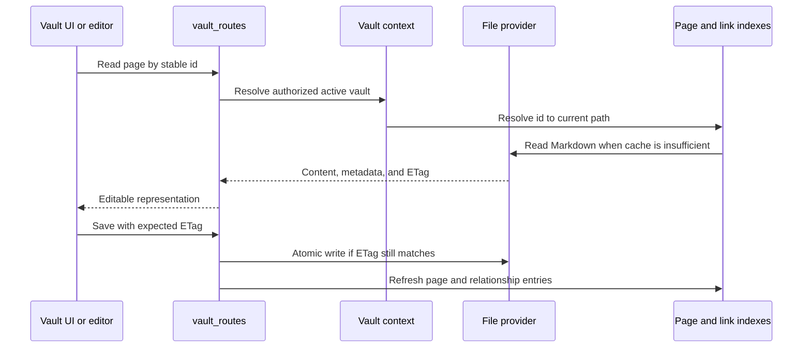

# Vault and files

## Responsibility

The Vault domain maps portable Markdown and assets to pages, folders,
attachments, searches, schemas, histories, trash, exports, citations, and
multi-vault selection. It is the largest domain and the primary owner of data
sovereignty.

## Page lifecycle

Page identity is separate from title and path. Front matter is normalized at
write boundaries while user-authored keys are preserved. Internal-only state
belongs in `.gnosi` sidecars when exposing it in front matter would pollute or
destabilize portable content.

## Indexes and caches

The page index accelerates listing, identifier resolution, front-matter access,
and search. The wikilink index resolves inbound links so page renames can update
references. Body and parsed-document caches avoid repeated reads. Every cache
is derived and must tolerate a cold rebuild.

Startup first loads valid disk snapshots, then starts refresh work. A partial
file-provider scan is marked partial and cannot replace a known complete cache.
Per-file failures are isolated so one online-only or orphaned placeholder does
not remove the rest of the vault from a response.

## File providers

The provider abstraction selects local, OneDrive, iCloud Drive, Google Drive,
or Nextcloud-aware behavior. Normal domain code still works with `Path`; the
adapter adds placeholder detection, hydration, availability, and path mapping.

Native OneDrive operation delegates hydration to a GUI-session `open` action
when the LaunchAgent cannot materialize an online-only file. Docker deployments
may use a host warmup endpoint because container reads cross another boundary.

## Attachments and file-valued properties

Writes choose an allowed target under the active vault, normalize names, avoid
collisions, and return portable metadata. File links are re-rooted at read time
for the current host. Upload and delete operations validate containment; a
client-provided path is never sufficient authorization.

## Trash and destructive operations

Ordinary deletion is recoverable: pages and related assets move through the
Vault trash model. Purge is distinct and removes content plus derived metadata
and inverse relations. Vault registry deletion removes the logical registry row
by default; physical folder deletion requires a separate explicit signal and
stronger containment checks.

## Concurrency invariants

- Stale ETags reject overwrites.
- Registry and daily-note creation use race-safe rechecks.
- Page, registry, link-index, and sidecar updates remain consistent after a
  rename or deletion.
- Absolute paths received from a client are resolved under approved roots.
- Symlinks and path traversal cannot escape the selected vault boundary.
- Markdown round trips preserve escape-sensitive content and wikilink syntax.

## Frontend

`VaultDashboard` owns navigation history and selects page, table, drawing,
gallery, board, calendar, timeline, feed, or reader surfaces. `VaultShell`
provides the frame; specialized components implement editors and views. The
frontend caches interaction state but treats backend page content and ETags as
authoritative.

## Block backgrounds in the editor

`BlockEditor` maps block background properties to portable Markdown using a
`
` wrapper. BlockNote renders the parsed
property on the block content and its core stylesheet paints the background on
the containing `.bn-block`, so the color spans the complete editor block,
including blocks nested inside a column.

The editor stylesheet must not reset non-default block backgrounds to
transparent or move the color to `.bn-inline-content`. Doing so turns a block
background into a text-sized chip and makes the result depend on heading text
length. Inline background styles remain appropriate for text-level highlights;
block backgrounds belong to the block container.

When changing this behavior, verify both a standalone heading and a heading
inside a `column-list`, then round-trip the Markdown and confirm the block
property and full-width rendering remain intact. The implementation lives in
`frontend/src/components/Vault/BlockEditor.jsx`; Markdown conversion is in
`frontend/src/components/Vault/markdown-mapper.js`.

Markdown code view uses an accessible localized textarea that auto-grows with
the document. An empty document retains a 500 px minimum editing surface so
source mode always provides a visible focus and typing target; non-empty
documents continue to grow from their measured content height.

## Verification focus

Run ETag concurrency, path containment, safe I/O, registry race, rename,
trash/purge, attachment numbering, relation, index refresh, and representative
Playwright Vault flows. Cloud-provider incidents also require a real placeholder
read because local fixture tests cannot reproduce File Provider behavior.
