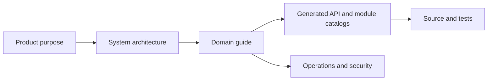

# Gnosi engineering documentation

This portal explains Gnosi from product intent to source-level implementation.
It is written for engineers who need to operate, review, extend, or audit the
system without depending on oral history.

## What Gnosi is

Gnosi is a local-first, self-hostable knowledge workspace. Markdown files in a
user-controlled vault are the durable source of truth for notes and structured
knowledge. A React frontend and FastAPI backend add editing, database-style
views, graph navigation, references and reading, communications, automation,
AI-assisted work, integrations, and optional multi-user controls.

The system supports three delivery surfaces:

- Native development and operation: uvicorn on port `5002` and Vite on `5173`.
- Docker self-hosting: backend, frontend, and Zotero translation-server.
- Electron desktop packages: the frontend plus a managed local backend.

## How to read this portal

Start with [purpose and scope](product/purpose-and-scope.md), then read the
[system context](architecture/system-context.md). Select a domain guide for the
capability you are changing. Generated catalogs provide exhaustive navigation
to routes, modules, environment names, tests, and skills.

## Evidence model

Documentation uses this precedence when sources disagree:

1. Executable source and runtime schemas.
2. Tests proving observable behavior.
3. Current deployment and configuration definitions.
4. Active engineering directives.
5. Git history for motivation and chronology.

Reviewed pages explain responsibilities and decisions. Generated pages describe
what is statically present. Neither substitutes for executing the relevant
tests and runtime flows.

## Current implementation index

- [Repository inventory](generated/repository-inventory.md)
- [FastAPI operations](generated/api-catalog.md)
- [Backend modules](generated/backend-modules.md)
- [Frontend routes and components](generated/frontend-catalog.md)
- [Relational tables and columns](generated/data-model.md)
- [Configuration names and consumers](generated/configuration.md)
- [Test files](generated/tests.md)
- [Runtime skills](generated/skills.md)
- [Domain coverage](generated/coverage.md)

## Change rule

A change is incomplete when it alters an externally visible contract,
architectural boundary, invariant, configuration key, operational procedure, or
failure mode without updating the relevant reviewed guide and regenerating the
reference catalogs.
