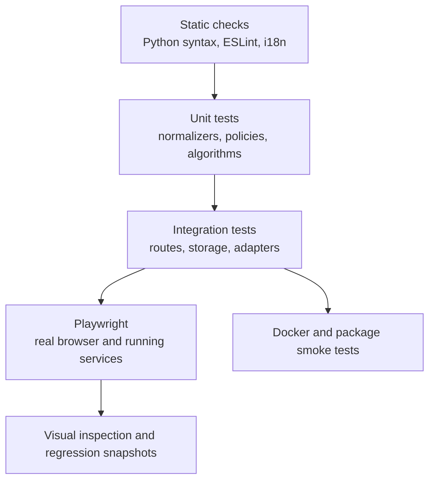

# Test strategy

## Quality layers

No single layer is sufficient. A frontend build catches imports and syntax but
not a broken interaction. A route unit test does not prove browser integration.
A screenshot does not prove persistence or authorization.

## Unified type checking

Run `pnpm typecheck` from the repository root. It runs frontend TypeScript,
strict mypy across the complete backend (excluding tests), strict mypy across
every indexed public pipeline Python file, and finally Python syntax checks
for backend, pipeline, scripts and extensions, in that order. Each failure
stops the remaining stages and returns its exit status.

The individual commands `typecheck:backend-boundaries` and
`typecheck:pipeline` remain available. This is a static gate, not a substitute
for lint, unit tests, builds, browser flows or deployment acceptance. A strict
pass does not prove that all existing explicit `Any` boundaries are removed.
The command regression checks complete targets and uses isolated POSIX shims
to exercise order and failure propagation; it does not prove Windows execution.

## Backend tests

Pytest covers services, route dependencies, normalization, storage, security,
concurrency, and regression cases. Tests use temporary vault and local-data
directories. External providers are stubbed unless a test is explicitly marked
as live/E2E.

Important suites include:

- Auth, PAT, workspace bootstrap, roles, and public surfaces.
- Path containment, safe writes, ETags, races, registry and sidecar behavior.
- Formulas, rollups, typed filters, relations, planning, and scheduling.
- Mail MIME/CID, contacts merge/vCard, calendar containment and reminders.
- AI routing, skills, MCP resilience, confirmations, and generated tools.
- Plugins, imports, citations, reader normalization, XSS, and SSRF.

## Frontend tests

Vitest covers components, hooks, registries, formatting utilities, typed view
logic, and state behavior. ESLint and the production Vite build are mandatory.
`check:i18n` verifies that referenced user-facing keys exist in every locale.

The build must finish with zero errors. Existing warnings are not permission to
add new warnings without review.

Frontend ownership checks use `gnosi/feature-boundaries` in ESLint. The
reviewed extension is an exact public-entry manifest at
`frontend/feature-public-entries.json`, with a reason per listed path.
Cross-feature consumers use the feature root/`index` or an explicitly reviewed
entry; unlisted siblings remain private. Check static imports, reexports,
literal lazy imports and TypeScript import types. The manifest must not create
an eager aggregate or change existing lazy boundaries.

The rules `shared` → no features/`app` and features → no `app` are
unconditional, including types and manifest entries. Feature internals may use
local imports. Global source contracts belong in `frontend/tests/contracts/`;
the source guardrail complements AST lint. Verify implementation after the
relocation; this documentation does not establish a passing global gate.

Run CPU-heavy build/typecheck gates separately from the complete real-DOM suite
on constrained machines. If parallel work causes test deadlines to expire,
repeat the affected suite in isolation and then the full suite with bounded
workers (for example, `pnpm --filter @gnosi/frontend exec vitest run
--maxWorkers=2 --minWorkers=2`). Keep the assertions and test deadlines intact;
an isolated pass alone does not establish that the full suite is green.

## Production bundle budgets

The frontend build runs `scripts/check-bundle-size.ts` after Vite. Fixed limits
apply to uncompressed JavaScript bytes: entry file 1,400,000; largest chunk
1,800,000; editor vendor 1,550,000; tldraw vendor 1,350,000; settings route
600,000. Missing or duplicate reviewed chunks fail the check. Tests cover
relative, root and prefixed deployment URLs, growth and missing chunks.
The entry-file metric is not the complete initial dependency graph, compressed
transfer size or a startup-time measurement. Vite's existing 1,500 kB advisory
remains visible; these budgets prevent growth, not prove optimal performance.

## End-to-end and visual tests

Playwright runs as a host-level project against the native application. An
anonymous setup covers boot and public behavior; authenticated setup covers
workspace functionality. Domain tests exercise Vault, dashboard, mail,
calendar, contacts, drawings, automation, agent chat, and navigation.

Visual snapshots cover representative desktop and mobile pages. For a UI
change, inspect the actual rendered page, click the changed control, watch the
console, and take a screenshot. Confirm that modals, overlays, toasts, and
menus use the registered z-index system and do not trap interaction.

## Accessibility gate

The Playwright `accessibility` project is a blocking WCAG 2.2 AA gate. It runs
axe against twelve selected product routes in
light and dark themes, including color contrast, labels, landmarks, and ARIA
relationships. The suite keeps application-owned markup in scope and does not
maintain a permanent violation allowlist. Its deterministic fixture enables
the optional modules represented by the route matrix, and every route also
fails on unhandled browser page errors so a crashed surface cannot pass axe.

Before scanning, each case requires the expected canonical URL and a visible
feature-specific surface, with no route skeleton or disabled-plugin fallback.
It does not reload the page to retry failed startup. The skip-link check verifies
its visible two-pixel border and keyboard underline; graph navigation follows
the vault-scoped link. Media and control-center screenshots preserve light/dark
contrast evidence. A green run covers these fixtures and states, not every
interaction, assistive technology, user dataset or complete WCAG conformance.

Interaction assertions complement axe for behavior that static analysis cannot
prove: skip navigation, visible focus, logical focus order, complete keyboard
operation, mobile tab roving focus, cancelable-dialog Escape handling, focus
trap and restoration, accessible names, and live route announcements. Shared
focus, modal, navigation, or color-token changes must pass this project before
release.

Global focus styling uses the `data-focus-modality` attribute on the document
root. Pointer activation suppresses generic outlines; keyboard activation uses
contextual indicators: existing borders for fields, underlines for links, and
outlines for borderless controls. Editable Vault page titles retain their caret
without an enclosing ring. Unit tests must cover modality transitions, while
browser checks cover pointer and keyboard focus in light and dark themes.

## Deployment tests

Docker CI currently validates Compose and builds the backend and frontend
images; it does not start containers or verify their health and persistence.
Those runtime checks remain required release evidence.

Electron release CI configures packaging for macOS arm64/x64, Linux arm64 and
Windows x64. Configuring that matrix, running desktop unit tests or checking a
synthetic browser-profile migration does not prove installer or frozen-backend
acceptance. Each architecture requires installation, startup, persistent-data
and 2.x-upgrade evidence. macOS currently uses manual installer updates.
Do not infer cross-platform acceptance from a local macOS run, or publish 3.0
before the complete release matrix passes.

## Change-to-test mapping

| Change | Minimum evidence |
| --- | --- |
| Pure reviewed documentation | Generator check, validator, strict docs build, browser docs smoke. |
| Generated catalog logic | Generator unit tests, two-run determinism, validator, strict docs build. |
| Backend behavior | Narrow pytest regression plus affected integration suite. |
| Frontend behavior | Vitest where feasible, i18n check, production build, browser action and screenshot. |
| Accessibility or shared UI token | Vitest for the shared primitive, four-locale parity, axe route matrix in light and dark, keyboard interaction suite, and browser screenshot. |
| Auth/security/path behavior | Negative tests and cross-scope attempts, not only the golden path. |
| Deployment/dependency | Native verification plus Docker or package CI as applicable. |

## Test catalog

The generated [test catalog](../generated/tests.md) lists owned test files and
navigation signals. Runner collection remains authoritative for executable test
counts.
