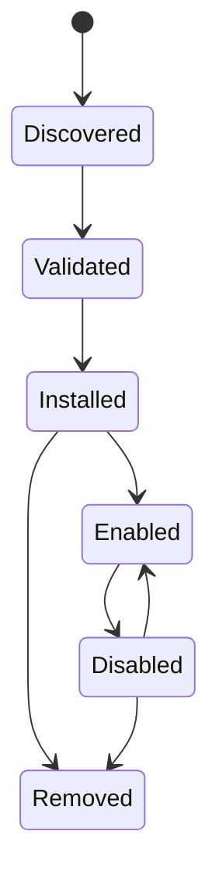

# Integrations and plugins

## Responsibility

Integrations connect user accounts and external systems. Plugins extend Gnosi
with declarative contributions and bounded executable behavior. MCP servers
contribute agent tools through a separate protocol boundary.

## Integration persistence

The integration manager stores non-secret account configuration and references
to secrets under local data. Each machine reconnects accounts independently.
Settings APIs list masked connection state, validate configuration, test
connectivity, choose defaults, and disconnect providers without exposing raw
tokens.

Google and Microsoft OAuth callbacks create or update provider records. IMAP,
SMTP, CalDAV, Drupal, Notion, and similar adapters normalize their own settings
into the common integration registry where possible.

## Plugin lifecycle

Plugin packages declare identity, version, compatibility, permissions,
contributions, and integrity information. Installation validates paths,
manifest structure, signatures where required, and declared effects. Enabling
reconciles managed settings, AI profiles, skills, or tools idempotently.
Disabling suspends managed contributions while preserving user-owned overrides.

Executable plugin behavior runs through a sandbox boundary with a constrained
environment and timeout. Plugins do not receive the complete host environment
or arbitrary secret access.

API v2 plugins may declare `contributes.academicRepositories` to provide a
complex academic search adapter. The contribution requires the `network`
permission, runs in the existing sandbox, and returns the normalized
`AcademicWork` contract. Built-in and custom repository definitions use the
same catalog surface, so per-search activation, source provenance, and partial
errors do not depend on connector origin.

Administrators can also define HTTPS OAI-PMH repositories or declarative
GET/JSON REST repositories. OAI supports sets, resumption tokens, incremental
harvests, and tombstones. REST definitions have bounded page, offset, cursor,
or `Link` pagination plus explicit JSON field mapping. Arbitrary methods and
executable mapping code are not accepted.

Direct networking stays disabled in both plugin runtimes. A granted `network`
capability exposes only the host RPC, which rejects private destinations and
bounds methods, redirects, time, and response size. UI frames keep
`connect-src 'none'`; the parent calls the same backend boundary after checking
the plugin's declared and granted permissions.

## Marketplace distribution

The official plugin index and its detached signature are published as GitHub
Release assets. Remote catalog installation requires a trusted signed index and
every selected package requires both SHA-256 integrity and a trusted detached
Ed25519 signature. Installed provenance records the source URL, checksum, and
verified publisher. Local ZIP installation remains available for development,
but starts disabled with no grants.

Installed plugins can be exported as deterministic ZIPs. Public submission is
an administrator operation sent to an explicitly configured moderation broker;
Gnosi never embeds a GitHub write token. The broker quarantines the package and
publishes it only after CI and human review.

## MCP boundary

Configured MCP servers are independent processes or remote endpoints. Startup
discovers their tool schemas and normalizes them into the agent catalog. Retry
and `Retry-After` handling are bounded. One failed server is recorded without
discarding tools from healthy servers.

## Example and companion integrations

The repository includes example plugin packaging, a Drupal MCP proxy, the
LibreOffice citation extension, and a Word citation helper. These are separate
clients with narrow backend contracts; they do not share backend filesystem or
credential access automatically.

## Invariants

- Integration secrets live outside Git and the synchronized vault.
- Disconnecting removes or revokes the local credential reference and selected
  defaults consistently.
- Plugin-managed and user-managed values remain distinguishable.
- Archive extraction and plugin paths cannot escape their installation root.
- Compatibility and permission validation occurs before activation.
- Official indexes and remote packages fail closed when integrity metadata is missing.
- Direct plugin sockets and browser connections never bypass the host RPC.
- Academic repository URLs pass HTTPS, DNS/IP, redirect, timeout, response-size,
  and safe XML validation before data reaches a connector.
- External-only services are never exposed as automated connectors.
- MCP tool origin and effect remain visible after catalog normalization.

## Verification focus

Run plugin manifest, signing, sandbox, state-race, AI contribution, MCP routing,
retry, academic repository permission, SSRF, XML, pagination, and connector
tests. A live integration test uses a dedicated test account, a bounded result
page, and must not mutate production data unintentionally.
